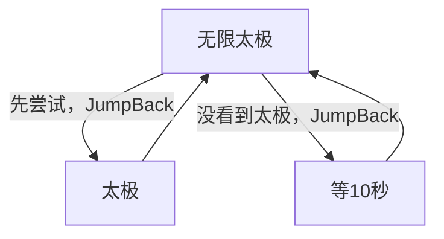

# 无限太极

本页说明界面任务「无限太极」。入口在 `assets/interface.json`，节点在 `assets/resource/pipeline/yysls_task.json`，入口名 `无限太极`。与 [无限集英](无限集英.md) 共用同一流水线文件，并共用其中的 `等10秒` 节点。

坐标与 ROI 均按控制器缩放到短边 720 后的 **1280×720** 图计算。不依赖 Python Agent。

## 目标

反复寻找并点击屏幕上的「太极」。本轮找不到就先空等 10 秒，再继续找。任务不会自行结束，需外部停止。

## 步骤

1. 入口 `无限太极`：无单独 `action` 字段（依赖默认命中行为）。`next` 为 `[JumpBack]太极`、`[JumpBack]等10秒`——每一轮**先**尝试「太极」，未命中再走「等10秒」。两条后继都带 JumpBack，走完都会回到本入口。
2. **太极**：OCR 期望「太极」，阈值 `0.8`，ROI `[880, 450, 280, 160]`（与「集英」同一矩形），点击后 `post_delay` **20000**（20 秒）。`next` 为空，随后跳回入口再认。
3. **等10秒**：与集英相同，本文件内 `DoNothing`，`post_delay` **10000**。本轮没看到「太极」时进入，等完再回入口。

因此运行中会一直交替做「点太极（成功则等 20 秒）」和「等 10 秒再找」，直到外部停止。

## 节点一览

| 节点 | 识别 / 动作 | ROI | 点击后等待 |
| --- | --- | --- | --- |
| `无限太极` | 后继 `[JumpBack]太极`、`[JumpBack]等10秒`；`on_error` → 自己 | — | — |
| `太极` | OCR「太极」，阈值 0.8，Click | `[880, 450, 280, 160]` | 20 秒 |
| `等10秒` | `DoNothing`（与集英共用） | — | 10 秒 |

阈值写死为 `0.8`。ROI 与「集英」节点相同，都是 `[880, 450, 280, 160]`，期望文字不同。

## 安全原则

- 只点 OCR「太极」命中项；认不到只走 `等10秒`，不盲点。
- 点中后固定等 20 秒再进入下一轮，避免连点。
- `等10秒` 无识别、立刻命中，正常画面下后继列表不会因「等不到节点」超时；入口 `on_error` 指向自己，主要兜动作失败一类情况。
- 不改写集英侧节点；两任务只是共用 `yysls_task.json` 与 `等10秒`。

## 与流水线关系

| 项 | 说明 |
| --- | --- |
| 入口 | 界面任务「无限太极」；入口节点名 `无限太极` |
| 节点文件 | `assets/resource/pipeline/yysls_task.json`（与 [无限集英](无限集英.md) 同文件） |
| Agent | 不需要 |
| 结束条件 | 无；外部停止前一直循环 |