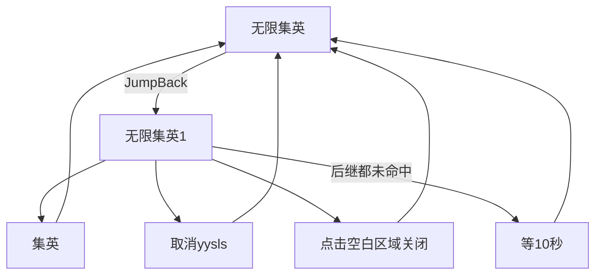

# 无限集英

本页说明界面任务「无限集英」。入口在 `assets/interface.json`，节点在 `assets/resource/pipeline/yysls_task.json`，入口名 `无限集英`。文件名与内部节点 `取消yysls` 仍带 `yysls` 字样，界面展示名是「无限集英」。

坐标与 ROI 均按控制器缩放到短边 720 后的 **1280×720** 图计算。不依赖 Python Agent。

## 目标

在能点到「集英」的画面里反复点击，形成无限循环。顺带处理同屏可能出现的「取消」和「点击空白区域关闭」。三者都找不到时先空等 10 秒，再继续找。

任务不会自行结束，需外部停止。

## 步骤

1. 入口 `无限集英`：`DoNothing`（无识别，立刻命中）。`next` 只有 `[JumpBack]无限集英1`。内层任意后继走完（含等待）都会跳回本入口，再进内层。
2. 内层 `无限集英1`：同样 `DoNothing`。按顺序尝试三个 OCR 点击节点；都未命中则 `on_error` → `等10秒`。
3. **集英**：OCR 期望「集英」，阈值 `0.8`，ROI `[800, 360, 0, 0]`（从 `(800, 360)` 到右下角），点击后 `post_delay` **11000**（11 秒）。`next` 为空，靠外层 JumpBack 继续。
4. **取消yysls**：OCR 期望「取消」，阈值 `0.8`，ROI `[0, 0, 720, 0]`（左侧宽 720、通高），点击后 `post_delay` **200**。
5. **点击空白区域关闭**：OCR 期望「点击空白区域关闭」，阈值 `0.8`，ROI `[0, 360, 0, 0]`（下半屏），点击后 `post_delay` **200**。
6. **等10秒**：本文件内定义的节点（不是 `public_task.json` 里的 `等一分钟`）。`DoNothing`，`post_delay` **10000**，`next` 为空，再回外层循环。

## 节点一览

| 节点 | 识别 / 动作 | ROI | 点击后等待 |
| --- | --- | --- | --- |
| `无限集英` | `DoNothing`；`[JumpBack]无限集英1` | — | — |
| `无限集英1` | `DoNothing`；后继三选一，失败 → `等10秒` | — | — |
| `集英` | OCR「集英」，阈值 0.8，Click | `[800, 360, 0, 0]` | 11 秒 |
| `取消yysls` | OCR「取消」，阈值 0.8，Click | `[0, 0, 720, 0]` | 200 ms |
| `点击空白区域关闭` | OCR「点击空白区域关闭」，阈值 0.8，Click | `[0, 360, 0, 0]` | 200 ms |
| `等10秒` | `DoNothing` | — | 10 秒 |

阈值写死为 `0.8`，覆盖流水线默认的 `0.6`。

## 安全原则

- 只点上述三个 OCR 命中项；认不到就等 10 秒，不盲点固定坐标。
- 「取消」只扫左半屏（宽 720），避免误点右侧「集英」一带。
- 点「集英」后固定等 11 秒再进入下一轮，不要把等待改成立即连点。
- 入口 `on_error` 指向自己；正常画面下内层会立刻命中，该字段不负责「三个按钮都没看到」（那是内层 `on_error` → `等10秒`）。

## 与流水线关系

| 项 | 说明 |
| --- | --- |
| 入口 | 界面任务「无限集英」；入口节点名 `无限集英` |
| 节点文件 | `assets/resource/pipeline/yysls_task.json`（与 [无限太极](无限太极.md) 同文件） |
| Agent | 不需要 |
| 结束条件 | 无；外部停止前一直循环 |