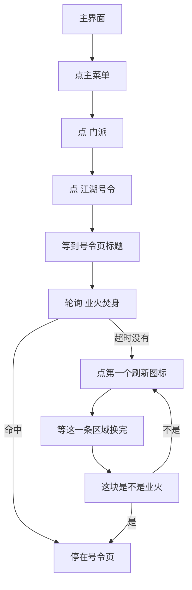

# 每日号令

本页说明预定界面任务「每日号令」。入口名预定为 `每日号令`。

坐标与 ROI 均按控制器缩放到短边 720 后的 **1280×720** 图计算。不依赖 Python Agent。不接入 [一条龙](一条龙.md)。

> **实现状态**：只写了本文。`assets/interface.json` 还没有这项，`assets/resource/pipeline/` 里也还没有对应文件。下面是要落地的步骤，不是当前程序的行为。

## 目标

人在主界面。打开 **菜单 → 门派 → 江湖号令**。号令页打开之后，OCR 查找 **业火焚身**。

- 页面上已经有：停在号令页。不点「业火焚身」，也不点刷新。
- 这一轮没有：点同屏**第一个**刷新图标。等这一条的区域换完，再只认这块是不是 **业火**。是就停。不是就再点这一枚刷新，重复「等换完 → 再认」，直到这块读到「业火」。

不改点第二枚及更后面的刷新图标。找到后要不要接取，本文不规定。刷新次数不设上限。

## 前置

主界面能点右上角主菜单。模板用已有的 `storage/主菜单.png`，ROI `[1080, 0, 200, 90]`，与 [返回百业](返回百业.md)、[自动买钱](自动买钱.md) 相同。

人已经停在门派页或号令页时，本文不另写往回点的路径。

## 步骤

1. 功能菜单已经开着，并且菜单区域内能 OCR 到「门派」：不再点主菜单，直接去点「门派」。避免把已经打开的菜单再点一次关掉。
2. 否则点右上角主菜单。只负责点开，不要连点。
3. 在功能菜单里 OCR 点「门派」，只点一次。
4. 门派页出来后，OCR 点「江湖号令」，只点一次。
5. 等到左上角标题出现「号令」，才进入查找。门派页上的入口文字是「江湖号令」，打开后的标题是「号令」，两者不要混用。标题还没出现时，不找「业火焚身」，也不点刷新。
6. 在号令页上轮询 OCR「业火焚身」。等待时间写在**父节点**的 `timeout` 上（先用仓库默认 4444 毫秒；列表出得更慢再加长这一处）。刷新图标不要和「业火焚身」放在同一条 `next` 里：刷新是模板、会立刻命中，第一帧没读到字就会把刷新点掉，后面的轮询不会发生。没读到字时走这一步的 `on_error`。
7. `on_error` 里模板匹配刷新图标，点排序后的第一枚。模板对不上就失败，不改点别的按钮，也不点固定坐标。这一步不要写 `max_hit`，后面还要重复点。
8. 点完后等**这一条**的区域刷新完，再 OCR。用 `post_wait_freezes` 盯这块文字区域：连续一段时间画面没有较大变化，才算换完。不要用固定空等代替，也不要在动画还在变时就认字。文字区域比图标大，具体相对图标的偏移等实机再定。
9. 只在这块区域里认「业火」（「业火焚身」能对上）。认到就停，不点击。不是「业火」就回到第 7 步，再点同一枚刷新。静止之后用较短的 `timeout`（约一次到两次识别，800 毫秒量级），对不上马上再刷新，不要空等默认的 4444 毫秒。

菜单已经开着时，跳过「点主菜单」，从「点门派」开始。

## 刷新图标

外观是小正方形，里面两个首尾相连的半圆箭头（常见的刷新符号）。图标上没有要认的字，用模板匹配，不用 OCR。

同屏可以有多枚。取最靠上的一枚当作「第一个」：`order_by` 为 `Vertical`，`index` 为 `0`。之后的重复刷新仍点这一枚。模板从实机截图裁，放到 `assets/resource/image/` 后再写进节点。先不放占位图。

## 预定节点

文件预定为 `assets/resource/pipeline/daily_order_task.json`。节点名全局不能和现有流水线撞名。

| 节点 | 识别 / 动作 | 说明 |
| --- | --- | --- |
| `每日号令` | 直接命中 | 先试菜单里已有「门派」，再点主菜单 |
| `号令_已开功能菜单` | OCR「门派」，不点击 | 菜单已开则跳过主菜单 |
| `号令_点主菜单` | 模板 `storage/主菜单.png`，点击 | ROI `[1080, 0, 200, 90]` |
| `号令_点门派` | OCR「门派」，点击，只点一次 | 功能菜单最底一行。2026-10-10 在 `127.0.0.1:16384` 点中约 `(887, 658)` |
| `号令_点江湖号令` | OCR「江湖号令」，点击，只点一次 | 门派页底部一排图标。同一次实机点中约 `(660, 619)` |
| `号令_等号令页` | OCR 左上角「号令」，不点击 | 打开成功。不要用「江湖号令」当标题：进来之后顶栏只有「号令」 |
| `号令_找业火焚身` | OCR「业火焚身」，不点击 | 命中后 `next` 为空，任务结束。超时走 `on_error` |
| `号令_点刷新` | 模板刷新图标，点击，`index` 0 | 只作为 `号令_找业火焚身` 的 `on_error`，以及下面认失败后的再刷新。`post_wait_freezes` 盯这一条文字区域。不设 `max_hit` |
| `号令_认刷新区域` | OCR「业火」，不点击 | 只认刚换完的那一块。命中则结束。父节点超时仍不是，则 `on_error` 回到 `号令_点刷新` |
| `每日号令_结束失败` | 直接命中 | 菜单、门派、江湖号令或刷新图标对不上时停住 |

`号令_点主菜单`、`号令_点门派`、`号令_点江湖号令` 都要限制点击次数，避免连点把菜单或页面关掉。

## 安全原则

- 主菜单、门派、江湖号令都只点认到的那一次。
- 「业火焚身」只识别。找到了就停，不点击。
- 先确认号令页标题，再查找。查找超时之后才允许点刷新。
- 刷新只点模板命中的第一枚。这块换完仍不是「业火」，就再点这一枚，不改点后面的图标。
- 区域还在变时不认字。认到「业火」就停，不点击。
- 认不到菜单、门派、江湖号令或刷新图标：任务失败，停在当前画面。

## 待实机再定

| 项 | 现状 |
| --- | --- |
| 「门派」「江湖号令」「业火焚身」的 ROI | 门派、江湖号令已点中，框还没收紧。业火焚身未单独测框 |
| 号令页标题 | 左上角「号令」。同一次实机第一张卡已经是「业火焚身」 |
| 刷新图标模板与 ROI | 未截 |
| 条目文字区域相对图标的偏移 | 未截。`post_wait_freezes` 和「业火」都用这块 |
| 刷新动画要静止多久 | 未测 |

## 与流水线关系

| 项 | 说明 |
| --- | --- |
| 入口 | 预定界面任务「每日号令」，入口节点名 `每日号令`。尚未写入 `interface.json` |
| 节点文件 | 预定 `assets/resource/pipeline/daily_order_task.json`，尚未添加 |
| Agent | 不需要 |
| 一条龙 | 不调用 |
| 结束 | 页面上已有「业火焚身」，或第一个刷新对应的区域读到「业火」。都停在号令页。一直不是就继续刷新，任务不会自己停 |
