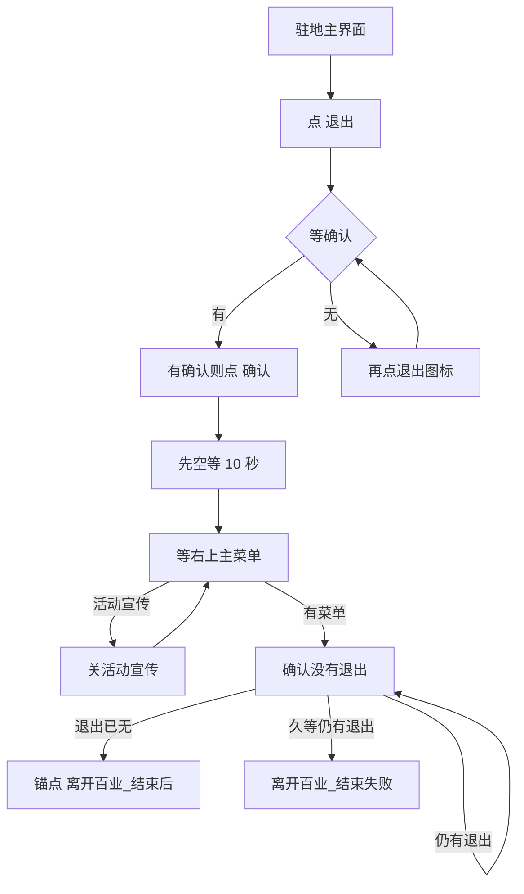

# 离开百业

本页说明界面任务「离开百业」。入口在 `assets/interface.json`，节点在 `assets/resource/pipeline/leave_baiye_task.json`，入口名 `离开百业`。可单独跑；也可由 [一条龙](一条龙.md) 在买药关货运、回到驻地主界面之后经锚点 `买药_结束后` 调用。单独 [自动买药](自动买药.md) 不调用本任务。

坐标与 ROI 均按控制器缩放到短边 720 后的 **1280×720** 图计算。

## 目标

如果主界面上没有**退出**并且没有**菜单**，查找是否有返回图标（如果有则点击返回，直到返回主界面）。如果没有返回图标也没有**退出**，查找点击切换菜单，切换后再查找**退出**，两次切换后没找到**退出**则失败。

人已经在百业驻地主界面（右上有 **退出**，货运界面已关掉）。点退出，有确认再点，等加载结束，直到右上出现 **主菜单**。

买药不复制这些节点。买齐后的 `买药_回到主菜单` 只负责关货运，然后 `next` 到本入口。

## 步骤

1. 入口 `timeout` **20 秒**（须盖住点退出 + 等确认 + 再点）。OCR 认右上 **退出** 文字（ROI `[1000, 0, 280, 70]`，阈值 0.5），点击用 `target_offset [0, -38, 0, 20]` 上移到门形图标——点在「退出」二字上打不开确认。读不到字就 `离开百业_结束失败`，不点固定坐标。`(1120, 36)` 偏右不在退出图标上。关货运后顶栏未稳时可能短暂只读到「计」，买药侧会先 `买药_等驻地退出` 再进本入口。与 [返回百业](返回百业.md) 等加载是同一个按钮；这里要点下去。
2. `离百业_等确认` 等离开确认（约 3 秒）；未出则 `离百业_再点退出` 再点一次图标。有确认则 OCR 点 **确认**（ROI `[940, 420, 260, 100]`，阈值 0.4）。不要点「取消」。两次仍无确认才失败，不点 `(1082, 475)`。点完再等加载，不要立刻认主菜单。
3. **先空等 10 秒**（`离百业_先等加载`）。过场开头会闪出主菜单，马上认会在加载图上把离开当成结束。
4. **再等加载结束**：模板 `storage/主菜单.png`，ROI `[1080, 0, 200, 90]`，阈值 0.85。等待写在 `离百业_先等加载` 的 `timeout`（130 秒，含前面的 10 秒）。同屏若 OCR 到活动宣传「前往」/「活动上新」（ROI `[40, 150, 1200, 430]`），走 `离百业_关活动弹窗`：点关闭叉 `(1182, 121)`，不要点「前往」；可连关最多 3 次，再继续等主菜单。
5. **确认没有退出**：`离百业_确认无退出` 在 `[1000, 0, 280, 70]` 取反 OCR「退出」，`timeout` **10 秒**。菜单在、退出也在（过场误闪菜单或仍在驻地），**继续等**，不要进 `离开百业_结束`（会跳过锚点，一条龙进不了炼药）。退出已经没有，再空等约 1.2 秒后走锚点 `离开百业_结束后`（给炉旁「炼药」对话一点出现时间）；10 秒仍有退出才 `离开百业_结束失败`。

## 与买药、一条龙的衔接

| 项 | 说明 |
| --- | --- |
| 谁调用 | 一条龙入口锚点 `买药_结束后` → `离开百业`；单独自动买药不调用 |
| 锚点 | `离开百业_结束后` |
| 「一条龙」 | 离开后锚点 → `自动炼药` |
| 单独「离开百业」 | 不设锚点 → `离开百业_结束` |
| 点不了退出或加载超时 | `离开百业_结束失败`，不进炼药 |

未买齐三家时买药不进 `买药_回到主菜单`，因此也不会进本流水线。

## 安全原则

- 只在货运已经关掉之后点「退出」。货运顶栏的返回箭头不是退出。
- 「退出」认文字、点图标（`target_offset` 上移）；「确认」只点 OCR 命中。认不到就停，不点固定坐标。
- 确认弹窗先于主菜单：弹窗会挡住顶栏。
- 点完退出和确认后先空等，再认主菜单。认到菜单后还要确认右上已经没有「退出」。菜单与退出同在时继续等，勿提前 `离开百业_结束`（跳过锚点）。加载图上没有主菜单，超时前不要当成已经离开。
- 离开后若出活动宣传挡住顶栏：只点关闭叉，不点「前往」。
- 不改写买药的已买标记。
