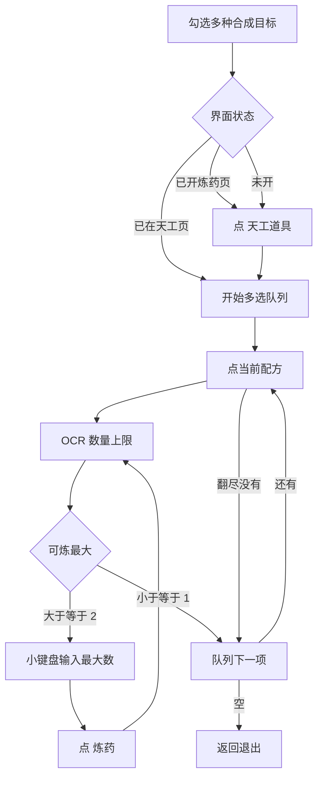

# 自动天工

本页说明界面任务「自动天工」。入口名 `自动天工`。流程对照 [自动炼药](自动炼药.md)：同一炉旁对话进界面，进界面后切 **天工道具**；改数量用小键盘、提交门槛仍是**最大数量 ≥ 2**。

与炼药的关键差别：**天工道具不消耗体力**。不算 `总体力 ÷ 需要体力`，不读体力行。最大数量只看材料侧上限（数量框 `当前/上限` 的右侧）。

合成目标由界面选项 **`天工合成目标`（复选框）** 决定：可勾选多种材料，任务按队列依次合成。也可勾选「积·三级（三种）」「积·二级（三种）」一次排队同级三种。

坐标与 ROI 均按控制器缩放到短边 720 后的 **1280×720** 图计算。需要 Agent。不接入 [一条龙](一条龙.md)。

> **实现状态**：合成 + 多选队列 + 已开天工页直进已落地（`tiangong_task.json` + `tiangong_action.py`）。

## 目标

按勾选材料依次：点配方 → 最大数循环炼到 ≤1 → 队列下一项；全部完成或找不到则退出界面。

不负责退出百业、寻路、买材料。不提供「扫描生成选项」任务；选项在 `interface.json` 中维护（当前含实机扫到的淬/积配方，可合成项默认勾选）。

## 界面选项 `天工合成目标`

挂在任务「自动天工」的 `option` 上，类型 **`checkbox`**。勾选多个 case 时，各 case 把对应 `天工_勾选_*` 节点设为 `enabled: true`（不用 `custom_action_param`，避免多选只剩最后一项）。Agent 用 `get_node_data` 汇总建队列；**全部勾选项跑完**才退出界面。

| 项 | 说明 |
| --- | --- |
| 选项名 | `天工合成目标` |
| 类型 | `checkbox`（多选） |
| 同级快捷 | `淬·基础（三种）` → 淬火油/淬水蜡/淬毒散；`积·三级/二级（三种）` → 积·同级三种 |
| 单品 case | 配方全名 → `{ "积××·×级": true }` |
| 队列顺序 | 先三级三种固定序（火脂→水蜡→毒锭），再二级同序，再其余勾选项 |
| `default_case` | 数组；默认勾选「积·三级（三种）」 |

## 算量公式（不耗体力）

```text
可炼最大数量 = 数量框上限
```

- **不读体力行**。
- 可炼为 0 或 1：不点「炼药」，推进队列下一项（队列空则退出）。
- 数量 OCR 失败：结束失败。

小键盘坐标与 [自动炼药](自动炼药.md) 相同。

## 与自动炼药的对照

| 项 | 自动炼药 | 自动天工 |
| --- | --- | --- |
| 打开界面 | 对话「炼药」/「点火」 | 相同；已开炼药页或已开天工页均可跳过对应步骤 |
| 分类 | 默认药方 | 左上方 **天工道具** |
| 选中项 | 写死「逍遥散」 | **checkbox 多选队列** |
| 体力 | 要读，参与算量 | **不需要** |
| 最大数量 | `min(floor(总÷需), 上限)` | **数量框上限** |
| 选项 | 无配方选项 | **`天工合成目标` checkbox** |
| Agent | 算量含体力 | 上限 + 小键盘 + 多选队列 |

## 前置

- 已勾选至少一项合成目标。
- 炉旁有对话，或炼药/天工界面已开。
- OCR 与 Agent 可用。

## 步骤

1. **已在天工页**（右栏「数量选择」/「需要材料」）→ 直接进合成路由。
2. 否则：已开炼药页则跳过对话；未开则点「炼药」/「点火」。
3. 点 **天工道具**（只点一次）→ `天工_开始多选队列` 建队列。
4. 对队列每一项：`天工_找并点配方`（限次下翻，找不到回顶并跳过）→ 可炼≤1 也跳过 → 否则算量循环。
5. 不可合成时不上下死循环；队列空 → 退出界面回主界面。



## 节点与 Agent

| 项 | 说明 |
| --- | --- |
| 流水线 | `assets/resource/pipeline/tiangong_task.json` |
| 合成入口 | `自动天工` |
| 选项 | `option.天工合成目标`（checkbox） |
| 队列 | `天工_开始多选队列` / `天工_队列下一项` |
| 算量 | `天工_算量并输入` / `天工_耗尽则退出`（不读体力） |

## 安全原则

- 未认出「天工道具」：不点其它分类。
- 只点队列当前配方**全名**（`^名$`），不盲点第一格；禁止「淬火油」点到「淬火油·灼焰」。
- 可炼 ≤ 1 不提交；≥ 2 必须输入最大数。
- **禁止**把炼药体力公式套到天工上。
- 已找到配方但材料不足 / 可炼 ≤1 / 缺材料弹窗取消 / 翻尽找不到：立刻换队列下一项，**不再为该项上下翻**；跑到最后一项后才退出，**整任务仍成功**。

## 与流水线关系

| 项 | 说明 |
| --- | --- |
| 入口 | 「自动天工」 |
| 节点文件 | `tiangong_task.json` |
| 选项 | `天工合成目标`（checkbox） |
| Agent | 需要 |
| 一条龙 | 不调用 |
| 结束 | 队列炼完 / 找不到配方 |
