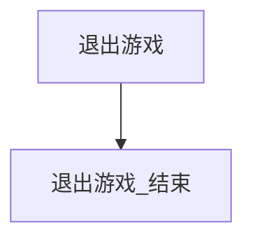

# 退出游戏

本页说明界面任务「退出游戏」。入口在 `assets/interface.json`，节点在 `assets/resource/pipeline/exit_game_task.json`，入口名 `退出游戏`。可单独跑；也可由 [一条龙](一条龙.md) 在 [找温无双](找温无双.md) 成功后经锚点 `找温无双_结束后` 调用。单独 [找温无双](找温无双.md) 不调用本任务。

## 前置条件（一条龙）

**只有一条龙前面各段都成功，并且已经认出右侧「温无双」对话条时，才会进入本任务。**

- 买药未买齐、提交未满五、第三轮失败、离开/炼药/买钱/返回/找温任一失败：都到不了本入口。
- 唯一入口：`找温无双_结束`（OCR 已命中对话条）→ 锚点 `找温无双_结束后` → `退出游戏`。
- `找温无双_结束失败` **不**走该锚点，不进本任务。

单独跑「退出游戏」无上述前置，只做空转收工，便于以后测真正退出。

## 当前状态：空转占位

**暂时不点主菜单、不点退出、不点确认。** 入口直接命中后进 `退出游戏_结束` 收工。人仍停在找温无双成功后的画面（右侧有「温无双」对话条）。

真正退出（主菜单 → 退出游戏 → 确认等）尚未实现，以后只改本流水线，不要把点击写进找温无双节点。

## 步骤（空转）

1. 入口 `退出游戏`：`DirectHit` / `DoNothing`，`next` → `退出游戏_结束`。
2. `退出游戏_结束`：`DirectHit` / `DoNothing`，`next` 为空，任务结束。

## 与一条龙的衔接

| 项 | 说明 |
| --- | --- |
| 谁调用 | 一条龙入口锚点 `"找温无双_结束后": "退出游戏"` |
| 时机 | 买药→离开→炼药→钱袋→返回→找温 **全部成功**，且 `找温无双_结束` 已认出对话条。不点对话 |
| 单独「找温无双」 | 不设该锚点，落到 `找温无双_收工` |
| 前序失败 / 找温失败 | 到不了本锚点；`找温无双_结束失败` 不进本任务 |

## 节点一览

| 节点 | 说明 |
| --- | --- |
| `退出游戏` | 入口。空转，立刻进结束 |
| `退出游戏_结束` | 收工。真正退出未实现 |

## 已知未实现

- 主菜单 / 设置入口、点「退出游戏」、确认弹窗的 ROI 与模板。
- 退出后是否还要关模拟器或 MFA，本任务不涉及。
