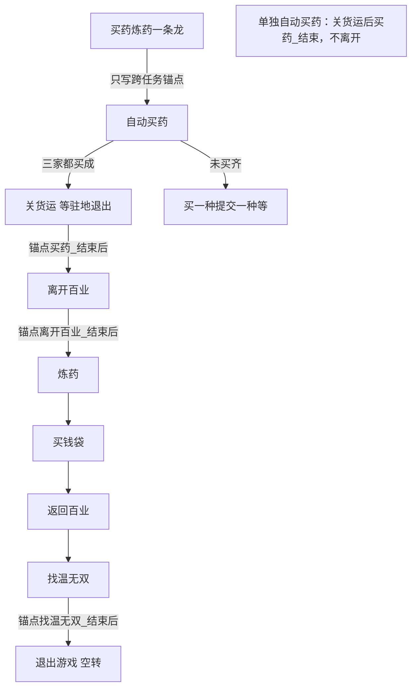

# 买药炼药一条龙

本页说明界面任务「买药炼药一条龙」：**先跑 [自动买药](自动买药.md)，三家买齐关货运后由本入口锚点接 [离开百业](离开百业.md)，再炼药、买钱袋，买钱成功后返回百业，再找温无双，最后 [退出游戏](退出游戏.md)（暂空转）**。入口与选项在 `assets/interface.json`；买药与一条龙入口在 `assets/resource/pipeline/medicine_task.json`。离开百业在 `leave_baiye_task.json`。退出游戏在 `exit_game_task.json`。炼药入口名必须是 `炼药`。

买药细节见 [自动买药](自动买药.md)。离开百业见 [离开百业](离开百业.md)。炼药细节见 [炼药](炼药.md)。买钱袋见 [买钱袋](买钱袋.md)。返回百业见 [返回百业](返回百业.md)。找人见 [找温无双](找温无双.md)。退出见 [退出游戏](退出游戏.md)。存放仍由买药在需要时调用，见 [存放原料](存放原料.md)。

## 功能概述

角色已站在温无双旁时，一条龙依次做：

1. 入口只写跨任务锚点，再 `next` 进 [自动买药](自动买药.md)（未买 / 买齐六项由自动买药初始化）。三家都买成后关货运，等到驻地「退出」。
2. 锚点 `买药_结束后` → [离开百业](离开百业.md)。再 `离开百业_结束后` → `炼药`。
3. 跑 [炼药](炼药.md)。退出界面后续 [买钱袋](买钱袋.md)。
4. 买钱成功回到主界面后，走 [返回百业](返回百业.md)。
5. 返回驻地成功后，走 [找温无双](找温无双.md)。寻到右侧对话条后不点对话。
6. **仅当上面 1–5 全部成功，且已认出「温无双」对话条**时，锚点 `找温无双_结束后` → [退出游戏](退出游戏.md)。中间任一段失败都不会进退出游戏。**当前为空转**：不点菜单、不退出，任务在此收工。

未买齐三家时，行为与单独「自动买药」相同：走「买一种提交一种」或第三轮失败，**不关货运去离开，也不进炼药，更不进退出游戏**。买药强制结束、提交未满五停在货运，同样不进。离开百业失败（`离开百业_结束失败`）不进炼药。买钱失败（`钱袋_结束失败`）不返回百业。返回百业失败（`回百业_结束失败`）不找人。找温失败（`找温无双_结束失败`）不进退出游戏。

## 前置条件

- 与 [自动买药](自动买药.md) 相同：站在温无双旁，短边 720，OCR 模型已就绪。
- **本机 Python Agent 可用**：PATH 上的 `python` 已装 `maafw==5.8.1`（或与资源一致的版本），`from maa.agent.agent_server import AgentServer` 不报错。一条龙一开就要连 Agent；未装时 MFA 会「Agent 连接重试 → Agent启动失败 → 任务失败：连接」。见 [本地开发与调试](本地开发与调试.md)。
- 离开百业成功后，画面上应出现对话条「炼药」。离开后到炼药这一段不寻路；若离开后没有炼药对话，由炼药任务自己失败或安全退出，买药侧不再补点。
- 返回驻地成功后走 [找温无双](找温无双.md)。人应在门口、脸朝正房。寻到对话条后不点，再进退出游戏空转。
- 炼药材料是否够用仍按炼药页：材料不足分支尚未实现。

## 衔接锚点

| 入口 | `买药_结束后` | `离开百业_结束后` | `钱袋_结束后` | `回百业_结束后` | `找温无双_结束后` |
| --- | --- | --- | --- | --- | --- |
| `自动买药` | 不设 → `买药_结束`（驻地主界面） | （不涉及） | （不涉及） | （不涉及） | （不涉及） |
| `买药炼药一条龙` | `离开百业` | `炼药` | `返回百业` | `找温无双` | `退出游戏` |
| 单独 `离开百业` | — | 不设 → `离开百业_结束` | — | — | — |
| 单独 `买钱袋` / `炼药` | — | — | 不设 → `钱袋_收工` | — | — |
| 单独 `返回百业` | — | — | — | 不设 → `回百业_收工` | — |
| 单独 `找温无双` | — | — | — | — | 不设 → `找温无双_收工` |

约定：

1. 未买 / 买齐六项与 `买药_进货运去哪` **只**在 `自动买药` 初始化。一条龙不抄这些锚点，只 `next` → `自动买药`。
2. `买药_结束后` → `离开百业` **只**由一条龙入口写；`自动买药` 不写该锚点，买齐关货运后停在驻地主界面（`买药_结束`）。
3. 关货运后：`买药_等驻地退出` 认出右上「退出」即已回主界面；有 `买药_结束后` 则跳转，否则 `买药_结束`。
4. `钱袋_结束` 走锚点 `钱袋_结束后`；买钱失败节点不走该锚点。`回百业_结束` 走锚点 `回百业_结束后`；`回百业_结束失败` 不找人。
5. `找温无双_结束`（已认出对话条）才走锚点 `找温无双_结束后` → `退出游戏`；`找温无双_结束失败` 与前序任一失败节点都不进退出游戏。单独找温无双不设锚点 → `找温无双_收工`。
6. `买药_结束`、`买药_强制结束`、`买药_提交未满五` 等仍直接结束或停在货运，**不要**在买药内部写死 `离开百业` 或 `退出游戏`。

## 界面任务与选项

| 项 | 说明 |
| --- | --- |
| 界面名 | `买药炼药一条龙` |
| entry | `买药炼药一条龙` |
| 选项 | 共用「买药数量」（默认买满）、「存放失败时」 |
| 单独「自动买药」 | 关货运后停在驻地主界面（`买药_结束`），不离开、不炼药 |
| 单独「离开百业」 | 从驻地主界面离开，结束后停住 |
| 单独「炼药」 / 「买钱袋」 | 买钱成功后收工，不返回百业 |
| 单独「返回百业」 | 停在驻地门口，不找温无双 |
| 单独「找温无双」 | 从驻地门口脸朝正房走进正房，寻到对话条后停住，不退出游戏 |
| 单独「退出游戏」 | 当前空转即结束；真正退出未实现 |

## 与两边任务的边界

- **不复制**买药 / 离开百业 / 炼药 / 买钱袋 / 返回百业 / 找温无双 / 退出游戏的内部节点；一条龙只写跨任务入口锚点，再进 `自动买药`。
- 炼药仍不调用买药 / 存放锚点，也不在失败时改写「已买成」标记。
- 一条龙任务过程中，已买标记与单独买药相同：只在本次任务存活。

## 节点一览（一条龙自有）

| 节点 | 说明 |
| --- | --- |
| `买药炼药一条龙` | 只写 `买药_结束后`=`离开百业`、`离开百业_结束后`=`炼药`、`钱袋_结束后`=`返回百业`、`回百业_结束后`=`找温无双`、`找温无双_结束后`=`退出游戏`；`next`=`自动买药` |
| `自动买药` | 见 [自动买药](自动买药.md)。初始化六项未买 / 买齐 |
| `炼药` → `买钱袋` → `返回百业` → `找温无双` → `退出游戏` | 见各自文档。找温后退出游戏暂空转 |

## 已知未实现

- 「返回驻地 / 确定」ROI 仍粗，待实机再收紧。
- 离开百业后到炼药对话出现的等待时间、对话条 ROI，以炼药页为准。
- 炼药正常退出仍写死进买钱袋，尚未改成 `炼药_结束后` 锚点。
- [退出游戏](退出游戏.md) 仍为空转，未接主菜单退出。
