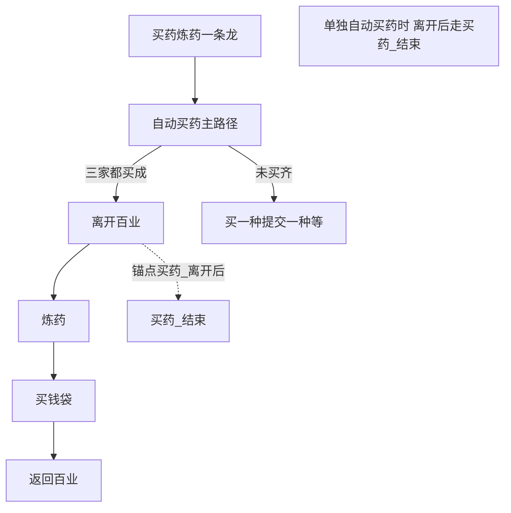

# 买药炼药一条龙

本页说明界面任务「买药炼药一条龙」：**先跑自动买药（含三家买齐后离开百业），再跑炼药，再买钱袋，买钱成功后返回百业**。入口与选项在 `assets/interface.json`；买药与一条龙入口在 `assets/resource/pipeline/medicine_task.json`。炼药入口名必须是 `炼药`。衔接用锚点 `买药_离开后`、`钱袋_结束后`。

买药细节见 [自动买药](自动买药.md)。炼药细节见 [炼药](炼药.md)。买钱袋见 [买钱袋](买钱袋.md)。返回百业见 [返回百业](返回百业.md)。存放仍由买药在需要时调用，见 [存放原料](存放原料.md)。

## 功能概述

角色已站在温月双旁时，一条龙依次做：

1. 与「自动买药」相同：进百业货运 → 必要时存放 → 清河 / 开封草药、胡牛儿枯茱萸 → 三家都买成才离开百业。
2. 确认标题不再是「百业货运」之后，不进 `买药_结束`，改走 `炼药`。
3. 炼药：点炼药 → 选逍遥散 → 循环炼到不能再炼，退出界面后续 [买钱袋](买钱袋.md)（体力 **≥200** 买金丝，否则跳过金丝只买一贯通宝）。
4. 买钱成功回到主界面后，走 [返回百业](返回百业.md)：主菜单 → 百业 →（可能过场）→ 返回驻地 → 确定 → 等右上「退出」出现（进驻地加载结束，只认不点）。

未买齐三家时，行为与单独「自动买药」相同：走「买一种提交一种」或第三轮失败，**不点退出，也不进炼药**。买药强制结束、提交未满五停在货运，同样不进炼药。买钱失败（`钱袋_结束失败`）不返回百业。

## 前置条件

- 与 [自动买药](自动买药.md) 相同：站在温月双旁，短边 720，OCR 模型已就绪。
- 离开百业成功后，画面上应出现对话条「炼药」。一条龙不寻路；若离开后没有炼药对话，由炼药任务自己失败或安全退出，买药侧不再补点。
- 炼药材料是否够用仍按炼药页：材料不足分支尚未实现。

## 衔接锚点

| 入口 | `买药_离开后` | `钱袋_结束后` |
| --- | --- | --- |
| `自动买药` | `买药_结束` | （不涉及） |
| `买药炼药一条龙` | `炼药` | `返回百业` |
| 单独 `买钱袋` / `炼药` | — | 不设锚点 → `钱袋_收工` |

约定：

1. `自动买药` 的 `anchor` 含 `"买药_离开后": "买药_结束"`。现有六项未买 / 买齐锚点不变。
2. `买药_确认已离开` 的 `next` 为锚点 `买药_离开后`。
3. 入口 `买药炼药一条龙`：`买药_离开后`=`炼药`，`钱袋_结束后`=`返回百业`。
4. `钱袋_结束` 走锚点 `钱袋_结束后`；买钱失败节点不走该锚点。
5. `买药_结束`、`买药_强制结束`、`买药_提交未满五` 等仍直接结束或停在货运，**不要**改成走 `买药_离开后`。

## 界面任务与选项

| 项 | 说明 |
| --- | --- |
| 界面名 | `买药炼药一条龙` |
| entry | `买药炼药一条龙` |
| 选项 | 共用「买药数量」「存放失败时」 |
| 单独「自动买药」 | 离开后结束，不炼药 |
| 单独「炼药」 / 「买钱袋」 | 买钱成功后收工，不返回百业 |
| 单独「返回百业」 | 保留，可从主界面单独跑 |

## 与两边任务的边界

- **不复制**买药 / 炼药 / 买钱袋 / 返回百业的内部节点；一条龙只改入口锚点。
- 炼药仍不调用买药 / 存放锚点，也不在失败时改写「已买成」标记。
- 一条龙任务过程中，已买标记与单独买药相同：只在本次任务存活。

## 节点一览（一条龙自有）

| 节点 | 说明 |
| --- | --- |
| `买药炼药一条龙` | 写未买 / 买齐六项；`买药_离开后`=`炼药`；`钱袋_结束后`=`返回百业` |
| `买药_确认已离开` | 锚点「买药_离开后」 |
| `炼药` → `买钱袋` → `返回百业` | 见各自文档 |

## 已知未实现

- 「返回驻地 / 确定」ROI 仍粗，待实机再收紧。
- 离开百业后到炼药对话出现的等待时间、对话条 ROI，以炼药页为准。
