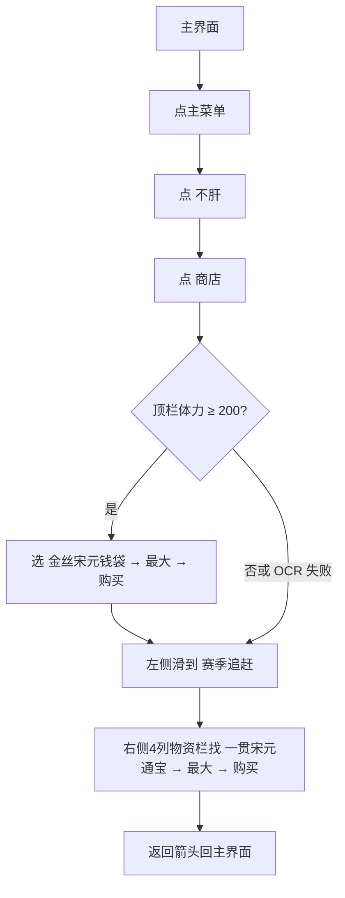
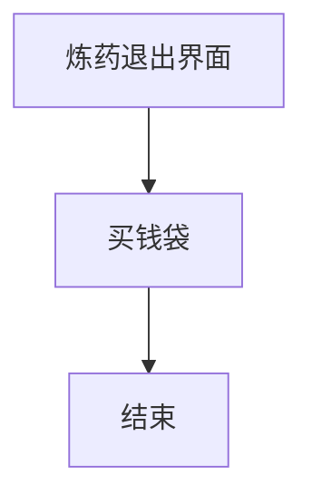

# 买钱袋

本页说明界面任务「买钱袋」。入口在 `assets/interface.json`，节点在 `assets/resource/pipeline/moneybag_task.json`，入口名 `买钱袋`。可单独跑；也可由 [炼药](炼药.md) 在退出炼药界面后调用。进商店后按顶栏体力决定是否买金丝钱袋。

流水线协议见 [任务流水线协议](https://github.com/MaaXYZ/MaaFramework/blob/main/docs/zh_cn/3.1-%E4%BB%BB%E5%8A%A1%E6%B5%81%E6%B0%B4%E7%BA%BF%E5%8D%8F%E8%AE%AE.md)。坐标与 ROI 均按控制器缩放到短边 720 后的 **1280×720** 图计算。

> **实现状态**：流水线已落地。成功结束（含**代币不够**）均点返回直到认出主菜单。购买确认弹窗仍粗。需要 Agent（`钱袋_判定是否买金丝`）。

## 目标

在主界面打开功能菜单，进入「不肝 → 商店」，再按体力分支：

1. **体力 ≥ 200**：在左侧分类「战斗养成」下选中 **金丝宋元钱袋**，点数量栏右侧最大箭头，再点 **购买**（单价为 **200 体力**；每周一补货，库存上限见物品说明）。
2. **体力 < 200**（或读不到体力）：**跳过金丝钱袋**，不点购买。
3. 无论是否买过金丝：左侧分类列向下滑，点 **赛季追赶** 文字**上方的图标**（不要只点文字）；在右侧 **物资栏**（中间 **4 列**物品格，不是单独页签）内滑动找到 **一贯宋元通宝**，点最大箭头后 **购买最大数量**。

买完用右上角返回箭头退出商店 / 不肝，回到主界面（模板可与 `medicine/返回.png` 同套，ROI 与买药返回一致）。

不负责炼药、买药、存放；失败不改写那些任务的锚点。

## 与炼药的衔接

| 项 | 说明 |
| --- | --- |
| 触发时机 | [炼药](炼药.md) 循环结束后已退出炼药界面、回到主界面时 |
| 条件 | 炼药正常退出后**始终**进 `买钱袋`；是否买金丝由买钱袋内按体力判定 |
| 衔接方式 | Custom `炼药_判定买钱袋` → `买钱袋`（读体力失败也可进买钱袋，只买通宝） |
| 体力读数 | 不得写死。商店 / 主界面顶栏可见 `当前/上限`（如 `10/2,500`，左为当前总体力）。买钱袋内用 `钱袋_读体力` + Custom `钱袋_判定是否买金丝` |

[买药炼药一条龙](买药炼药一条龙.md) 跑完炼药后是否买钱袋：与单独炼药相同。一条龙在入口设 `"钱袋_结束后": "返回百业"`，买钱成功后进 [返回百业](返回百业.md)；不必复制买钱袋节点。

## 前置

- 人在 **主界面**（大世界），能点开右上角主菜单（模板 `storage/主菜单.png`，与存放相同）。
- 短边 720；中文 OCR 已就绪；Agent 已启动（判定是否买金丝）。
- 买金丝钱袋需要当前体力 **≥ 200**（单价 200）。体力不足时跳过金丝，改买通宝。
- 「一贯宋元通宝」用另一货币（绿币/代币）；**代币不够视为成功**，跳过购买并退出回主界面。

## 步骤

起点：主界面。

1. 点右上角 **主菜单**（`storage/主菜单.png`，ROI `[1080, 0, 200, 90]`，阈值约 0.85）。
2. 在右侧功能菜单 OCR 点 **不肝**（探路 ROI 约 `[780, 150, 480, 450]`）。
3. 进入不肝后，顶栏点 **商店**（探路 ROI 约 `[0, 0, 500, 100]`）。默认左侧分类常为 **战斗养成**。
4. Custom **`钱袋_判定是否买金丝`**：OCR 顶栏体力（`钱袋_读体力`）。
   - **≥ 200**：走步骤 5（买金丝），再步骤 6–8。
   - **< 200** 或 OCR 失败：跳过步骤 5，直接步骤 6–8。
5. （仅体力够时）物品区 OCR 点 **金丝宋元钱袋**（探路 ROI 约 `[180, 100, 700, 520]`）。右侧详情出现后：
   - 点数量栏右侧 **最大箭头**：模板 `medicine/最大.png`（与买药相同，须点在方框内）；失败兜底 `(1184, 578)`。
   - OCR / 点击 **购买**（右下大按钮，ROI 约 `[980, 600, 280, 100]`）。
   - 若有确认弹窗：待实机补；不明弹窗优先取消或返回，不盲点。
6. 在左侧分类列向下滑（探路：列内 `(90, 480)`→`(90, 200)`，约 **1 次** 即可露出「赛季追赶」），OCR 认出「赛季追赶」后，点击文字**上方的图标**（`target_offset` 约 `[0, -40, 0, 0]`，或等价上移点击）。左侧其它分类（战斗养成等）同样点图标不点字。
7. **物资栏**即侧栏右侧、详情板左侧的 **4 列物品格**（无「物资」页签可点）。先认通宝；没有则在物资栏内向下滑（`(500, 580)`→`(500, 160)`，历时 700 毫秒），最多再滑 **2** 次（共约 3 页），OCR「一贯宋元通宝」/「通宝」（优先点名称上方图标区）。滑页节点的 `timeout` 须盖住选通宝 OCR；`on_error` 不要与 `next` 写成同一个选通宝节点（会触发 error handling loop）。三页仍没有则退出主界面（算成功，不买别的货）。
8. 同样点最大箭头，再点 **购买**（买最大数量）。
9. 点右上角返回箭头退出，直到认出主菜单图标（回到主界面）。模板 `medicine/返回.png` / `storage/主菜单.png`。
10. **代币不够**（右栏 OCR 到「代币不足 / 货币不足 / 余额不足 / 条件不足 / 不足」）：不点购买，视为成功，直接走退出回主界面。购买按钮点不到时同样收场为成功。

示意：

炼药侧触发：

## 实机注记（1280×720，探路）

探路当日：主界面 → 主菜单 → 不肝 → 商店 → 战斗养成下已能直接看到金丝宋元钱袋；选中后单价 **200 体力**，库存说明为每周一补货 15、最大库存 30。顶栏体力形如 `10/2,500`。商店布局为：左侧分类图标列 + 中间 **4 列物资栏** + 右侧购买详情。同屏战斗养成物资栏里也能看到「一贯宋元通宝」，但规格仍要求先切到 **赛季追赶**，再在其物资栏里买，不以战斗养成格里的同名物替代。

| 控件 | 识别 / 坐标 | 说明 |
| --- | --- | --- |
| 主菜单 | 模板 `storage/主菜单.png`，ROI `[1080, 0, 200, 90]` | 与存放相同 |
| 不肝 | OCR「不肝」，ROI 约 `[780, 150, 480, 450]` | 功能菜单第二行一带 |
| 商店页签 | OCR「商店」，ROI 约 `[0, 0, 500, 100]` | 不肝顶栏，在「不肝」右侧 |
| 体力判定 | OCR `当前/上限`，`钱袋_读体力`；Custom `钱袋_判定是否买金丝`（`agent/moneybag_action.py`） | ≥200 买金丝，否则跳过 |
| 战斗养成 | OCR「战斗养成」，左侧列约 `[0, 70, 180, 520]` | 进商店后默认常已选中 |
| 金丝宋元钱袋 | OCR「金丝宋元钱袋」，物品区约 `[180, 100, 700, 520]` | 战斗养成格内；单价 200 体力 |
| 数量最大箭头 | 模板 `medicine/最大.png`（仅方框及内部，约 23×23），ROI `[1140, 530, 100, 90]`，阈值 0.65；兜底 `(1184, 578)` | 与买药共用；须点在方框内 |
| 购买 | OCR「购买」，约 `[980, 600, 280, 100]` | 右下 |
| 左侧分类下滑 | Swipe `(90, 480)`→`(90, 200)`，约 1 次 | 露出「赛季追赶」 |
| 赛季追赶 | OCR「赛季追赶」后点文字**上方图标**（`target_offset` ≈ `[0, -40, 0, 0]`） | 点字无效/不准；图标选中后有白底高亮 |
| 战斗养成等侧栏项 | 同样：OCR 文字定位 → 点上方图标 | 与赛季追赶同一规则 |
| 物资栏 | 中间 4 列物品格，ROI 约 `[180, 100, 750, 520]` | 侧栏右侧、购买详情左侧；**不是**顶栏页签，无需 OCR「物资」 |
| 一贯宋元通宝 | OCR「一贯宋元通宝」，物资栏同上 ROI | 赛季追赶下物资栏下滑约 1 次可见；单价探路为 1000（绿币）；点格优先图标 |
| 返回箭头 | `medicine/返回.png`，ROI `[1125, 0, 145, 68]`；兜底 `(1182, 34)` | 与买药 / 炼药退出同图标 |

缺模板时优先 OCR，**勿伪造**模板图。主菜单已有现成模板可复用。

## 安全原则

- 炼药正常退出后始终进买钱袋；金丝是否购买由店内体力判定。
- 金丝钱袋：体力 **< 200** 或读不到体力时**跳过**，不盲点购买；不要用战斗养成里其它商品冒充。
- 左侧分类必须点文字**上方的图标**，只点 OCR 文字框不可靠。
- 一贯宋元通宝：必须在「赛季追赶」下的 **4 列物资栏**里买；**代币不够 = 成功**，退出回主界面。
- 成功结束必须回到主界面（认出 `storage/主菜单.png`）。
- 未知确认框：优先取消或返回，不盲点确认。
- 不调用自动买药 / 存放 / 炼药内部购买节点；失败不改写它们的状态。

## 与流水线关系

| 项 | 说明 |
| --- | --- |
| 入口 | 界面任务「买钱袋」（已登记）；入口节点名 `买钱袋` |
| 节点文件 | `assets/resource/pipeline/moneybag_task.json` |
| 自定义动作 | `钱袋_判定是否买金丝`（`agent/moneybag_action.py`） |
| 与炼药 | 炼药退出后进 `买钱袋`；店内按体力决定是否买金丝 |
| 与买药 / 存放 | 解耦。复用主菜单与返回箭头模板 |
| 与一条龙 | 买钱成功后锚点 `钱袋_结束后`→[返回百业](返回百业.md)；单独跑落到 `钱袋_收工` |

## 已知未实现

- 购买确认弹窗未单独处理。
- 主界面 / 商店顶栏体力 ROI 仍粗。
- 「不足」OCR 可能过宽，若误伤再收紧 expected。
