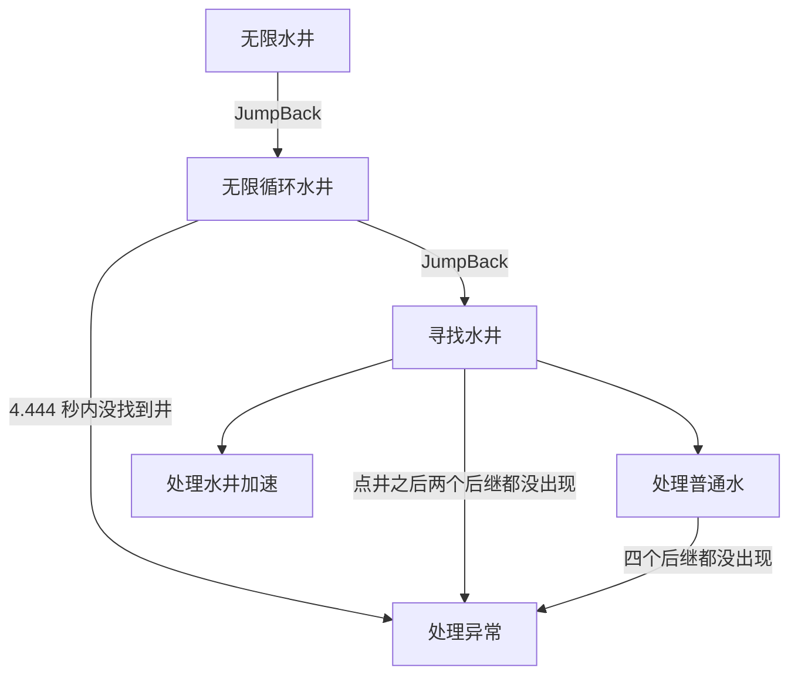
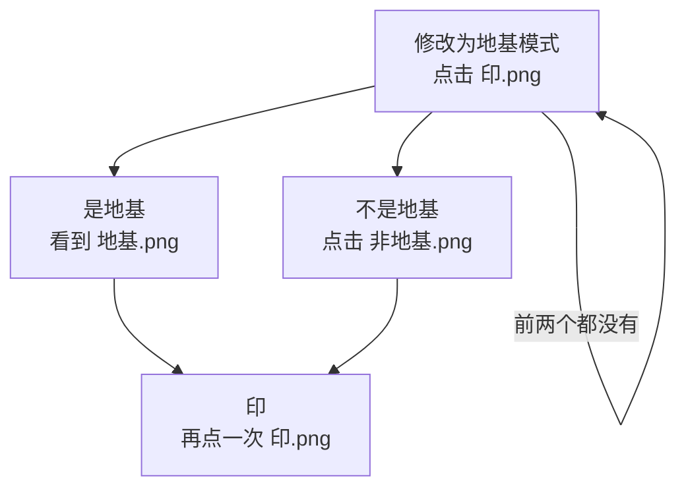
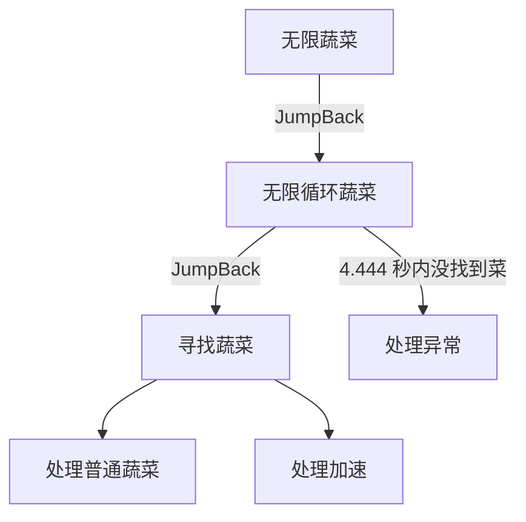

# 任务流程

> **本文范围**：只写界面里的旧任务（无限水井、修改为地基模式），以及未单独挂界面的无限蔬菜、处理异常与破解机关。[无限集英](tasks/无限集英.md)、[无限太极](tasks/无限太极.md) 与买药、存放、离开/返回百业、自动炼药、自动买钱、找温无双等另有专文，本文不展开。
>
> | 新玩法 | 专文 |
> | --- | --- |
> | 一条龙（总入口） | [一条龙](tasks/一条龙.md) |
> | 无限集英 | [无限集英](tasks/无限集英.md) |
> | 无限太极 | [无限太极](tasks/无限太极.md) |
> | 存放原料 | [存放原料](tasks/存放原料.md) |
> | 自动买药 | [自动买药](tasks/自动买药.md) |
> | 离开百业 | [离开百业](tasks/离开百业.md) |
> | 自动炼药 | [自动炼药](tasks/自动炼药.md) |
> | 自动天工 | [自动天工](tasks/自动天工.md) |
> | 自动买钱 | [自动买钱](tasks/自动买钱.md) |
> | 返回百业 | [返回百业](tasks/返回百业.md) |
> | 找温无双 | [找温无双](tasks/找温无双.md) |
> | 退出游戏 | [退出游戏](tasks/退出游戏.md) |
> | 每日号令 | [每日号令](tasks/每日号令.md)（尚未接入流水线） |

流水线协议以 MaaFramework 文档为准：[任务流水线协议](https://github.com/MaaXYZ/MaaFramework/blob/main/docs/zh_cn/3.1-%E4%BB%BB%E5%8A%A1%E6%B5%81%E6%B0%B4%E7%BA%BF%E5%8D%8F%E8%AE%AE.md)。下面只写读本仓库 JSON 时需要用到的规则，然后按**旧任务**展开。

## 节点怎么串起来

`assets/resource/pipeline/` 里的 JSON 合并成一张节点表。界面任务通过 `entry` 指定从哪个节点进入。

一次执行可以概括成：

1. 先识别当前要进入的节点。入口没有「上一个节点」，第一次识别用的就是入口自己的 `timeout`。识别失败则走入口自己的 `on_error`。
2. 命中后按 `pre_wait_freezes` → `pre_delay` → `action` → `post_wait_freezes` → `post_delay` 的顺序做事，再截图识别它的 `next`。
3. `next` 按数组顺序在同一张截图上识别，只进入第一个命中的节点。这一轮都没命中，就等待 `rate_limit` 后重新截图，直到 `timeout`。因此 `timeout` 限制的是「父节点等待某个后继出现」的时间，要拉长某个按钮的等待，应改它父节点的 `timeout`。
4. `next` 超时，或动作执行失败，改走该节点的 `on_error`。`on_error` 同样按顺序识别。
5. `[JumpBack]节点名` 表示：这个节点以及它后面的链走完（走到 `next` 为空）之后，回到父节点，父节点从自己的 `next` 开头再认一遍。错误处理还没找到可执行节点时不会回跳；一旦 `on_error` 里的节点执行成功且后续为空，跳回栈里如果还有父节点，循环会继续。
6. 没写 `recognition` 的节点是 `DirectHit`，不看画面，立刻命中。它如果排在 `next` 或 `on_error` 的前面，后面的兄弟节点不会被尝试。
7. 没写 `action` 的节点是 `DoNothing`，只负责「看到了就进入 next」，自己不点击。写了 `Click` 又没写 `target` 时，点击刚才识别到的区域。

`attach.description` 只是附注，不参与执行。下面引用它，用来对照节点作者写的意图。

## 全节点默认参数

`assets/resource/default_pipeline.json` 在资源加载时合并进每个节点。节点里写了的字段覆盖这里的值。

| 字段 | 本仓库的默认值 | 作用 |
| --- | --- | --- |
| `roi` | `[150, 30, 970, 670]` | 没单独写 ROI 的节点，只在这个矩形里识别 |
| `pre_delay` | `0` | 识别命中到动作之前的等待 |
| `post_delay` | `99` | 动作完成到识别 `next` 之前的等待 |
| `pre_wait_freezes` / `post_wait_freezes` | `0` | 不等待画面静止 |
| `rate_limit` | `444` | 每一轮 `next` 识别至少间隔 444 毫秒 |
| `timeout` | `4444` | 等待 `next` 命中的最长时间 4.444 秒 |
| `TemplateMatch.threshold` | `0.8` | 找图相似度 |
| `TemplateMatch.order_by` | `Horizontal` | 多个命中时从左到右取 |
| `OCR.threshold` | `0.6` | 文字置信度 |
| `Click.target` | `true` | 点在本节点刚识别到的位置 |

本仓库没有任何节点覆盖 `timeout`、`rate_limit`、`pre_delay`。下文只列出和上表不同的等待、ROI、阈值和排序。

ROI 是 `[x, y, w, h]`。宽或高为 `0` 表示延伸到画面对应边缘，所以 `[0, 0, 0, 0]` 是全屏。例如 `[0, 0, 0, 360]` 是从顶上开始、高度 360、一直到右边缘的横条；`[1180, 560, 0, 0]` 是从点 `(1180, 560)` 延伸到右下角。

这些坐标落在短边 720 的缩放图上。默认 ROI 的右边缘是 `150 + 970 = 1120`，下边缘是 `30 + 670 = 700`，另有节点把 `x` 写到 `1180`。这组数字对应的是大约 1280×720 的横屏画面。作者本地模拟器分辨率见 [本地开发与调试](本地开发与调试.md)。

## 无限水井

入口 `无限水井`（`well_task.json`）。附注写的是「主入口节点，持续循环寻找水井」。节点本身是 `DirectHit`，马上进入 `[JumpBack]无限循环水井`；`无限循环水井` 再进入 `[JumpBack]寻找水井`。水井被点到、后续链走完后，会回到 `无限循环水井` 再找下一口。

### 找井和点井

`寻找水井`：

- 模板 `井小.png`、`井大.png`，阈值 `0.8`，`order_by` 为 `Random`（多口井时随机点一口）
- ROI 用默认值 `[150, 30, 970, 670]`
- 动作 `Click`，`post_delay` `200`
- 父节点 `无限循环水井` 最多等 `4444` 毫秒。超时走 `无限循环水井` 的 `on_error`：`处理异常`
- 点中之后的 `next` 是 `处理普通水`、`处理水井加速`。这两个在 `4444` 毫秒内都没出现，走 `寻找水井` 的 `on_error`。列表写成 `处理异常`、`无限水井`，但 `处理异常` 是 `DirectHit`，会马上命中，后面的 `无限水井` 不会执行

`处理普通水`：

- OCR 期望文字 `普通水`，ROI `[400, 100, 200, 100]`，点击，`post_delay` `200`
- 命中后的 `next` 顺序：`理财` → `查找水井` → `直接开始` → `观看广告`
- 这四个都没出现时，`on_error` 为 `处理异常`

`查找水井` 再用 `井小.png` / `井大.png` 看井还在不在，阈值 `0.8`，动作是 `DoNothing`，`post_delay` `200`，`next` 为空。井还在就结束这一轮，靠 JumpBack 回去继续找。井已经不在画面上，则继续尝试后面的 `直接开始` 和 `观看广告`。

`处理水井加速`：

- OCR 期望 `水井加速`，ROI 为顶部横条 `[0, 0, 0, 360]`，自己不点击
- `next`：`20` → `免费完成` → `回主界面`
- 没有 `on_error`。三个后继都没出现时，这条分支失败

`无限水井` 自己的 `on_error` 也是 `无限水井`。因为 `无限循环水井` 是 `DirectHit`，入口几乎总会立刻进入它；这个 `on_error` 只覆盖入口自身识别或动作失败，不负责「屏幕上没有井」。

## 修改为地基模式

入口 `修改为地基模式`（`public_task.json`）。它不是 JumpBack 循环：点完「印」并确认地基状态后，链路会结束。

入口先在 ROI `[0, 360, 0, 0]`（画面下半部分）找 `印.png` 并点击。`4444` 毫秒内找不到则任务结束，这个节点没有 `on_error`。

点中之后在 `4444` 毫秒内按顺序看：

1. `是地基`：在默认 ROI 里找到 `地基.png`。节点不点击该图，接着进入 `印`。
2. `不是地基`：找到 `非地基.png` 并点击，然后进入 `印`。
3. `修改为地基模式`：下半屏再次出现 `印.png` 就再点一次，然后重新看上面两项。

`印` 在下半屏点击 `印.png`，`next` 为空，任务到这里成功结束。

`是地基` 和 `不是地基` 都没有单独写 ROI，搜索范围是默认的 `[150, 30, 970, 670]`。

## 无限集英

见专文 [无限集英](tasks/无限集英.md)。节点在 `yysls_task.json`。

## 无限太极

见专文 [无限太极](tasks/无限太极.md)。节点在 `yysls_task.json`。

## 无限蔬菜

定义在 `vegetable_task.json`，结构和无限水井相同，但 `interface.json` 的 `task` 没有这项，通用 UI 不会列出它。

`寻找蔬菜`：

- 模板 `vegetable/菜大.png`、`vegetable/菜小.png`，阈值 `0.8`，`order_by` 为 `Random`
- 点击，`post_delay` `200`
- 默认 ROI
- 点中后的 `next`：`处理普通蔬菜`、`处理加速`
- 父节点 `无限循环蔬菜` 超时（没找到菜）时 `on_error` 为 `处理异常`
- 点中后两个后继都没出现时，`on_error` 写成 `处理异常`、`无限蔬菜`。同样因为 `处理异常` 是 `DirectHit`，实际只会进入 `处理异常`

`处理普通蔬菜`：

- OCR 期望 `少许蔬菜`，ROI `[400, 100, 200, 100]`，点击，`post_delay` `200`
- `next`：`特殊农牧` → `查找蔬菜` → `直接开始` → `观看广告`
- 都没出现时 `on_error` 为 `处理异常`
- 附注仍写着「处理普通水选项」，和节点实际认的文字不一致

`特殊农牧`：OCR 期望 `文俶` 或 `乐闻`，`order_by` 为 `Horizontal`，ROI 顶部横条 `[0, 0, 0, 360]`，点击后 `next` 为空。

`查找蔬菜`：再次匹配两张菜的图，阈值 `0.8`，不点击，`post_delay` `200`，`next` 为空。看到菜就结束这一轮并跳回循环。

`处理加速` 定义在 `public_task.json`，蔬菜和别的流程共用：OCR 期望 `加速`（不是水井那条的「水井加速」），顶部横条，不点击，然后走 `20` → `免费完成` → `回主界面`。

`无限蔬菜` 的 `on_error` 是它自己，含义和无限水井的入口 `on_error` 相同。

## 处理异常

`处理异常` 在 `public_task.json`。无限水井、无限蔬菜在找不到目标或点开后对不上后续界面时会进这里。它是 `DirectHit`，进入后用自己的 `4444` 毫秒在下面这些节点里找第一个命中的。

`处理异常` 的 `next` 里原先有 `经验`，该行已被 `//` 注释，运行时不会进入 `经验`。

| 顺序 | 节点 | 识别 | 动作 | 命中之后 |
| --- | --- | --- | --- | --- |
| 1 | `防机关术` | OCR `防机关术`，默认 ROI | 不点击 | `破解机关` |
| 2 | `重试` | `重试.png`，下半屏 `[0, 360, 0, 0]` | 点击 | 结束 |
| 3 | `理财` | OCR `理财`，顶部横条，从左到右 | 点击 | 结束 |
| 4 | `直接开始` | OCR `直接开始`，顶部横条 | 点击 | 结束 |
| 5 | `处理普通水` | OCR `普通水`，ROI `[400, 100, 200, 100]` | 点击 | 见无限水井一节 |
| 6 | `观看广告` | OCR `观看广告`，ROI `[200, 200, 0, 350]` | 不点击 | `算了` |
| 7 | `关闭设置` | OCR `设置`，ROI `[640, 360, 0, 0]` | 不点击 | `点击...` |
| 8 | `撤销` | `撤销.png`，下半屏 | 点击 | 再找 `撤销`，否则 `完成布局` |
| 9 | `x` | `x.png`，全屏 `[0, 0, 0, 0]` | 点击 | `完成布局` |
| 10 | `关闭改布局` | `改布局.png`，左半屏 `[0, 0, 640, 0]` | 不点击 | `印` |
| 11 | `回主界面` | `更多.png`，ROI `[1180, 560, 0, 0]` | 点击 | `关闭更多`，否则 `什么也不做` |

和默认值不同的等待：

- `算了`：OCR `算了`，ROI `[200, 200, 640, 0]`，点击，`post_delay` `5555`
- `什么也不做`：`DirectHit`，`post_delay` `200`，`next` 为空
- `免费完成` 不在这张表里，但加速分支会用到它：OCR 期望是 `免费`（不是整句「免费完成」），ROI `[200, 200, 640, 700]`，自己不点击，然后 `立即完成`
- `立即完成`：OCR `立即完成`，ROI `[0, 0, 640, 700]`，点击
- `20`：模板 `20.png`，ROI `[200, 200, 640, 700]`，不点击。附注是「匹配到需要花费20补天石则回主界面」，所以看到这张图就去 `回主界面`

`回主界面` 实际点的是 `更多.png`。随后 `关闭更多` 在右半屏 `[640, 0, 0, 0]` 找 `设置.png`，找到了也不点这张图，而是进入 `点击...`，再在同一 ROI `[1180, 560, 0, 0]` 点一次 `更多.png`。若 `设置.png` 不在，列表里的下一项 `什么也不做` 是 `DirectHit`，会立刻结束这条分支。

`撤销` 可以连着点：它的 `next` 第一项就是自己，`撤销.png` 还在就继续点；不在了才点 `完成布局`（`完成.png`，ROI `[0, 360, 640, 0]`，下半屏左侧宽 640）。

`关闭设置` 命中后的 `点击...` 与 `回主界面` 用的是同一张 `更多.png` 和同一块 ROI。

## 破解机关

`verification_task.json`。没有单独的界面任务，只能从 `处理异常` → `防机关术` → `破解机关` 进来。

`破解机关` 是 `DirectHit`，`next` 为 `机关1`、`收下`。`机关1` 到 `机关12` 都是模板匹配加滑动：

- 模板 `机关/1.png` … `机关/12.png`
- 阈值和排序用默认值：`0.8`、`Horizontal`
- ROI 用默认值 `[150, 30, 970, 670]`
- `begin` 为 `true`，滑动起点是刚匹配到的那一块
- `duration` `500` 毫秒，`end_hold` `200` 毫秒
- 每一格的 `next` 都是下一格，再加上 `收下`。最后的 `机关12` 只接 `收下`

终点是固定坐标：

| 节点 | 终点 | 节点 | 终点 |
| --- | --- | --- | --- |
| `机关1` | `[426, 333]` | `机关7` | `[428, 444]` |
| `机关2` | `[508, 333]` | `机关8` | `[508, 444]` |
| `机关3` | `[602, 333]` | `机关9` | `[602, 444]` |
| `机关4` | `[686, 333]` | `机关10` | `[686, 444]` |
| `机关5` | `[766, 333]` | `机关11` | `[766, 444]` |
| `机关6` | `[856, 333]` | `机关12` | `[856, 444]` |

某一格在父节点的 `4444` 毫秒内没匹配到，就会改试同级的 `收下`。`收下` 是 OCR 期望文字 `收下`，默认 ROI，点击，`next` 为空。

## 写了但没有人引用的节点

下面这些节点在 `public_task.json` 里有定义，没有任何 `next` 或 `on_error` 指向它们，界面任务也不会从它们进入：

| 节点 | 行为 |
| --- | --- |
| `经验` | OCR `经验`，顶部横条，从左到右点击。只出现在 `处理异常` 的注释里 |
| `农牧` | OCR `农牧`，同样是顶部横条并点击 |
| `制作` | OCR `制作`，同样是顶部横条并点击 |
| `建造` | OCR `建造`，同样是顶部横条并点击 |
| `等一分钟` | `DirectHit`，`post_delay` `60000` |

集英和太极用的等待节点是 `等10秒`（定义在 `yysls_task.json`），不是 `等一分钟`；细节见专文。
