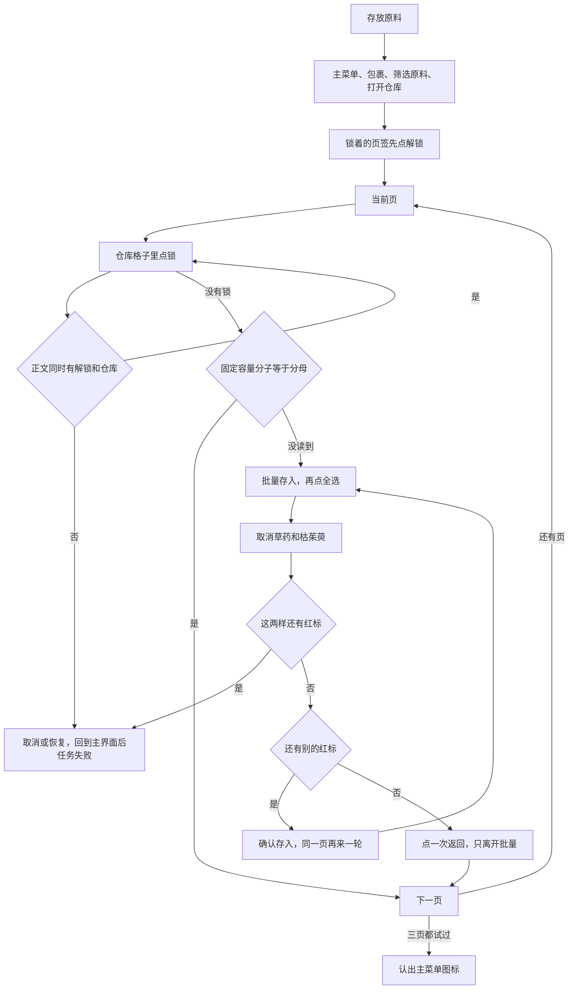
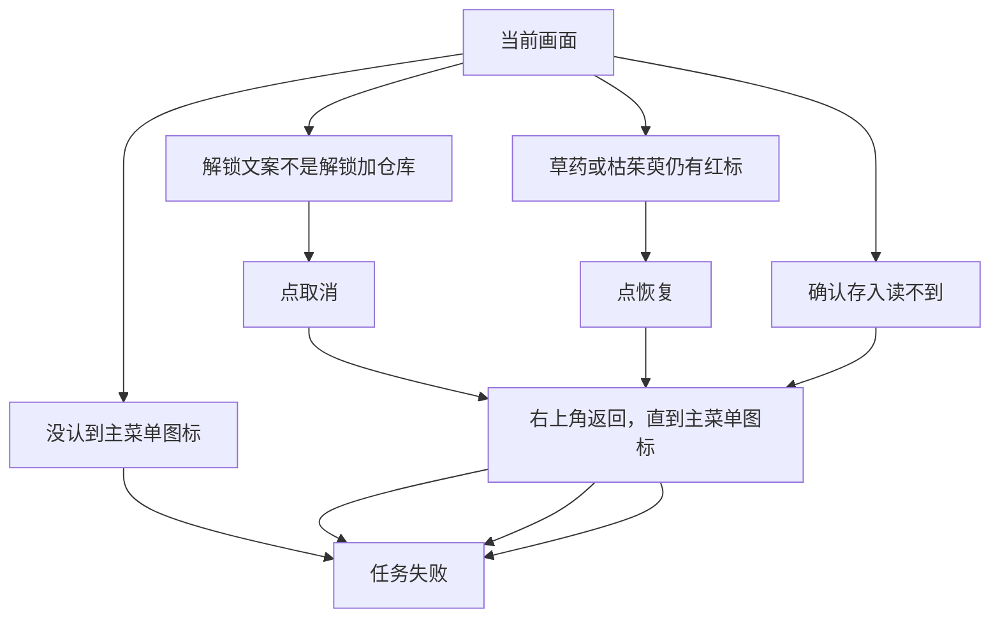

# 存放原料

本页说明界面任务「存放原料」。入口在 `assets/interface.json`，节点在 `assets/resource/pipeline/storage_task.json`，模板在 `assets/resource/image/storage/`。`medicine_task.json` 里的自动买药节点没有改。

流水线协议见 [任务流水线协议](https://github.com/MaaXYZ/MaaFramework/blob/main/docs/zh_cn/3.1-%E4%BB%BB%E5%8A%A1%E6%B5%81%E6%B0%B4%E7%BA%BF%E5%8D%8F%E8%AE%AE.md)。`next` 按顺序在同一张截图上识别，只进入第一个命中的节点；这一轮都没命中就等到 `timeout`，再走 `on_error`。没写 `recognition` 的节点是直接命中。直接命中若和识别节点排在同一个 `next` 里，前面的识别一错过，它就会在这一帧执行，不会再等。

节点没写的 `timeout`、`rate_limit`、`post_delay` 继承 `assets/resource/default_pipeline.json`：等待后继 4444 毫秒，两轮识别至少间隔 444 毫秒，动作之后再等 99 毫秒。OCR 默认阈值 0.6，模板默认阈值 0.8。下表只列节点里写出来的 ROI。

本分支没有 `docs/zh_cn/README.md`。那份索引在 PR #1（`cursor/zh-cn-project-docs-d8ea`）。两支合并后，把本页和 [自动买药](自动买药.md) 加进索引。

## 功能概述

人可以停在主界面，也可以已经打开包裹或仓库。任务把筛选调成「原料」，打开仓库。三个页签先看一遍：锁着的页签是加号，点底部「解锁」把它变成数字，这一步消耗玉环，已经同意。然后按第 1、2、3 页处理：先解开这一页格子上的锁，再批量存入。草药和枯茱萸留在背包，其它原料存进去。

当前页的固定容量已经满了，或这一轮全选之后除了草药和枯茱萸没有别的红标，就换下一页。三页都试过，回到主界面。页没满、背包里却还有别的原料时，确认存入之后会在同一页再来一轮。全选一次只选当前页空位装得下的数量。

格子上的锁弹出「是否消耗 10000 解锁6个仓库固定容量格」时，可以点金色「确认」。正文里必须同时有「解锁」和「仓库」，否则点「取消」，任务失败。页签上的「解锁」实机点下去会直接解开；若仍弹出确认框，同样要同时读到这两个词才点确认。草药或枯茱萸取消之后如果还带着红标，点「恢复」。默认再回到主界面并让任务失败。界面选项「失败时」选「停在原地（测试）」时，不点返回。两种情况都不点「确认存入」。

## 前置条件

- 角色停在主界面，或包裹、仓库已经打开。主界面要能看到右上角菜单图标。任务不寻路。已经在包裹里时，不再点菜单。
- 控制器把画面缩放到短边 720。下面的 ROI 和点击坐标都是 1280×720。提供的截图是 1600×900，先用 `INTER_AREA` 缩到 720p，再裁模板。手动点过的坐标乘 0.8。
- 中文 OCR 模型已放到 `assets/resource/model/ocr/`。加载失败时，按钮名和筛选都不会命中。
- 要存的东西在包裹的「原料」里。草药和枯茱萸可以在，任务会把它们留在背包。
- 仓库有 3 个页签，坐标 (528, 90)、(591, 90)、(664, 90)。解开的页签是数字，锁着的是加号。点加号那一页，中间出现「解锁可获得12格仓库容量」和「消耗材料」，底部「解锁」在 (591, 621)。点下去直接解开，新页有 6 个锁着的格子。格子要在批量模式外面点。点一次弹出「是否消耗 10000 解锁6个仓库固定容量格」，确认后解开 6 格。批量模式里点锁没有反应。页签和格子两种解锁都已经同意消耗。

## 完整流程

### 主路径



打开界面：

1. `存放_从屏幕开始` 先看标题。ROI `[780, 0, 280, 78]` 里有「道具」，或 `[390, 8, 230, 70]` 里有「仓库」，说明包裹或仓库已经开着，直接去核对筛选，不再点主菜单。第二次实机停在仓库里时，菜单图标不在，原先会 `存放_直接失败`。
2. 两边都没有，才 `存放_点主菜单` 在右上角匹配 `主菜单.png`。这张图也是「已经回到主界面」的判断，退出时只认不点。带红点的主界面和不带红点的主界面都能对上；仓库、背包、菜单上的返回箭头对不上。
3. `存放_点包裹` 只点文字「包裹」。读不到才点 (875, 213)。标题 ROI 里出现「道具」才继续。
4. 筛选条 `[830, 598, 150, 42]` 里已经是「原料」就不要再点开。否则点 (920, 621)，再在列表下半段 `[800, 500, 230, 110]` 里点「原料」。点完筛选条上必须再读到一次「原料」。
5. 左侧出现「固定容量」或标题「仓库」，说明仓库面板已经开着。这时不再点仓库图标：那张模板在面板开着时也会匹配，多点一次会把仓库关掉。两个都没读到才点图标，兜底坐标 (1058, 34)。

### 页签

仓库面板打开后，先走 `存放_先开页签`，再开始存。`存放_开锁第1页`、`存放_开锁第2页`、`存放_开锁第3页` 依次点三个页签。每一页：

1. `[380, 250, 500, 80]` 里认「解锁可获得」或「12格」。这是锁着的页签中间那句「解锁可获得12格仓库容量」。
2. 没读到，再在这一页页签自己的小块里认加号。第 1 页是 `[504, 68, 48, 44]`，第 2 页 `[567, 68, 48, 44]`，第 3 页 `[640, 68, 48, 44]`。加号和那句中文分成两次识别，避免跟单个符号挤在同一次批量 OCR 里。
3. 两样都没有，这一页已经是数字，看下一页。
4. 有的话点 `[430, 595, 330, 50]` 里的「解锁」，读不到就点 (591, 621)。实机点下去会直接变成数字，不出确认框。
5. 若右下角仍出现「确认」，正文 `[400, 310, 500, 80]` 里必须同时有「解锁」和「仓库」才点。确认的兜底是 (1082, 475)。文案对不上就点取消，然后按失败选项处理。
6. 当前页签上要读到数字才算解开。读不到就 `存放_页签解锁失败`，不开始存。

三页都看完，回到 `存放_第1页` 按原顺序存。新解开的一页有 6 个锁着的格子，交给下面的格子解锁。某一页存满之后才点下一页。

### 解锁

每一页先点页签，再进 `存放_解锁循环`。锁只在仓库格子 `[380, 150, 450, 480]` 里找，不搜右边的背包。点中一把之后等弹窗。

`存放_解锁文案合格` 要求同一块正文里同时读到「解锁」和「仓库」。这块 ROI 是 `[400, 310, 500, 80]`，不包含左上角的仓库标题。两个词都有，才点金色「确认」；读不到「确认」就点 (1082, 475)。文案对不上，或确认也点不下去，就点「取消」。取消的兜底坐标 (140, 474) 是从解锁弹窗截图上量的按钮范围，不是盲点购买用的坐标。

没有锁之后看容量。下面两句是搜索用的正则，分子和分母必须是同一个数。顶部的「仓库 29/60」这种总容量不在这个 ROI 里。

```regex
固定容量\s*[（(]\s*(\d+)\s*[/／]\s*\1\s*[）)]
固定容量\s*(\d+)\s*[/／]\s*\1
```

读成满页就换下一页，这时还没进批量模式，不用先点返回。800 毫秒内没读到，不把它当成满页，照常去存。后面如果全选不出红标，仍会换页。

### 存放

`存放_点批量存入` 点背包底部的「批量存入」，然后 OCR「全选」。刚进批量时全选在中间，大约 (996, 681)；选出红标之后，按钮变成「全选 / 恢复 / 确认存入」，全选会挪到左边。所以正常路径靠文字找。坐标 (996, 681) 只作为「刚刚点过批量存入、文字还没出现」的兜底。已经有红标时，这个点会落在「恢复」上，那条兜底不会走。

全选只勾当前页还空着的格子。然后：

1. 背包范围 `[790, 110, 470, 530]` 里等最多 800 毫秒，找带着红标的草药。模板裁掉了底部叠放数字，点击阈值 0.75。找到就点它，再点 (240, 656) 关掉详情。详情上的确认不点。没找到就看枯茱萸，也不点那块空白。这次实机的原料背包里没有草药，就应该这样跳过。
2. 枯茱萸同样等 800 毫秒，不再和直接命中的复核排在同一次 `next` 里。旧模板含叠放数字，实机数量是 530 时分数只有 0.716 到 0.738，低于当时的点击阈值 0.78，所以没点到；复核阈值 0.70 把它拦住了。现在 `枯茱萸_选中.png` 只留图标上半 30 行，点击阈值 0.75，复核 0.65。清掉红标之后图标变样，`枯茱萸.png` 和 `草药.png` 不参与点击。
3. `存放_复核` 按顺序看：草药仍选中、枯茱萸仍选中、还有别的红标、都没有。复核阈值 0.65，比点击的 0.75 低，红标还在就要拦住。
4. 还有别的红标，才 OCR「确认存入」。读不到这四个字就不点，也不会改点坐标。存完回到 `存放_存一轮`，同一页再全选一次。
5. 没有别的红标，说明这一页的空位没装进其它原料，或者背包里只剩草药和枯茱萸。先点一次右上角返回，只离开批量，再去下一页。第 3 页之后同样先离开批量，然后进入退出循环。

批量模式下页签点了不会换页，所以换页前必须先离开批量。按实机顺序，第一次返回只退出批量，仓库面板还在；再点才关仓库。

### 退出

安卓返回键在批量模式里没有用，任务全程不发返回键。

`存放_退出循环` 先认主菜单图标。认到了就停，动作是 `DoNothing`，避免把菜单又点开。没认到就点返回模板，最多 6 次。两张返回图分别来自仓库顶栏和功能菜单，阈值 0.82，互相不会误认，也不会认成主菜单图标。模板没有时点 (1188, 32)，最多 4 次。这个点同时落在仓库箭头和菜单箭头上。

正常路径的锚点 `存放_离开后` 是 `存放_结束`，节点走完、没有后继，任务成功。失败路径先到 `存放_失败时`。界面选项「失败时」默认是「回到主界面」：`pipeline_override` 把 `存放_失败时` 的 `next` 设成 `存放_准备失败退出`，那个节点再把 `存放_离开后` 改成 `存放_标记失败`。选「停在原地（测试）」时，`next` 改成 `存放_停在原地`，不点返回，不跑退出循环，人留在当前画面，然后同样去等哨兵，任务失败。流水线 JSON 里 `存放_失败时` 的默认 `next` 也是 `存放_准备失败退出`，不选选项时和「回到主界面」一样。

`存放_标记失败` 和 `存放_停在原地` 都去等一句画面上不会出现的话。等不到，而且它自己没有 `on_error`，流水线就返回失败。一开始主菜单、包裹标题、仓库标题都没有时，不先乱点，直接走 `存放_直接失败`。

### 失败



上图是默认「回到主界面」。选「停在原地（测试）」时，取消或恢复之后不走 `back`，直接失败。

- 包裹、筛选或仓库打不开：默认能回主界面就先回去，再失败。测试选项则停在当前画面。
- 页签或格子的解锁文案不对：只点取消。
- 草药或枯茱萸还带着红标：只点恢复，不点确认存入。
- 「确认存入」读不到：不点底部坐标。
- 页签点了解锁仍读不到数字：不开始批量存入。

## 安全规则

- 页签上的「解锁」只在读到「解锁可获得」或当前页签是加号之后才点。坐标 (591, 621) 是这一步的兜底。
- 金色「确认」只出现在已经读到「解锁」和「仓库」之后。未知弹窗点「取消」。页签解锁和格子解锁用的是两套确认节点，格子那套的 `max_hit` 不会被页签花掉。
- 「确认存入」只出现在复核之后，而且复核的前两个节点都没认出草药、枯茱萸的红标。
- 草药、枯茱萸用选中态模板。点击阈值高于截图里的第二名；复核阈值更低，用来拦住还没取消干净的红标。
- 红标模板只说明「还有别的格子被选中」。它不代替那两样的检查，因为该存的原料也带着同样的红标。
- 全选的坐标兜底不在三按钮状态下使用。
- 退出时主菜单图标只识别。返回最多大约 6 次模板加 4 次坐标。
- 失败前尽量离开批量和各级面板。任务失败靠一次必然超时的识别，而不是一个走完就算成功的空节点。

## 锚点和次数

| 锚点 | 谁设置 | 指向 |
| --- | --- | --- |
| `存放_下一页` | `存放_第1页`、`存放_第2页`、`存放_第3页` | 下一页，或 `存放_页已尽` |
| `存放_关详情后` | `存放_取消草药`、`存放_取消枯茱萸` | 取消下一件，或 `存放_复核` |
| `存放_离开后` | 入口设为 `存放_结束`；`存放_准备失败退出` 改成 `存放_标记失败` | 回到主界面之后走成功或失败 |
| `存放_开锁之后` | `存放_开锁第1页` 到 `存放_开锁第3页` | 下一页页签，或 `存放_第1页` |
| `存放_本页签数字` | 同上 | `存放_核第1页数字` 到 `存放_核第3页数字` |
| `存放_页签加号` | 同上 | `存放_第1页是加号` 到 `存放_第3页是加号` |

点锁最多 20 次。页签上的「解锁」文字和坐标各最多 4 次，页签确认坐标最多 3 次。确认存入最多 18 次。全选最多 24 次。点选中的草药、枯茱萸各最多 12 次。离开批量的那一次返回最多 4 次。最终退出的返回模板最多 6 次，坐标最多 4 次。仓库打不开时，补开最多 2 次，然后按失败选项处理。

## 节点一览

下表按 `storage_task.json` 的书写顺序。识别方式里的「直接命中」就是 `DirectHit`。`Click 识别区域` 表示点击本节点刚刚认出的文字或模板。`next` 和 `on_error` 从左到右是数组顺序。`存放_文案有解锁` 和 `存放_文案有仓库` 只被 `存放_解锁文案合格` 引用，不单独走点击。

| 节点 | 识别方式 | ROI | 动作 | next | on_error |
| --- | --- | --- | --- | --- | --- |
| `存放原料` | 直接命中 | — | DoNothing | `存放_从屏幕开始` | `存放_直接失败` |
| `存放_从屏幕开始` | 直接命中 | — | DoNothing | `存放_屏上有道具`、`存放_屏上有仓库` | `存放_点主菜单` |
| `存放_屏上有道具` | OCR 「道具」，阈值 0.5 | `[780, 0, 280, 78]` | DoNothing | `存放_检查筛选` | — |
| `存放_屏上有仓库` | OCR 「仓库」，阈值 0.45 | `[390, 8, 230, 70]` | DoNothing | `存放_检查筛选` | — |
| `存放_点主菜单` | 模板 `主菜单.png`，阈值 0.85 | `[1080, 0, 200, 90]` | Click 识别区域 | `存放_点包裹` | `存放_直接失败` |
| `存放_点包裹` | OCR 「包裹」，阈值 0.5 | `[780, 150, 480, 260]` | Click 识别区域 | `存放_确认道具` | `存放_点包裹坐标` |
| `存放_点包裹坐标` | 直接命中 | — | Click (875, 213) | `存放_确认道具` | `存放_失败时` |
| `存放_确认道具` | OCR 「道具」，阈值 0.5 | `[780, 0, 280, 78]` | DoNothing | `存放_检查筛选` | `存放_点包裹坐标` |
| `存放_检查筛选` | 直接命中 | — | DoNothing | `存放_筛选已是原料` | `存放_打开筛选` |
| `存放_筛选已是原料` | OCR 「原料」，阈值 0.5 | `[830, 598, 150, 42]` | DoNothing | `存放_确保仓库` | — |
| `存放_打开筛选` | 直接命中 | — | Click (920, 621) | `存放_点列表原料` | `存放_点原料坐标` |
| `存放_点列表原料` | OCR 「原料」，阈值 0.5 | `[800, 500, 230, 110]` | Click 识别区域 | `存放_确认原料筛选` | `存放_点原料坐标` |
| `存放_点原料坐标` | 直接命中 | — | Click (868, 587) | `存放_确认原料筛选` | `存放_失败时` |
| `存放_确认原料筛选` | OCR 「原料」，阈值 0.5 | `[830, 598, 150, 42]` | DoNothing | `存放_确保仓库` | `存放_点原料坐标` |
| `存放_确保仓库` | 直接命中 | — | DoNothing | `存放_看到固定容量`、`存放_看到仓库标题` | `存放_点仓库图标` |
| `存放_看到固定容量` | OCR 「固定容量」，阈值 0.4 | `[400, 108, 420, 85]` | DoNothing | `存放_先开页签` | — |
| `存放_看到仓库标题` | OCR 「仓库」，阈值 0.45 | `[390, 8, 230, 70]` | DoNothing | `存放_先开页签` | — |
| `存放_点仓库图标` | 模板 `仓库图标.png`，阈值 0.85 | `[980, 0, 160, 70]` | Click 识别区域 | `存放_看到固定容量`、`存放_看到仓库标题` | `存放_点仓库坐标` |
| `存放_点仓库坐标` | 直接命中 | — | Click (1058, 34) | `存放_看到固定容量`、`存放_看到仓库标题` | `存放_失败时` |
| `存放_先开页签` | 直接命中 | — | DoNothing | `存放_开锁第1页` | — |
| `存放_开锁第1页` | 直接命中 | — | Click (528, 90) | `存放_看页签锁` | — |
| `存放_开锁第2页` | 直接命中 | — | Click (591, 90) | `存放_看页签锁` | — |
| `存放_开锁第3页` | 直接命中 | — | Click (664, 90) | `存放_看页签锁` | — |
| `存放_看页签锁` | 直接命中 | — | DoNothing | `存放_读到解锁可获得` | `存放_看页签加号` |
| `存放_看页签加号` | 直接命中 | — | DoNothing | 锚点「存放_页签加号」 | 锚点「存放_开锁之后」 |
| `存放_读到解锁可获得` | OCR 「解锁可获得」、「12格仓库」、「12格」，阈值 0.4 | `[380, 250, 500, 80]` | DoNothing | `存放_点页签解锁` | `存放_点页签解锁坐标` |
| `存放_第1页是加号` | OCR 「+」，阈值 0.35 | `[504, 68, 48, 44]` | DoNothing | `存放_点页签解锁` | `存放_点页签解锁坐标` |
| `存放_第2页是加号` | OCR 「+」，阈值 0.35 | `[567, 68, 48, 44]` | DoNothing | `存放_点页签解锁` | `存放_点页签解锁坐标` |
| `存放_第3页是加号` | OCR 「+」，阈值 0.35 | `[640, 68, 48, 44]` | DoNothing | `存放_点页签解锁` | `存放_点页签解锁坐标` |
| `存放_点页签解锁` | OCR 「解锁」，阈值 0.45 | `[430, 595, 330, 50]` | Click 识别区域，最多 4 次 | `存放_等页签确认` | — |
| `存放_点页签解锁坐标` | 直接命中 | — | Click (591, 621)，最多 4 次 | `存放_等页签确认` | `存放_失败时` |
| `存放_等页签确认` | 直接命中 | — | DoNothing | `存放_页签看到确认` | `存放_核本页数字` |
| `存放_页签看到确认` | OCR 「确认」，阈值 0.45 | `[940, 440, 280, 70]` | DoNothing | `存放_页签弹窗合格` | `存放_点取消` |
| `存放_页签弹窗合格` | 同时命中 `存放_文案有解锁`、`存放_文案有仓库` | — | DoNothing | `存放_点页签确认` | `存放_点页签确认坐标` |
| `存放_点页签确认` | OCR 「确认」，阈值 0.45 | `[940, 440, 280, 70]` | Click 识别区域 | `存放_核本页数字` | `存放_点页签确认坐标` |
| `存放_点页签确认坐标` | 直接命中 | — | Click (1082, 475)，最多 3 次 | `存放_核本页数字` | `存放_失败时` |
| `存放_核本页数字` | 直接命中 | — | DoNothing | 锚点「存放_本页签数字」 | `存放_页签解锁失败` |
| `存放_核第1页数字` | OCR 一位数字，阈值 0.35 | `[504, 68, 48, 44]` | DoNothing | 锚点「存放_开锁之后」 | — |
| `存放_核第2页数字` | OCR 一位数字，阈值 0.35 | `[567, 68, 48, 44]` | DoNothing | 锚点「存放_开锁之后」 | — |
| `存放_核第3页数字` | OCR 一位数字，阈值 0.35 | `[640, 68, 48, 44]` | DoNothing | 锚点「存放_开锁之后」 | — |
| `存放_页签解锁失败` | 直接命中 | — | DoNothing | `存放_失败时` | — |
| `存放_第1页` | 直接命中 | — | Click (528, 90) | `存放_解锁循环` | — |
| `存放_第2页` | 直接命中 | — | Click (591, 90) | `存放_解锁循环` | — |
| `存放_第3页` | 直接命中 | — | Click (664, 90) | `存放_解锁循环` | — |
| `存放_页已尽` | 直接命中 | — | DoNothing | `存放_退出循环` | — |
| `存放_解锁循环` | 直接命中 | — | DoNothing | `存放_点锁`、`存放_看是否已满` | `存放_看是否已满` |
| `存放_点锁` | 模板 `锁.png`，阈值 0.85 | `[380, 150, 450, 480]` | Click 识别区域 | `存放_等解锁弹窗` | — |
| `存放_等解锁弹窗` | 直接命中 | — | DoNothing | `存放_解锁文案合格`、`存放_点取消` | `存放_点取消坐标` |
| `存放_文案有解锁` | OCR 「解锁」，阈值 0.4 | `[400, 310, 500, 80]` | DoNothing | — | — |
| `存放_文案有仓库` | OCR 「仓库」，阈值 0.4 | `[400, 310, 500, 80]` | DoNothing | — | — |
| `存放_解锁文案合格` | 同时命中 `存放_文案有解锁`、`存放_文案有仓库` | — | DoNothing | `存放_点确认解锁`、`存放_点确认解锁坐标` | `存放_点取消` |
| `存放_点确认解锁` | OCR 「确认」，阈值 0.45 | `[940, 440, 280, 70]` | Click 识别区域 | `存放_解锁循环` | — |
| `存放_点确认解锁坐标` | 直接命中 | — | Click (1082, 475) | `存放_解锁循环` | — |
| `存放_点取消` | OCR 「取消」，阈值 0.45 | `[60, 440, 180, 70]` | Click 识别区域 | `存放_失败时` | — |
| `存放_点取消坐标` | 直接命中 | — | Click (140, 474) | `存放_失败时` | — |
| `存放_看是否已满` | 直接命中 | — | DoNothing | `存放_本页已满` | `存放_存一轮` |
| `存放_本页已满` | OCR 固定容量，分子等于分母，阈值 0.4 | `[400, 108, 420, 85]` | DoNothing | 锚点「存放_下一页」 | — |
| `存放_存一轮` | 直接命中 | — | DoNothing | `存放_点批量存入`、`存放_已在批量` | `存放_补开仓库`、`存放_失败时` |
| `存放_点批量存入` | OCR 「批量存入」，阈值 0.45 | `[980, 630, 250, 85]` | Click 识别区域 | `存放_点全选` | `存放_点全选坐标` |
| `存放_已在批量` | OCR 「全选」、「确认存入」、「恢复」，阈值 0.45 | `[790, 630, 470, 85]` | DoNothing | `存放_点全选` | `存放_失败时` |
| `存放_点全选` | OCR 「全选」，阈值 0.45 | `[800, 630, 280, 85]` | Click 识别区域 | `存放_取消草药` | — |
| `存放_点全选坐标` | 直接命中 | — | Click (996, 681) | `存放_取消草药` | — |
| `存放_取消草药` | 直接命中 | — | DoNothing | `存放_点选中草药` | `存放_取消枯茱萸` |
| `存放_点选中草药` | 模板 `草药_选中.png`，阈值 0.75 | `[790, 110, 470, 530]` | Click 识别区域 | `存放_关详情` | — |
| `存放_取消枯茱萸` | 直接命中 | — | DoNothing | `存放_点选中枯茱萸` | `存放_复核` |
| `存放_点选中枯茱萸` | 模板 `枯茱萸_选中.png`，阈值 0.75 | `[790, 110, 470, 530]` | Click 识别区域 | `存放_关详情` | — |
| `存放_关详情` | 直接命中 | — | Click (240, 656) | 锚点「存放_关详情后」 | — |
| `存放_复核` | 直接命中 | — | DoNothing | `存放_草药仍选中`、`存放_枯茱萸仍选中`、`存放_还有别的原料`、`存放_本页无需再存` | — |
| `存放_草药仍选中` | 模板 `草药_选中.png`，阈值 0.65 | `[790, 110, 470, 530]` | DoNothing | `存放_选择不对` | — |
| `存放_枯茱萸仍选中` | 模板 `枯茱萸_选中.png`，阈值 0.65 | `[790, 110, 470, 530]` | DoNothing | `存放_选择不对` | — |
| `存放_还有别的原料` | 模板 `红标.png`，阈值 0.8 | `[790, 110, 470, 530]` | DoNothing | `存放_点确认存入` | `存放_失败时` |
| `存放_点确认存入` | OCR 「确认存入」，阈值 0.45 | `[1000, 630, 260, 85]` | Click 识别区域 | `存放_存一轮` | — |
| `存放_本页无需再存` | 直接命中 | — | DoNothing | `存放_离开批量再翻页` | — |
| `存放_离开批量再翻页` | 直接命中 | — | DoNothing | `存放_离开批量` | 锚点「存放_下一页」 |
| `存放_离开批量` | 模板 `返回_界面.png`、`返回_菜单.png`，阈值 0.82 | `[1080, 0, 200, 90]` | Click 识别区域 | 锚点「存放_下一页」 | — |
| `存放_选择不对` | 直接命中 | — | DoNothing | `存放_点恢复` | `存放_点恢复坐标` |
| `存放_点恢复` | OCR 「恢复」，阈值 0.45 | `[860, 630, 220, 85]` | Click 识别区域 | `存放_失败时` | — |
| `存放_点恢复坐标` | 直接命中 | — | Click (995, 681) | `存放_失败时` | — |
| `存放_失败时` | 直接命中 | — | DoNothing | `存放_准备失败退出` | — |
| `存放_停在原地` | 直接命中 | — | DoNothing | `存放_失败哨兵` | — |
| `存放_补开仓库` | 直接命中 | — | DoNothing | `存放_点仓库图标` | `存放_点仓库坐标` |
| `存放_准备失败退出` | 直接命中 | — | DoNothing | `存放_退出循环` | — |
| `存放_退出循环` | 直接命中 | — | DoNothing | `存放_主界面菜单`、`存放_点返回` | `存放_点返回坐标`、`存放_直接失败` |
| `存放_主界面菜单` | 模板 `主菜单.png`，阈值 0.85 | `[1080, 0, 200, 90]` | DoNothing | 锚点「存放_离开后」 | — |
| `存放_点返回` | 模板 `返回_界面.png`、`返回_菜单.png`，阈值 0.82 | `[1080, 0, 200, 90]` | Click 识别区域 | `存放_退出循环` | — |
| `存放_点返回坐标` | 直接命中 | — | Click (1188, 32) | `存放_退出循环` | `存放_直接失败` |
| `存放_结束` | 直接命中 | — | DoNothing | — | — |
| `存放_标记失败` | 直接命中 | — | DoNothing | `存放_失败哨兵` | — |
| `存放_直接失败` | 直接命中 | — | DoNothing | `存放_失败哨兵` | — |
| `存放_失败哨兵` | OCR 「存放原料任务失败哨兵」，阈值 0.3 | `[0, 0, 30, 24]` | DoNothing | — | — |

## 模板

模板都是 1600×900 截图缩到 1280×720 之后的无损裁剪。分数是这些截图上的 `TM_CCOEFF_NORMED`，不是实机连续画面。

| 文件 | 裁自 | 720p 范围 | 用途 |
| --- | --- | --- | --- |
| `主菜单.png` | 主界面 | (1171, 17, 32, 29) | 点开菜单，也用来判断回到主界面。带红点的画面 0.999，其它界面右上角最高约 0.51 |
| `返回_界面.png` | 仓库顶栏 | (1176, 13, 26, 32) | 仓库、背包、批量模式的返回。功能菜单上约 0.69 |
| `返回_菜单.png` | 功能菜单 | (1180, 28, 22, 26) | 功能菜单的返回。仓库顶栏上约 0.69 |
| `仓库图标.png` | 背包顶栏 | (1044, 16, 32, 30) | 仓库两个字右边的图标。面板已经打开时也会得到 1.0，批量模式里降到 0.45 以下 |
| `锁.png` | 有锁的仓库页 | (544, 343, 36, 38) | 仓库格子中心的锁。有锁的页 0.97 以上，空页和背包最高约 0.59 |
| `红标.png` | 已全选的背包 | (942, 146, 22, 40) | 选中格子右侧的红标。未选中的画面最高约 0.62 |
| `草药_选中.png` | 已全选的背包，再裁掉底部数字 | 宽 36，高 22（原 36 行里的上 22 行） | 带着红标的草药，不含叠放数字。点击阈值 0.75，复核 0.65 |
| `枯茱萸_选中.png` | 已全选的背包，再裁掉底部数字 | 宽 44，高 30（原 44 行里的上 30 行） | 带着红标的枯茱萸，不含叠放数字。实机整图对数量 530 只有 0.716–0.738。上 30 行在提供的对照里，选中约 0.809，未选中约 0.42。点击阈值 0.75，复核 0.65 |
| `草药.png` | 存完后的背包 | (842, 167, 32, 30) | 不带红标的草药。这张里没有叠放数字，没有再裁。选中和未选中都能到 0.95 以上，流水线不加载 |
| `枯茱萸.png` | 存完后的背包，裁掉底部数字 | 宽 45，高 38（原 45 行里的上 38 行，数字从第 39 行开始） | 不带红标的枯茱萸，不含叠放数字。别的格子也能对上，流水线不加载 |

`草药.png` 和 `枯茱萸.png` 留在目录里，是为了记下清掉红标之后的样子。红标会改掉整块图标的明暗，选中态模板对不上未选中的图，未选中的图也分不清该不该点。把未选中的图放进点击节点，会把已经取消的格子又点选上。

## 坐标

下表是 1280×720。1600×900 的手动点位乘 0.8。取消按钮没有单独的手动点位，是从弹窗截图的白色按钮范围量出来的。

| 操作 | 1280×720 | 1600×900 |
| --- | --- | --- |
| 主菜单图标中心 | 约 (1187, 31)，以模板为准 | (1481, 38) |
| 包裹 | OCR，兜底 (875, 213) | (1094, 266) |
| 筛选条 | (920, 621) | (1150, 776) |
| 列表里的原料 | OCR，兜底 (868, 587) | (1085, 734) |
| 仓库图标 | 模板，兜底 (1058, 34) | (1322, 42) |
| 页签 1、2、3 | (528, 90)、(591, 90)、(664, 90) | (660, 112)、(739, 112)、(830, 112) |
| 页签解锁 | OCR，兜底 (591, 621) | (739, 776) |
| 页签或格子的解锁确认 | OCR，兜底 (1082, 475) | (1352, 594) |
| 解锁取消 | OCR，兜底 (140, 474) | 弹窗左侧白按钮 |
| 刚进入时的全选 | OCR，兜底 (996, 681) | (1245, 851) |
| 选出红标后的全选 | OCR，约 (877, 681) | (1094, 851) |
| 恢复 | OCR，兜底 (995, 681) | 选中后中间那颗 |
| 确认存入 | OCR，约 (1172, 683) | (1440, 853) |
| 批量存入 | OCR，约 (1097, 681) | (1372, 850) |
| 关掉详情 | (240, 656) | (300, 820) |
| 右上角返回 | 模板，兜底 (1188, 32) | 批量或仓库 (1492, 34)，菜单 (1495, 50) |

示例格子只说明截图当时的位置：草药在第一行第一列附近，枯茱萸在第二行第二列附近。存完之后枯茱萸会挪到草药旁边。任务在整个背包范围里搜模板，不按这两格点。

## 改任务时注意

- 点击草药、枯茱萸时只引用 `草药_选中.png`、`枯茱萸_选中.png`。不要把未选中的两张图加进同一个模板列表。这两张选中图不要再把叠放数字裁回去。
- `存放_取消草药`、`存放_取消枯茱萸` 的后继里不要再放直接命中。直接命中会在模板漏一帧时立刻跳过，等不满 800 毫秒。
- 失败后要回主界面的节点，`next` 写成 `存放_失败时`，不要直接写 `存放_准备失败退出`。测试选项靠改 `存放_失败时` 停在原地。
- `存放_点确认解锁坐标` 必须留在文案合格之后。把它放到弹窗判断前面，会在正文还没读到时点确认。
- `存放_点全选坐标` 只能挂在刚点过「批量存入」的 `on_error` 上。
- `存放_主界面菜单` 保持 `DoNothing`。它和 `存放_点主菜单` 用的是同一张图。
- 换页前若还在批量模式，要先走 `存放_离开批量`。直接点页签不会换页。
- 校验时 `storage_task.json` 和 `interface.json` 需要通过 schema。`default_pipeline.json` 里原有的模板默认段仍会报错，不要为了这条任务去改它。

```bash
python tools/validate_schema.py --schema-dir deps/tools
```

## 已知问题与待验证

`34cbd3f` 在 MuMu 上跑过一次，从主界面进到批量全选。枯茱萸没点掉，复核拦住之后点了恢复，并回到主界面，任务失败。下面这一版改了模板、页签解锁、失败时停在原地，以及从已经打开的包裹接着跑。这些改动还没有再上机。

- 那一次：菜单、包裹、筛选原料、打开仓库、第 1 页格子解锁 3 次、批量存入、全选都点上了。背包 31 种原料，全选勾了 30 个，因为这一页容量不够。背包里没有草药。枯茱萸带着红标，模板分数 0.738，点击阈值 0.78 没点到，复核 0.70 拦住，点了恢复并退出。
- 同一次之后若人还停在仓库里再跑，菜单图标不在，会 `存放_直接失败`。这一版先认「道具」或「仓库」。
- 页签是加号时先点「解锁」，以及新页上那 6 个格子锁，这一版还没在模拟器里看过。实机截图里点「解锁」会直接解开，没有确认框；流水线仍准备了确认框。
- 从主界面进包裹、筛原料、打开仓库、解开格子、全选，上面那一次已经走到。确认存入、换页、正常存完回主界面，还没有跑通。
- 「固定容量」在空页上很淡，截图像素最高大约 80。OCR 可能读不到。读不到会改走全选；若把没满的页读成分子等于分母，这一页会被跳过。
- 全选若把仅有的空位都分给了排在前面的草药和枯茱萸，取消之后就看不到别的红标。任务会当成这一页没有别的原料，去下一页。后面的页若空位更多，仍可能把剩下的原料存进去。三页都这样的话，其它原料留在背包，任务仍按正常结束。
- 第一次右上角返回被写成「只退出批量、仓库还开着」。这是按退出顺序推断的：再点一次才关仓库，然后关背包，再关菜单。若某次返回直接关了仓库，下一页的页签会点空，补开仓库会从第 1 页重来。
- 未选中的枯茱萸模板在原料背包的另一个格子上也能到 0.86，所以不能用来点击。选中态现在裁掉了数字。提供的对照里，上 30 行选中约 0.809、未选中约 0.42。复核阈值是 0.65。实机若把选中态压到 0.65 以下，可能漏拦；若把未选中抬到 0.65 以上，会误判失败并点恢复。这一组新分数还没有在模拟器里再量过。
- 仓库图标在面板开着时仍然匹配。任务先认左侧文字。文字若失败，多点一次会关掉仓库，坐标兜底再点一次把它打开。
- 失败状态依赖左上角 30×24 的区域读不到那句哨兵。若 OCR 误命中，失败路径会变成成功。
- 自动买药的行为没有改。开封重试和售罄节点是否在实机复测，仍以 [自动买药](自动买药.md) 为准。
