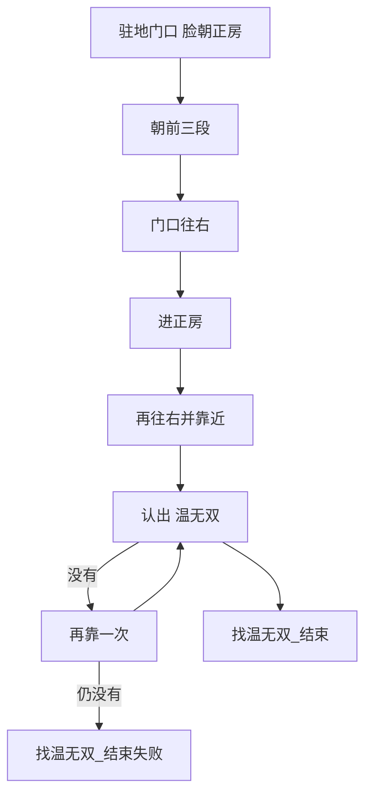

# 找温无双

本页说明界面任务「找温无双」。入口在 `assets/interface.json`，节点在 `assets/resource/pipeline/find_wen_task.json`，入口名 `找温无双`。可单独跑；也可由 [买药炼药一条龙](买药炼药一条龙.md) 在 [返回百业](返回百业.md) 成功后通过锚点 `回百业_结束后` 调用。

坐标按控制器缩放到短边 720 后的 **1280×720** 图计算。

## 目标

返回驻地之后，人在门口，脸朝正房。沿镜头前方走进正房，直到屏幕右侧出现对话条「温无双」。

摇杆方向跟着镜头。落点或朝向变了，这条线会走偏。

## 步骤

1. **朝前三段**，每段 1.5 秒。左侧从 `(200, 420)` 滑到 `(200, 220)`。过院门、趟过水渠，停在正房门左侧的门框前。水可以过。
2. **往右 0.7 秒**，从 `(180, 400)` 滑到 `(360, 400)`，正对门口。
3. **朝前 1.2 秒**走进正房。
4. **再往右 0.5 秒**（滑到 `(340, 400)`），**朝前 1 秒**，靠近柜台。
5. OCR 右侧对话条「温无双」，ROI `[730, 380, 220, 70]`，阈值 0.5。与 [自动买药](自动买药.md) 要点的是同一条。**只认不点**。
6. 没认到就再做一次第 4 步，然后再认。仍没有则 `找温无双_结束失败`，停在当前画面。

## 与一条龙的衔接

| 项 | 说明 |
| --- | --- |
| 触发 | 一条龙入口锚点 `"回百业_结束后": "找温无双"` |
| 时机 | 返回驻地成功、`回百业_结束` 之后。人在门口，脸朝正房 |
| 单独「返回百业」 | 不设该锚点，落到 `回百业_收工` |
| 返回失败 | `回百业_结束失败` 不进本任务 |
| 寻到之后 | 停在 `找温无双_结束`，不点对话，不接着再买一轮 |

## 安全原则

- 不点「温无双」，不点「退出」，不打开菜单。
- 直走会贴在门左侧，必须先往右再进门。
- 对话条出现就停，不再往前走。
