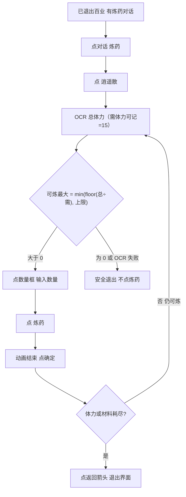

# 炼药

本页说明界面任务「炼药」。入口在 `assets/interface.json`，节点在 `assets/resource/pipeline/alchemy_task.json`，算量与小键盘输入由 Agent 自定义动作 `炼药_算量并输入`（`agent/alchemy_action.py`）完成。本任务与 [自动买药](自动买药.md)、[存放原料](存放原料.md) 解耦：不调用买药/存放节点，也不依赖它们的锚点。

流水线协议见 [任务流水线协议](https://github.com/MaaXYZ/MaaFramework/blob/main/docs/zh_cn/3.1-%E4%BB%BB%E5%8A%A1%E6%B5%81%E6%B0%B4%E7%BA%BF%E5%8D%8F%E8%AE%AE.md)。`next` 按顺序在同一张截图上识别，只进入第一个命中的节点；这一轮都没命中就等到 `timeout`，再走 `on_error`。没写 `recognition` 的节点是直接命中。

节点没写的 `timeout`、`rate_limit`、`post_delay` 继承 `assets/resource/default_pipeline.json`。OCR 默认阈值 0.6，模板默认阈值 0.8。坐标与 ROI 均按控制器缩放到短边 720 后的 **1280×720** 图计算。

> **实现状态**：流水线与 Agent 已落地。对话条「炼药」ROI、材料不足分支仍粗；跑任务需启用 `interface.json` 里的 `agent`（`python ./agent/main.py`）。

## 目标

角色已经退出百业，界面上已有「炼药」对话条时，点开炼药，选中「逍遥散」，按当前体力与材料上限循环炼到不能再炼（无体力或无材料），再退出炼药界面。不负责退出百业（那是另一条流程，例如买药三家买齐后的离开百业）。

当前只炼「逍遥散」。材料是否够用暂不校验。「总体力」可变，**不得写死**，每次运行 OCR 读取。「需要体力」（或「消耗体力」）可按药方记入：逍遥散实测为 **15**。

### 算量公式

```text
可炼最大数量 = min( floor(OCR总体力 ÷ 需要体力), 数量框上限 )
```

- `需要体力`：逍遥散记 **15**（可写死在规格/实现常量里）。
- `OCR总体力`：每次运行从体力行 OCR，禁止写死。
- `数量框上限`：数量框形态为 `当前/上限`（如 `1/99`），取斜杠右侧。
- 若可炼最大数量为 **0**，或总体力 OCR / 解析失败（读不到、需要体力为 0）：**安全退出，不点「炼药」**。

### OCR 读数示例（实机）

选中逍遥散、尚未改数量时，右下「炼药」按钮上方体力行形态为 `总体力/需要体力`：

| 含义 | 示例读数 | 说明 |
| --- | --- | --- |
| 体力行（改数量前） | `1330/15` | 左=总体力（可变），右=单份需要体力（逍遥散 15） |
| 数量框 | `1/99` | 左=当前数量，右=上限 |
| 按公式 | `min(floor(1330÷15), 99) = min(88, 99) = 88` | 应输入 88 |

改数量成功后（实机注记）：

| 项 | 改前 | 改后 |
| --- | --- | --- |
| 数量框 | `1/99` | `88/99`（1→88） |
| 体力行 | `1330/15` | `1330/1320` |

即：输入数量后，体力行右侧会变成 **`数量 × 需要体力`**（本例 `88 × 15 = 1320`），不再显示单份 15。实现时应用改数量前的读数算量，不要拿改后的右侧当「需要体力」。

## 前置

- 人已经退出百业，屏幕上能看到对话条「炼药」。本任务不寻路、不点温无双、不进百业货运、也不点「退出」。
- 控制器把画面缩放到短边 720。下面的 ROI 和点击坐标都是 1280×720 上的数。
- 中文 OCR 模型已放到 `assets/resource/model/ocr/`。加载失败时对话、药名、体力和按钮都不会命中。
- 背包里应有炼逍遥散所需材料；材料不足的分支**尚未实现**，见「已知未实现」。

## 步骤

起点：退出百业之后，界面上已有炼药对话（本任务从这里开始）。

1. 点对话条「炼药」，进入炼药界面。
2. 在列表里找到并点「逍遥散」。认不到时按实现约定翻页或安全退出（翻页细节待实机裁 ROI 后写入 JSON）。
3. OCR 右下「炼药」按钮上方的体力行：改数量前为 `总体力/需要体力`（见上表示例）。「总体力」每次 OCR；「需要体力」逍遥散可记 **15**。
4. 点数量框，弹出数字小键盘。数量框实测为 `当前/上限`（如 `1/99`）；上限一并用于算量。
5. 按 [算量公式](#算量公式) 得到可炼最大数量。材料不足暂不处理。
6. 若可炼数量为 0，或第 3 步 OCR 失败：走安全退出，**不点「炼药」**。
7. 否则在小键盘输入该数量（退格清掉默认值后再键入），点确认，再点底右「炼药」提交。
8. 等炼制动画结束，完成结算出现后点右下「确定」关掉。
9. 再读体力与数量上限：若可炼数量仍大于 0，回到第 3 步继续算量输入并提交（循环）；若为 0（体力不够一份，或材料导致上限为 0），点右上角返回箭头退出炼药界面（模板 `medicine/返回.png`，与百业货运/商店返回同一图标）。

示意：



## 实机坐标（1280×720）

下列点击坐标已实机验证，基坐标系为短边 720 缩放后的 **1280×720**。写入 JSON 时与现有 `medicine_task` / `storage_task` 一样用这套数，不要再乘 0.8。

| 控件 | 坐标 (x, y) | 实机说明 |
| --- | --- | --- |
| 数量框 | `(1090, 505)` | 点开后弹出数字小键盘；框内 OCR 为 `当前/上限` |
| 小键盘·退格 | `(1024, 452)` | 清掉默认当前数量（常为 1） |
| 小键盘·确认 | `(1158, 452)` | 输入完成后点确认，关闭小键盘 |

小键盘布局为手机式（上排 `1 2 3`，非计算器 `7 8 9`）。列 x = `1024 / 1090 / 1158`，行 y = `236 / 308 / 380 / 452`（行距 72；`8` / 退格 / 确认已实机点测，其余由同网格推导，截图标点复核对齐）：

| | x=`1024` | x=`1090` | x=`1158` |
| --- | --- | --- | --- |
| y=`236` | `1` `(1024, 236)` | `2` `(1090, 236)` | `3` `(1158, 236)` |
| y=`308` | `4` `(1024, 308)` | `5` `(1090, 308)` | `6` `(1158, 308)` |
| y=`380` | `7` `(1024, 380)` | `8` `(1090, 380)` | `9` `(1158, 380)` |
| y=`452` | 退格 `(1024, 452)` | `0` `(1090, 452)` | 确认 `(1158, 452)` |

同屏补测（1280×720，小键盘已打开、已选逍遥散时）：

| 控件 | 坐标 / ROI | 说明 |
| --- | --- | --- |
| 列表·逍遥散 | 点击 `(137, 209)`；OCR ROI `[20, 80, 420, 440]` | 左上首格 |
| 体力行 | OCR ROI `[1000, 540, 250, 70]` | 改数量前为 `总/需`；改后右侧变 `数量×需` |
| 数量框 OCR | ROI `[1040, 485, 110, 45]` | `当前/上限` |
| 底右「炼药」 | 点击 `(1138, 678)`；OCR ROI `[1000, 640, 260, 80]` | 提交按钮 |
| 完成·确定 | 点击 `(1125, 665)`；OCR ROI `[1000, 620, 260, 100]` | 炼制动画结束后的结算「确定」 |
| 右上返回箭头 | 模板 `medicine/返回.png`，ROI `[1125, 0, 145, 68]`；兜底 `(1182, 34)` | 与买药关商店/货运返回同一图标 |

对话条「炼药」ROI 仍粗（`[700, 300, 450, 350]`），离开百业后宜再收紧。缺模板时优先 OCR，**勿伪造**模板图。

## 安全原则

- 数量为 0，或总体力 OCR / 解析失败时：只安全退出，绝不点「炼药」。
- 「总体力」不得写死为固定值，必须每次运行 OCR；「需要体力」/「消耗体力」可按药方记入（逍遥散实测 15）。
- 输入数量必须是可炼最大数量：`min(floor(OCR总体力 ÷ 需要体力), 数量框上限)`；不得超出。
- 算量必须用**改数量前**的体力行（右侧为单份需要）；改后右侧变为 `数量×需要`，不能再当除数。
- 未认出「逍遥散」时：不盲点其它药方，不提交炼药。
- 每轮按可炼最大数量提交；关结算后复查，仍可炼则继续循环，耗尽（体力不够一份或上限为 0）才点返回箭头退出；不根据材料弹窗点确认。
- 不调用自动买药、存放原料的入口或锚点；失败也不改写它们的状态。
- 退出百业不在本任务范围内；本任务假定起点已在百业外且对话已在。

## 与流水线关系

| 项 | 说明 |
| --- | --- |
| 入口 | 界面任务「炼药」（`interface.json` 已登记；需 Agent） |
| 节点文件 | `assets/resource/pipeline/alchemy_task.json` |
| 自定义动作 | `炼药_算量并输入`、`炼药_耗尽则退出`、`炼药_判定买钱袋`（`agent/alchemy_action.py`） |
| 模板目录 | 暂无；优先 OCR |
| 与买药 | 解耦。买药负责进货运、买草药/枯茱萸、离开百业；炼药不复用 `medicine_task.json` 里的购买节点 |
| 与存放 | 解耦。不调用 `存放_从屏幕开始` 等节点 |
| 衔接 | 单独跑本任务时，人须已退出百业且有「炼药」对话。串联见 [买药炼药一条龙](买药炼药一条龙.md)。炼药正常退出主界面后续跑 [买钱袋](买钱袋.md)；店内体力 **≥200** 才买金丝，**<200** 只买一贯通宝 |

## 已知未实现

- 对话条「炼药」ROI 仍粗，离开百业后宜再收紧。
- 材料不足弹窗/灰按钮未单独处理；耗尽判定靠体力行与数量上限。
- 只覆盖「逍遥散」；其它药方未列入。
- 退出界面用返回箭头模板，未再认主界面。
- 算量与耗尽判定依赖 Agent；未启动 Agent 时自定义动作不会跑。
- 结束后接 [买钱袋](买钱袋.md)：Custom `炼药_判定买钱袋` 进买钱袋；是否买金丝由买钱袋内按体力判定（**<200 跳过金丝，只买一贯通宝**）。