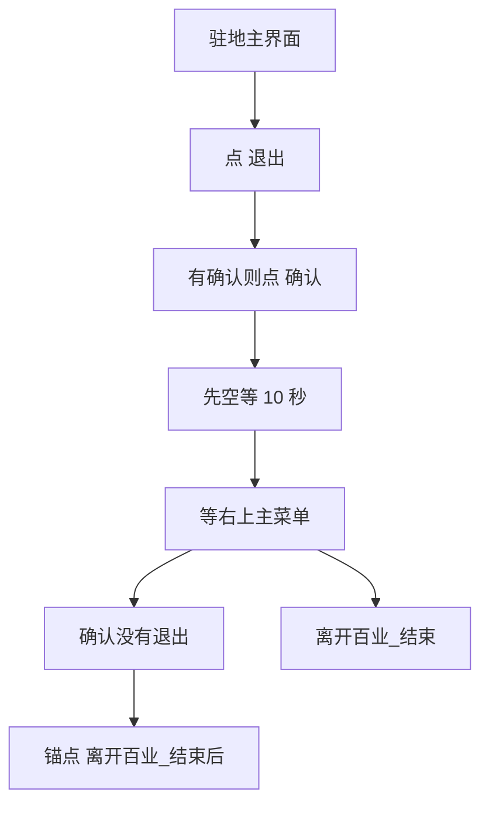

# 离开百业

本页说明界面任务「离开百业」。入口在 `assets/interface.json`，节点在 `assets/resource/pipeline/leave_baiye_task.json`，入口名 `离开百业`。可单独跑；也可由 [自动买药](自动买药.md) 在 `买药_确认已离开`（货运已关、人在驻地主界面）之后调用。

坐标与 ROI 均按控制器缩放到短边 720 后的 **1280×720** 图计算。

## 目标

人已经在百业驻地主界面（右上有 **退出**，货运界面已关掉）。点退出，有确认再点，等加载结束，直到右上出现 **主菜单**。

买药不复制这些节点。买齐后的 `买药_回到主菜单` 只负责关货运，然后 `next` 到本入口。

## 步骤

1. OCR 点右上 **退出**（ROI `[1000, 0, 280, 70]`，阈值 0.5）。读不到再点 `(1120, 36)`。与 [返回百业](返回百业.md) 等加载是同一个按钮；这里要点下去。
2. 有离开确认则 OCR 点 **确认**（ROI `[990, 440, 190, 70]`，阈值 0.45）。不要点「取消」。OCR 失败再点 `(1082, 475)`。没有弹窗也先进入下一步，不要立刻认主菜单。
3. **先空等 10 秒**（`离百业_先等加载`）。过场开头会闪出主菜单，马上认会在加载图上把离开当成结束。
4. **再等加载结束**：模板 `storage/主菜单.png`，ROI `[1080, 0, 200, 90]`，阈值 0.85。等待写在 `离百业_先等加载` 的 `timeout`（130 秒，含前面的 10 秒；加载有时超过 1 分钟）。
5. **确认没有退出**：`离百业_确认无退出` 在 `[1000, 0, 280, 70]` 取反 OCR「退出」。菜单在、退出也在，说明还在驻地或弹窗上，继续等。退出已经没有，才走锚点。

## 与买药、一条龙的衔接

| 项 | 说明 |
| --- | --- |
| 谁调用 | `买药_确认已离开` 的 `next` 是 `离开百业` |
| 锚点 | `离开百业_结束后` |
| 单独「自动买药」 | 锚点 → `买药_结束` |
| 「买药炼药一条龙」 | 锚点 → `炼药` |
| 单独「离开百业」 | 不设锚点 → `离开百业_结束` |
| 点不了退出或加载超时 | `离开百业_结束失败`，不进炼药 |

未买齐三家时买药不进 `买药_回到主菜单`，因此也不会进本流水线。

## 安全原则

- 只在货运已经关掉之后点「退出」。货运顶栏的返回箭头不是退出。
- 确认弹窗先于主菜单：弹窗会挡住顶栏。
- 点完退出和确认后先空等，再认主菜单。认到菜单后还要确认右上已经没有「退出」。加载图上没有主菜单，超时前不要当成已经离开。
- 不改写买药的已买标记。
