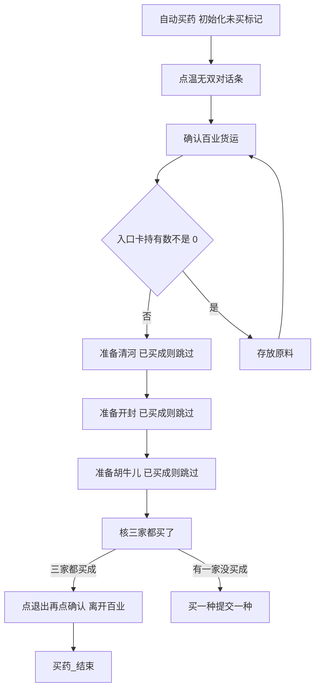
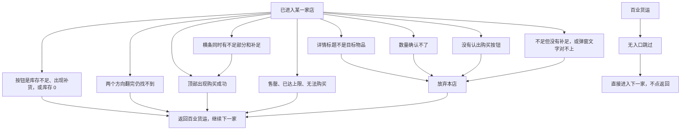

# 自动买药

本页说明界面任务「自动买药」。入口节点、选项和购买逻辑在 `assets/interface.json`，节点在 `assets/resource/pipeline/medicine_task.json`，三张模板在 `assets/resource/image/medicine/`。

流水线协议见 [任务流水线协议](https://github.com/MaaXYZ/MaaFramework/blob/main/docs/zh_cn/3.1-%E4%BB%BB%E5%8A%A1%E6%B5%81%E6%B0%B4%E7%BA%BF%E5%8D%8F%E8%AE%AE.md)。`next` 按顺序在同一张截图上识别，只进入第一个命中的节点；这一轮都没命中就等到 `timeout`，再走 `on_error`。没写 `recognition` 的节点是直接命中。直接命中如果排在 `next` 后面，前面的识别只要有一帧没命中，同一帧就会进到它，不会把父节点的 `timeout` 用完。翻页因此放在 `on_error`。`on_error` 里的直接命中节点会马上执行，排在它后面的兄弟不会再试。同一份 `next` 里有两个及以上 OCR 时，MaaFw 5.8 会把它们并成一次批量识别；批量检测认不出单独的数字「1」。数量栏因此单独成一层，并加 `only_rec`。

节点没写的 `timeout`、`rate_limit`、`post_delay` 继承 `assets/resource/default_pipeline.json`：等待后继 4444 毫秒，两轮识别至少间隔 444 毫秒，动作之后再等 99 毫秒。OCR 默认阈值 0.6，模板默认阈值 0.8。下表只列节点里写出来的 ROI；直接命中不使用 ROI。

本分支没有 `docs/zh_cn/README.md`。那份索引在 PR #1（`cursor/zh-cn-project-docs-d8ea`）。两支合并后，把本页和 [存放原料](存放原料.md) 加进索引。

## 功能概述

角色已经站在 NPC 温无双旁边时，任务先打开百业货运。生活杂物入口卡上的持有数不是 0，就先离开货运，把原料存进仓库，再回来买药。卡上都是 0，就直接买。

草药和枯茱萸是周库存，每家店每周大约只能买 99 个。因此「这家已经买成」只在认出「购买成功」时记一次，并且在本次「自动买药」任务里一直保留：领奖开下一轮货运时不要清掉。清河草药、开封草药、胡牛儿枯茱萸三家都买成之后，人还在百业货运：点右上角「退出」，弹出确认后再点「确认」，离开百业。单独「自动买药」离开后走 `买药_结束`；「买药炼药一条龙」把锚点 `买药_离开后` 指到 `炼药`，见 [买药炼药一条龙](买药炼药一条龙.md)。这和店里、货运里点「返回」不是同一条路：返回只关当前界面，不退出百业。

有一家没买成（没入口、售罄、放弃、提示闪掉没记上），胡牛儿走完后去 `买药_核三家都买了`；核不过就第一轮、第二轮走「买一种提交一种」，提交满 5 份领奖，回到温无双后再进下一轮，已买成的店直接跳过；第三轮不提交，任务失败。未买齐时不要点「退出」。买药路径不点「仓库取出」。草药和枯茱萸在存放时留在背包。

| 顺序 | 商店 | 购买目标 |
| --- | --- | --- |
| 1 | 清河生活杂物商店 | 草药 |
| 2 | 开封生活杂物商店 | 草药 |
| 3 | 胡牛儿动使杂货 | 枯茱萸 |

清河和开封的货架相同。有库存时，草药在生活杂物商店第二行第三列，枯茱萸在胡牛儿第五行第一列、单价 1000。买完之后卡片会沉到列表底部，任务不按格子点：先认当前画面上的名字，没有再往下翻。货架上若盖着「百业派对已开启」，点标题栏空白 (640, 32) 把它关掉，不点通知上的字。

三家共用界面选项「购买数量」：买 1 个，或点最大后购买。某一家的 8 张材料卡都进不去，或这件货的日库存、周库存已经是 0，就跳过这家（不记「已买成」），继续下一家。进店本身不算买成。任务关掉再开，锚点会丢，那时只能靠货架上的周库存 0 /「库存不足」跳过。

## 前置条件

- 角色站在温无双身旁，能点到屏幕右侧中部的对话条「温无双」。任务不寻路，也不点头顶名牌。
- 百业货运这一轮的 8 张材料卡里，至少有一件目标商店也卖的同名物品，否则对应那家店会被跳过。
- 控制器把画面缩放到短边 720。下面的 ROI 和点击坐标都是这张 1280×720 图上的数，不是 1600×900 截图像素。
- 中文 OCR 模型已放到 `assets/resource/model/ocr/`。加载失败时材料名和按钮都不会命中。

## 完整流程

### 主路径



对话到货运：

1. `买药_点击温无双对话条` 只在 ROI `[730, 380, 220, 70]` 里点「温无双」。大世界画面不会静止，这个节点没有 `post_wait_freezes`，点完只等 400 毫秒。OCR 失败就点坐标 (809, 413)，最多 4 次。领奖回到大世界后还要再进货运，所以比原来多留两次。
2. `买药_寻找货运选项` 先找右侧「百业货运」。没有选项时，点底部对话里的「货运订单 / 人手不足 / 少侠 / 百业之繁荣」，最多 12 次，再回来找选项。次数放宽是为了领奖后重新打开对话。
3. 标题栏认出「百业货运」、横幅处理完之后，先看材料卡。`买药_查入口名0` 到 `买药_查入口名7` 用和生活杂物候选相同的 29 个名字，只认不点。命中后 `买药_查入口数*` 在名字上方一小块里认持有数。读到 `1/2`、`2/2` 这种分子不是 0 的数，或单独一个非 0 数字，就 `买药_去存放`。`0/2` 或这一格认不出，就看下一张卡。某一序号已经没有名字，或 8 张都不是非 0，就 `买药_准备清河`，不存放。
4. 要存放时先点右上角返回离开货运，确认标题不再是「百业货运」，再从 `存放_从屏幕开始` 跑现有存放流程。单独的「存放原料」任务仍从 `存放原料` 进入，行为不变。存放失败走界面选项「存放失败时」：默认回主界面后任务失败，选「停在原地」就留在当前画面。失败后不再买药。
5. 存放正常结束时人在主界面。`买药_存放后再进货运` 重新点温无双。这一次锚点「买药_进货运去哪」已经是 `买药_准备清河`，横幅处理完直接买，不会再存放。

每一家店的公共后半段是：点一张材料卡 → 点「获取途径」 → 先认整行店名，没有就只在列表里下滑，认到才点这家店 → 等货架停稳 → 有派对横幅就点空白关掉，再认当前画面上的目标，没有才往下翻 → 核对右侧详情标题 → 确认还有库存 → 按选项设定数量 → OCR「购买」 → 处理结果 → 点右上角返回 → 确认回到百业货运且获取途径弹窗已关。返回之后走锚点 `买药_买完返回`。

材料卡只在 `[200, 350, 560, 270]` 里认，不包含右侧详情。`order_by` 是 `Vertical`：先比纵坐标，y 完全相同才比 x。`Horizontal` 是先比 x，会按列而不是按行排。清河和开封如果一个用 index 0、一个用 index 1，就会点到不同的卡。两家现在都从 `买药_生活杂物候选0` 开始，排序相同，所以是同一张卡。获取途径弹窗里会同时列出清河生活杂物商店和开封生活杂物商店。

已经凑满的卡没有「获取途径」，右侧只有「百业频道求助」。点开后认不出获取途径，就点左侧空白 (400, 300)，再试下一张。绿色完成数字和卡名不在同一个框里，流水线不靠颜色排除这些卡。弹窗里先由 `买药_认清河商店`、`买药_认开封商店` 或 `买药_认胡牛儿商店` 只认整行店名，动作是 `DoNothing`。整行必须是 `清河生活杂物商店`、`开封生活杂物商店` 或 `胡牛儿动使杂货`，前后只允许空白。厚脂肉块的首屏经常只有生活物资支援箱，商店在下面。这一屏对不上整行时，`买药_点击获取途径` 的 `on_error` 只有锚点「买药_途径没店」，下一步只有滑动节点。滑动在列表右侧空白从 (745, 560) 到 (745, 420)，y 差 140，历时 600 毫秒，`end_hold` 120 毫秒。获取途径里没有更短的滑动。滑完等 (640, 480) 停稳，再认整行，最多 3 次。认到之后才进入对应的点击节点。仍没有才关弹窗换下一张。8 张里面对得上的都会试。某一序号已经没有匹配，就不再往下试。

都进不去时走带店名的跳过节点：`买药_清河跳过_无入口`、`买药_开封跳过_无入口`、`买药_胡牛儿跳过_无入口`。人还在百业货运，这些节点不点返回，否则会退出货运。日志里能直接看到是哪一家没有入口。

已经点到店名、但商店标题对不上时，不再换剩下的卡。这时人可能已经在店里，继续点货运卡片会点错地方。按关弹窗或返回离开，然后去下一家。

进店之后不把列表拉到顶。买完的商品会沉到列表底部，固定格子对不上。先等货架坐标 (300, 400) 停稳，再看有没有「百业派对」或「点击空白区域」。有就点标题栏空白 (640, 32)，等画面停稳后再认，最多 3 次。没有横幅，或 3 次仍关不掉，才 OCR 当前画面，大约再等 1.2 秒。这一轮的 `next` 里只有物品名，没有翻页。认不到才手指从 (300, 520) 滑到 (300, 260)，滑完再等这块货架连续静止 400 毫秒，然后重新识别。向下最多 8 次，用完才反方向再翻 8 次。两个方向都没有，当作本店已买完。三家各有一套翻页节点，次数不共用。草药和枯茱萸的点击阈值是 0.35，用来认变灰的名字，这次没有改阈值。角标「库存不足」不在点击目标里。点下去之前不会在惯性里抢点：滑动节点带 `post_wait_freezes`，停稳后的下一次识别才是点击位置。

选中之后进入 `买药_确认可购买`。右下角按钮是「库存不足」、详情里出现「补货」，或日库存、周库存为 0，就走锚点「买药_已买完跳过」，点返回再去下一家，绝不点那个灰按钮。有剩余才设定数量。

跳过和买完都进入下一家。胡牛儿走完（买成返回、已买完跳过、或无入口）去 `买药_核三家都买了`：三家锚点都已是「已买成」才进 `买药_离开百业`；否则去 `买药_轮次检查`。进店、售罄、放弃本店都不改「已买成」标记，也不点「退出」。

### 三家买成标记

草药、枯茱萸每周每店额度有限（约 99）。同一局里领奖开下一轮后，已经买成的店不要再进。标记只活在这一次「自动买药」任务里；停掉再开会丢，那时靠画面上的周库存判断。

只在入口 `自动买药` 初始化一次，`买药_准备清河` 以及领奖后再进货运时都不要清掉：

| 锚点 | 初始指向 | 购买成功后指向 |
| --- | --- | --- |
| `买药_清河已买` | `买药_清河未买` | `买药_清河已买成` |
| `买药_开封已买` | `买药_开封未买` | `买药_开封已买成` |
| `买药_胡牛儿已买` | `买药_胡牛儿未买` | `买药_胡牛儿已买成` |
| `买药_清河买齐` | `买药_这家没买` | `买药_核开封买齐` |
| `买药_开封买齐` | `买药_这家没买` | `买药_核胡牛儿买齐` |
| `买药_胡牛儿买齐` | `买药_这家没买` | `买药_离开百业` |

准备节点先进「已买」锚点，再决定要不要点材料卡：

1. `买药_准备清河` 的 `next` 是锚点 `买药_清河已买`。还是 `买药_清河未买` 时，照常写入本店找货、认店名等锚点，再去 `买药_生活杂物候选0`。已经是 `买药_清河已买成` 时，直接 `买药_准备开封`，不点卡。开封、胡牛儿同样。
2. `买药_看到购买成功` 的 `next` 是锚点 `买药_本店已买`，不要直接 `买药_返回货运`。三个准备节点把它分别指到 `买药_记下清河已买`、`买药_记下开封已买`、`买药_记下胡牛儿已买`。
3. 记账节点是直接命中：改上表里对应的两个锚点，然后 `买药_返回货运`。没入口、售罄、放弃本店、`买药_等待购买成功` 等不到提示就直接返回，都不经过记账，标记不动。
4. `买药_确认商店`、`买药_确认胡牛儿` 不再改任何「结束」或「买齐」锚点。进店不等于买成。不再使用锚点 `买药_三店都没有`。
5. `买药_准备胡牛儿` 的 `买药_买完返回`，以及 `买药_胡牛儿跳过_无入口` 的 `next`，都指向 `买药_核三家都买了`。

核齐链路：

```text
买药_核三家都买了 → 锚点 买药_清河买齐
  这家没买 → 买药_轮次检查
  核开封买齐 → 锚点 买药_开封买齐
    这家没买 → 买药_轮次检查
    核胡牛儿买齐 → 锚点 买药_胡牛儿买齐
      这家没买 → 买药_轮次检查
      买药_离开百业
```

`买药_清河未买` / `买药_清河已买成` 与 `买药_这家没买` 必须是不同节点。直接命中总会命中，不能共用一个节点既去买货又去看轮次。

### 离开百业

三家都买成、人已经回到百业货运、获取途径弹窗已关之后，才走这一段。提交材料、领奖、存放、某一家没买成，都不要进这里。

`返回` 和 `退出` 不是同一个按钮：

| 按钮 | 何时点 | 结果 |
| --- | --- | --- |
| 返回 | 店里回货运，或存放前关掉货运 | 关当前界面。存放前用它离开货运，角色仍在温无双旁、仍算在百业里 |
| 退出 | 仅三家都买成之后 | 弹出是否离开百业。再点确认才真正离开 |

步骤：

1. `买药_离开百业` 先确认标题仍是「百业货运」。对不上就 `买药_强制结束`，不要盲点退出。
2. `买药_点退出` 在右上角 OCR「退出」并点击。ROI 先用 `[1000, 0, 280, 70]`，盖住顶栏右侧，尽量避开左侧标题。读不到就点 (1182, 34) 一次作为兜底；这个点和商店返回坐标相同，只允许在已经核齐、标题仍是百业货运时使用。最多 2 次。
3. `买药_等离开确认` 等弹窗。`买药_点离开确认` 在 `[990, 440, 190, 70]` OCR「确认」并点击，与兑换弹窗金色确认同一块。读不到再点 (1082, 475)。不要点「取消」。正文不必核对，因为只有核齐之后才会走到这里；若弹窗不是离开确认、OCR 又对不上，`on_error` 是 `买药_强制结束`，停在当前画面，不要再点返回把货运关掉却没离开百业。
4. `买药_确认已离开` 取反 OCR「百业货运」，标题 ROI `[90, 0, 260, 65]`。认不到这三个字，视为已经离开，走锚点 `买药_离开后`（单独买药指向 `买药_结束`；一条龙指向 `炼药`）。仍能读到就再走点退出，合计最多 2 轮。

`自动买药` 入口已初始化 `"买药_离开后": "买药_结束"`；`买药_确认已离开` 走该锚点。一条龙见 [买药炼药一条龙](买药炼药一条龙.md)。

这一段还没有实机截图。「退出」两字是否就在返回箭头的位置、离开确认是否和兑换确认同一坐标，改 JSON 前要用 1280×720 的货运顶栏和弹窗各裁一张核对。

### 失败和放弃



- 点不开温无双，或百业货运标题对不上：`买药_强制结束`。任务停在当前画面。
- 清河没有可用入口：`买药_清河跳过_无入口`，不点返回，改去开封。开封同样改去胡牛儿。胡牛儿没有入口：`买药_胡牛儿跳过_无入口`，去 `买药_核三家都买了`。三家都已买成才 `买药_离开百业`；否则 `买药_轮次检查`。未买齐不要点「退出」。
- 店里这件货库存是 0，或翻到头仍找不到：对应的已买完跳过节点，点返回后继续下一家。
- 换卡时若获取途径弹窗还开着，`买药_换卡前关弹窗` 点左侧 (400, 300) 再试下一张。这个节点不限制次数，否则 8 张卡换不完。关弹窗之前，三家各在列表内向下翻最多 3 次：`买药_清河途径上滑`、`买药_清河途径再滑`、`买药_清河途径三滑`，开封和胡牛儿各有一套，次数不共用。这 9 次加上提交路径的 3 次，起止都是 (745, 560) 和 (745, 420)，历时 600 毫秒，`end_hold` 120 毫秒。滑完的 `next` 是只认不点的整行节点。已经点了店名但商店标题对不上时，改走 `买药_关闭途径弹窗`，最多 3 次，然后确认是否回到货运，不再换卡。
- 标题、数量或「购买」按钮不符合下面的安全原则时，走 `买药_放弃本店`，只点返回，不购买。
- 商店返回模板没命中时，点 (1182, 34)，最多 2 次。还回不到货运就强制结束。

## 节点一览

下表按 `medicine_task.json` 的书写顺序，但三家各自复制的找货和数量节点收在后面两节，大表里用一行带过。`买药_生活杂物候选0` 到 `候选7`、`买药_胡牛儿候选0` 到 `候选7`，以及两边的路由，各自合成一行。识别方式里的「直接命中」就是 `DirectHit`，不看画面。`Click 识别区域` 表示点击本节点刚刚认出的文字或模板。`next` 和 `on_error` 从左到右是数组顺序，只会进入第一个命中的节点。

| 节点 | 识别方式 | ROI | 动作 | next | on_error |
| --- | --- | --- | --- | --- | --- |
| `自动买药` | 直接命中 | — | DoNothing。写入六项未买 / 买齐锚点，以及 `买药_离开后`=`买药_结束` | `买药_点击温无双对话条` | `买药_寻找货运选项` |
| `买药_点击温无双对话条` | OCR「温无双」 | `[730, 380, 220, 70]` | Click 识别区域 | `买药_寻找货运选项` | `买药_点击温无双坐标` |
| `买药_点击温无双坐标` | 直接命中 | — | Click (809, 413) | `买药_寻找货运选项` | `买药_点击百业货运坐标` |
| `买药_寻找货运选项` | 直接命中 | — | DoNothing | `买药_点击百业货运`、`买药_点对话展开选项` | `买药_点击温无双坐标`、`买药_点击百业货运坐标` |
| `买药_点击百业货运` | OCR「百业货运」 | `[840, 470, 180, 55]` | Click 识别区域 | `买药_确认货运界面` | `买药_点击百业货运坐标` |
| `买药_点对话展开选项` | OCR「货运订单」、「人手不足」、「少侠」、「百业之繁荣」 | `[300, 585, 700, 50]` | Click 识别区域 | `买药_寻找货运选项` | `买药_点击百业货运坐标` |
| `买药_点击百业货运坐标` | 直接命中 | — | Click (924, 498) | `买药_确认货运界面` | `买药_强制结束` |
| `买药_确认货运界面` | OCR「百业货运」 | `[90, 0, 260, 65]` | DoNothing | `买药_进货运看横幅` | `买药_强制结束` |
| `买药_进货运看横幅` | 直接命中 | — | DoNothing | `买药_横幅还在` | `买药_进货运之后` |
| `买药_进货运_点掉横幅` | 直接命中 | — | Click (640, 32)，最多 3 次 | `买药_横幅再看` | `买药_横幅没点掉` |
| `买药_进货运之后` | 直接命中 | — | DoNothing | 锚点「买药_进货运去哪」 | `买药_准备清河` |
| `买药_查入口名0` 至 `名7` | OCR 29 个生活杂物候选，Vertical，index 0 至 7，阈值 0.5 | `[200, 350, 560, 270]` | DoNothing | 同序号的 `买药_查入口数*` | `买药_准备清河` |
| `买药_查入口数0` 至 `数7` | OCR 非 0 持有数，阈值 0.35 | 名字框再偏移 `[-28, -44, 70, 20]` | DoNothing | `买药_去存放` | 下一张 `买药_查入口名*`，最后一张是 `买药_准备清河` |
| `买药_去存放` | 直接命中 | — | DoNothing | `买药_存前点返回` | — |
| `买药_存前点返回` | 模板 `medicine/返回.png`，阈值 0.8 | `[1125, 0, 145, 68]` | Click 识别区域 | `买药_存前标题已关` | `买药_存前点返回坐标` |
| `买药_存前点返回坐标` | 直接命中 | — | Click (1182, 34)，最多 2 次 | `买药_存前标题已关` | `存放_失败时` |
| `买药_存前标题已关` | OCR 取反，「百业货运」 | `[90, 0, 260, 65]` | DoNothing | `存放_从屏幕开始` | `买药_存前点返回坐标` |
| `买药_存放后再进货运` | 直接命中 | — | DoNothing | `买药_点击温无双对话条` | — |
| `买药_准备清河` | 直接命中 | — | DoNothing。写本店找货等锚点，不复位已买标记 | 锚点「买药_清河已买」 | `买药_清河跳过_无入口` |
| `买药_清河未买` | 直接命中 | — | DoNothing | `买药_生活杂物候选0` | — |
| `买药_清河已买成` | 直接命中 | — | DoNothing | `买药_准备开封` | — |
| `买药_准备开封` | 直接命中 | — | DoNothing。同上 | 锚点「买药_开封已买」 | `买药_开封跳过_无入口` |
| `买药_开封未买` | 直接命中 | — | DoNothing | `买药_生活杂物候选0` | — |
| `买药_开封已买成` | 直接命中 | — | DoNothing | `买药_准备胡牛儿` | — |
| `买药_准备胡牛儿` | 直接命中 | — | DoNothing。同上 | 锚点「买药_胡牛儿已买」 | `买药_胡牛儿跳过_无入口` |
| `买药_胡牛儿未买` | 直接命中 | — | DoNothing | `买药_胡牛儿候选0` | — |
| `买药_胡牛儿已买成` | 直接命中 | — | DoNothing | `买药_核三家都买了` | — |
| `买药_清河跳过_无入口` | 直接命中 | — | DoNothing | `买药_准备开封` | — |
| `买药_开封跳过_无入口` | 直接命中 | — | DoNothing | `买药_准备胡牛儿` | — |
| `买药_胡牛儿跳过_无入口` | 直接命中 | — | DoNothing | `买药_核三家都买了` | — |
| `买药_清河跳过_已买完` | 直接命中 | — | DoNothing | `买药_返回货运` | — |
| `买药_开封跳过_已买完` | 直接命中 | — | DoNothing | `买药_返回货运` | — |
| `买药_胡牛儿跳过_已买完` | 直接命中 | — | DoNothing | `买药_返回货运` | — |
| `买药_生活杂物候选0` 至 `候选7` | OCR 29 个生活杂物候选，Vertical，index 0 至 7，阈值 0.5 | `[200, 350, 560, 270]` | Click 识别区域 | `买药_点击获取途径` | `买药_换卡前关弹窗` |
| `买药_生活杂物路由1` 至 `路由7` | 直接命中 | — | DoNothing | 同序号的 `买药_生活杂物候选*` | `买药_入口用尽` |
| `买药_胡牛儿候选0` 至 `候选7` | OCR 38 个胡牛儿候选，Vertical，index 0 至 7，阈值 0.5 | `[200, 350, 560, 270]` | Click 识别区域 | `买药_点击获取途径` | `买药_换卡前关弹窗` |
| `买药_胡牛儿路由1` 至 `路由7` | 直接命中 | — | DoNothing | 同序号的 `买药_胡牛儿候选*` | `买药_入口用尽` |
| `买药_入口用尽` | 直接命中 | — | DoNothing | 锚点「买药_无入口跳过」 | `买药_结束` |
| `买药_换卡前关弹窗` | 直接命中 | — | Click (400, 300) | 锚点「买药_换下一张」 | `买药_入口用尽` |
| `买药_点击获取途径` | OCR「获取途径」 | `[790, 300, 220, 80]` | Click 识别区域 | 锚点「买药_目标商店」 | 锚点「买药_途径没店」 |
| `买药_认清河商店` | OCR 整行「清河生活杂物商店」 | `[540, 330, 230, 270]` | DoNothing | `买药_点击清河商店` | `买药_换卡前关弹窗` |
| `买药_认开封商店` | OCR 整行「开封生活杂物商店」 | `[540, 330, 230, 270]` | DoNothing | `买药_点击开封商店` | `买药_换卡前关弹窗` |
| `买药_点击清河商店` | OCR 整行「清河生活杂物商店」 | `[540, 330, 230, 270]` | Click 识别区域 | `买药_确认商店` | `买药_关闭途径弹窗` |
| `买药_点击开封商店` | OCR 整行「开封生活杂物商店」 | `[540, 330, 230, 270]` | Click 识别区域 | `买药_确认商店` | `买药_关闭途径弹窗` |
| `买药_清河途径上滑`、`买药_开封途径上滑`、`买药_胡牛儿途径上滑` | 直接命中 | — | Swipe (745, 560)→(745, 420)，600 毫秒，end_hold 120，等 (640, 480) 停稳 | 对应的认商店 | 同店的途径再滑 |
| `买药_清河途径再滑`、`买药_开封途径再滑`、`买药_胡牛儿途径再滑` | 直接命中 | — | 同上 | 对应的认商店 | 同店的途径三滑 |
| `买药_清河途径三滑`、`买药_开封途径三滑`、`买药_胡牛儿途径三滑` | 直接命中 | — | 同上 | 对应的认商店 | `买药_换卡前关弹窗` |
| `买药_认胡牛儿商店` | OCR 整行「胡牛儿动使杂货」 | `[480, 260, 420, 320]` | DoNothing | `买药_点击胡牛儿商店` | `买药_换卡前关弹窗` |
| `买药_点击胡牛儿商店` | OCR 整行「胡牛儿动使杂货」 | `[480, 260, 420, 320]` | Click 识别区域 | `买药_确认胡牛儿` | `买药_关闭途径弹窗` |
| `买药_确认商店` | OCR「生活杂物」 | `[40, 8, 240, 62]` | DoNothing | 锚点「买药_本店找货」 | `买药_关闭途径弹窗` |
| `买药_横幅还在` | OCR「百业派对」、「点击空白区域」，阈值 0.45 | `[40, 60, 1200, 560]` | DoNothing | 锚点「买药_点横幅」 | `买药_横幅没点掉` |
| `买药_横幅再看` | 直接命中 | — | DoNothing | `买药_横幅仍在` | 锚点「买药_横幅之后」 |
| `买药_横幅仍在` | OCR「百业派对」、「点击空白区域」，阈值 0.45 | `[40, 60, 1200, 560]` | DoNothing | 锚点「买药_点横幅」 | `买药_横幅没点掉` |
| `买药_横幅没点掉` | 直接命中 | — | DoNothing | 锚点「买药_横幅之后」 | — |
| `买药_清河_点掉横幅`、`买药_开封_点掉横幅`、`买药_胡牛儿_点掉横幅` | 直接命中 | — | Click (640, 32)，各最多 3 次 | `买药_横幅再看` | `买药_横幅没点掉` |
| 清河、开封的找货五节点 | 见「按店复制的找货」 | — | — | — | — |
| `买药_校验草药标题` | OCR「草药」 | `[800, 78, 250, 62]` | DoNothing | `买药_确认可购买` | `买药_放弃本店` |
| `买药_确认胡牛儿` | OCR「胡牛儿动使杂货」 | `[15, 0, 420, 72]` | DoNothing | 锚点「买药_本店找货」 | `买药_关闭途径弹窗` |
| 胡牛儿的找货五节点 | 见「按店复制的找货」 | — | — | — | — |
| `买药_校验枯茱萸标题` | OCR「枯茱萸」 | `[800, 78, 250, 62]` | DoNothing | `买药_确认可购买` | `买药_放弃本店` |
| `买药_确认可购买` | 直接命中 | — | DoNothing | `买药_按钮是库存不足`、`买药_看到补货`、`买药_库存为零`、`买药_库存还有` | `买药_设定数量` |
| `买药_按钮是库存不足` | OCR「库存不足」，阈值 0.35 | `[1080, 640, 190, 75]` | DoNothing | 锚点「买药_已买完跳过」 | `买药_放弃本店` |
| `买药_看到补货` | OCR「补货」，阈值 0.35 | `[880, 525, 360, 95]` | DoNothing | 锚点「买药_已买完跳过」 | `买药_放弃本店` |
| `买药_库存为零` | OCR 日库存或周库存为 0，阈值 0.35 | `[1000, 140, 270, 70]` | DoNothing | 锚点「买药_已买完跳过」 | `买药_放弃本店` |
| `买药_库存还有` | OCR 日库存或周库存大于 0，阈值 0.35 | `[1000, 140, 270, 70]` | DoNothing | `买药_设定数量` | `买药_设定数量` |
| `买药_设定数量` | 直接命中 | — | DoNothing | `买药_确保数量为1` | `买药_放弃本店` |
| `买药_数量已是1` | OCR `only_rec`，正则见「购买数量」 | `[1044, 548, 86, 54]` | DoNothing | `买药_点击购买` | `买药_放弃本店` |
| `买药_数量大于1` | OCR `only_rec`，正则见「购买数量」 | `[1044, 548, 86, 54]` | DoNothing | `买药_点击购买` | `买药_放弃本店` |
| `买药_数量仍是1` | OCR `only_rec`，正则见「购买数量」 | `[1044, 548, 86, 54]` | DoNothing | `买药_买满仍是1` | `买药_放弃本店` |
| `买药_买满仍是1` | 直接命中 | — | DoNothing | `买药_点击购买` | `买药_放弃本店` |
| `买药_确保数量为1` | 直接命中 | — | DoNothing | 锚点「买药_本店保1」 | `买药_输入数量1`、`买药_放弃本店` |
| `买药_输入数量1` | 直接命中 | — | DoNothing | 锚点「买药_本店输入」 | `买药_放弃本店` |
| `买药_点击最大` | 直接命中 | — | DoNothing | 锚点「买药_本店买满」 | `买药_点击最大坐标` |
| `买药_点击最大坐标` | 直接命中 | — | Click (1184, 578)，最多 3 次 | 锚点「买药_本店买满确认」 | `买药_放弃本店` |
| 三家的数量节点 | 见「按店复制的数量」 | — | — | — | — |
| `买药_点击购买` | OCR「购买」 | `[1040, 640, 220, 75]` | Click 识别区域 | `买药_处理购买结果` | `买药_放弃本店` |
| `买药_处理购买结果` | 直接命中 | — | DoNothing | `买药_看到购买成功`、`买药_兑换看到补足`、`买药_兑换看到不足部分`、`买药_点兑换取消`、`买药_购买失败`、`买药_购买确认`、`买药_无购买弹窗` | `买药_放弃本店` |
| `买药_看到购买成功` | OCR「购买成功」 | `[480, 100, 320, 70]` | DoNothing | 锚点「买药_本店已买」 | `买药_返回货运` |
| `买药_记下清河已买` | 直接命中 | — | DoNothing。`买药_清河已买`→已买成，`买药_清河买齐`→核开封 | `买药_返回货运` | — |
| `买药_记下开封已买` | 直接命中 | — | DoNothing。`买药_开封已买`→已买成，`买药_开封买齐`→核胡牛儿 | `买药_返回货运` | — |
| `买药_记下胡牛儿已买` | 直接命中 | — | DoNothing。`买药_胡牛儿已买`→已买成，`买药_胡牛儿买齐`→离开百业 | `买药_返回货运` | — |
| `买药_核三家都买了` | 直接命中 | — | DoNothing | 锚点「买药_清河买齐」 | — |
| `买药_核开封买齐` | 直接命中 | — | DoNothing | 锚点「买药_开封买齐」 | — |
| `买药_核胡牛儿买齐` | 直接命中 | — | DoNothing | 锚点「买药_胡牛儿买齐」 | — |
| `买药_这家没买` | 直接命中 | — | DoNothing | `买药_轮次检查` | — |
| `买药_兑换看到补足` | OCR「补足」 | `[400, 290, 460, 70]` | DoNothing | `买药_兑换补足后核对不足部分` | `买药_不足时点取消` |
| `买药_兑换补足后核对不足部分` | OCR「不足部分」 | `[400, 290, 460, 70]` | DoNothing | `买药_点兑换确认`、`买药_点兑换确认坐标` | `买药_不足时点取消` |
| `买药_兑换看到不足部分` | OCR「不足部分」 | `[400, 290, 460, 70]` | DoNothing | `买药_兑换确认有补足` | `买药_点兑换取消` |
| `买药_兑换确认有补足` | OCR「补足」 | `[400, 290, 460, 70]` | DoNothing | `买药_点兑换确认` | `买药_不足时点取消` |
| `买药_点兑换确认` | OCR「确认」 | `[990, 440, 190, 70]` | Click 识别区域 | `买药_等待购买成功` | `买药_点兑换确认坐标` |
| `买药_点兑换确认坐标` | 直接命中 | — | Click (1082, 475) | `买药_等待购买成功` | — |
| `买药_等待购买成功` | 直接命中 | — | DoNothing | `买药_看到购买成功` | `买药_返回货运`（不记账） |
| `买药_点兑换取消` | OCR「取消」 | `[60, 440, 180, 70]` | Click 识别区域 | `买药_放弃本店` | `买药_放弃本店` |
| `买药_不足时点取消` | OCR「取消」 | `[60, 440, 180, 70]` | Click 识别区域 | `买药_放弃本店` | `买药_点兑换取消坐标` |
| `买药_点兑换取消坐标` | 直接命中 | — | Click (140, 475) | `买药_放弃本店` | — |
| `买药_购买失败` | OCR「售罄」、「已达上限」、「无法购买」 | `[280, 160, 680, 380]` | DoNothing | `买药_关闭购买弹窗` | `买药_点击返回坐标` |
| `买药_关闭购买弹窗` | OCR「取消」、「知道了」、「关闭」 | `[280, 160, 680, 400]` | Click 识别区域 | `买药_返回货运` | `买药_点击返回坐标` |
| `买药_购买确认` | OCR「知道了」、「点击空白」 | `[280, 140, 680, 220]` | Click 识别区域 | `买药_返回货运` | `买药_点击返回坐标` |
| `买药_无购买弹窗` | OCR 取反，12 个词 | `[280, 90, 720, 430]` | DoNothing | `买药_返回货运` | `买药_点击返回坐标` |
| `买药_放弃本店` | 直接命中 | — | DoNothing | `买药_返回货运` | — |
| `买药_返回货运` | 模板 `medicine/返回.png`，阈值 0.8 | `[1125, 0, 145, 68]` | Click 识别区域 | `买药_确认回到货运` | `买药_点击返回坐标` |
| `买药_点击返回坐标` | 直接命中 | — | Click (1182, 34) | `买药_确认回到货运` | `买药_强制结束` |
| `买药_确认回到货运` | OCR「百业货运」 | `[90, 0, 260, 65]` | DoNothing | `买药_回货运看横幅` | `买药_关闭途径弹窗`、`买药_强制结束` |
| `买药_回货运看横幅` | 直接命中 | — | DoNothing | `买药_横幅还在` | `买药_货运无弹窗` |
| `买药_回货运_点掉横幅` | 直接命中 | — | Click (640, 32)，最多 3 次 | `买药_横幅再看` | `买药_横幅没点掉` |
| `买药_货运无弹窗` | OCR 取反，「清河生活杂物商店」、「开封生活杂物商店」、「胡牛儿动使杂货」 | `[520, 320, 260, 230]` | DoNothing | 锚点「买药_买完返回」 | `买药_关闭途径弹窗`、`买药_强制结束` |
| `买药_关闭途径弹窗` | 直接命中 | — | Click (400, 300) | `买药_确认回到货运` | `买药_返回货运`、`买药_强制结束` |
| `买药_轮次检查` 到 `买药_点空白关轮次` | 见「买一种提交一种」 | | | | |
| `买药_离开百业` | OCR「百业货运」 | `[90, 0, 260, 65]` | DoNothing | `买药_点退出` | `买药_强制结束` |
| `买药_点退出` | OCR「退出」，阈值 0.5 | `[1000, 0, 280, 70]` | Click 识别区域，最多 2 次 | `买药_等离开确认` | `买药_点退出坐标` |
| `买药_点退出坐标` | 直接命中 | — | Click (1182, 34)，最多 1 次 | `买药_等离开确认` | `买药_强制结束` |
| `买药_等离开确认` | 直接命中 | — | DoNothing | `买药_点离开确认` | `买药_点离开确认坐标` |
| `买药_点离开确认` | OCR「确认」，阈值 0.45 | `[990, 440, 190, 70]` | Click 识别区域 | `买药_确认已离开` | `买药_点离开确认坐标` |
| `买药_点离开确认坐标` | 直接命中 | — | Click (1082, 475) | `买药_确认已离开` | `买药_强制结束` |
| `买药_确认已离开` | OCR 取反，「百业货运」 | `[90, 0, 260, 65]` | DoNothing | 锚点「买药_离开后」 | `买药_点退出` |
| `买药_结束` | 直接命中 | — | DoNothing。单独买药离开后停；或提交未满 5 份时仍停在货运 | — | — |
| `买药_强制结束` | 直接命中 | — | DoNothing | — | — |

没写出来的等待，以 JSON 为准。和购买是否发生直接相关的几个限制是：对话展开最多 12 次；百业货运选项 OCR 最多 6 次，坐标最多 3 次；温无双坐标最多 4 次；每张材料卡等「获取途径」最多 2.5 秒，弹窗里先等店名最多 2.8 秒，三家没认到再各在列表内向下翻最多 3 次，每次滑完再等最多 2 秒；每家店向下、向上各翻 8 次，三家分开计数；确认可购买最多等 2.5 秒；当前画面认物品大约 1.2 秒，认不到才翻页；派对横幅在进货运、回货运、每家店和提交材料时各最多点 3 次空白；数量已是 1 之后等「购买」最多 4 秒，等不到就放弃；每家减号模板和减号坐标各最多 20 次；每家输入「1」最多 2 次；每家最大按钮先点一次，数量仍不大于 1 再点一次；处理购买结果最多等 4 秒。`买药_寻找货运选项` 和 `买药_处理购买结果` 的 `rate_limit` 是 400 毫秒，`买药_确认可购买` 是 300 毫秒。数量是不是 1 的那一层是 250 毫秒。看横幅的那一层是 200 毫秒。

`max_hit` 按节点名计，整段任务共用同一个计数。清河把「向下翻 8 次」用完之后，如果开封还指向同一个节点，开封就无法再往下翻，会把「没翻到」当成售罄。所以找货、减号、输入和买满核对都按店复制，前缀是 `买药_清河_`、`买药_开封_`、`买药_胡牛儿_`。界面覆盖仍然指向不带店名的 `买药_确保数量为1`、`买药_输入数量1`、`买药_点击最大`、`买药_点击最大坐标`，这四个是直接命中的入口，进店前由准备节点把锚点指到该店的副本。

`买药_无购买弹窗` 取反的 12 个词是：确定、确认、取消、知道了、不足部分、补足、手动兑换、本赛季不再提醒、售罄、无法购买、点击空白、购买成功。这些字都没出现，才当作没有弹窗并返回。

候选节点点中之后写入锚点「买药_换下一张」：生活杂物候选 i 指向 `买药_生活杂物路由` 后面那一张（候选 0 指向路由 1），候选 7 指向 `买药_入口用尽`。胡牛儿同样。`max_hit` 为 4，清河和开封会再点同一张卡。路由认不出这个序号时，直接 `买药_入口用尽`，不再往更高的序号试，因为后面的 index 也不会有匹配。

准备节点在「未买」分支进店前写入下面这些锚点，并写入「买药_本店已买」指向该店的记账节点。候选节点只改「买药_换下一张」，不覆盖另外的锚点。准备节点不写、也不清「已买 / 买齐」六项；那六项只在 `自动买药` 入口初始化，只在记账节点改写。`买药_确认商店` 和 `买药_确认胡牛儿` 只进本店找货，不改结束相关锚点。开封确认走的是同一个 `买药_确认商店`。`买药_胡牛儿买齐` 成功后指向 `买药_离开百业`，不要直接 `买药_结束`。

| 准备节点 | 买药_目标商店 | 买药_途径没店 | 买药_买完返回 | 买药_无入口跳过 | 买药_已买完跳过 | 买药_本店已买 |
| --- | --- | --- | --- | --- | --- | --- |
| `买药_准备清河` | `买药_认清河商店` | `买药_清河途径上滑` | `买药_准备开封` | `买药_清河跳过_无入口` | `买药_清河跳过_已买完` | `买药_记下清河已买` |
| `买药_准备开封` | `买药_认开封商店` | `买药_开封途径上滑` | `买药_准备胡牛儿` | `买药_开封跳过_无入口` | `买药_开封跳过_已买完` | `买药_记下开封已买` |
| `买药_准备胡牛儿` | `买药_认胡牛儿商店` | `买药_胡牛儿途径上滑` | `买药_核三家都买了` | `买药_胡牛儿跳过_无入口` | `买药_胡牛儿跳过_已买完` | `买药_记下胡牛儿已买` |

| 准备节点 | 本店找货 | 本店点货 | 本店保1 | 本店输入 | 本店买满 | 本店买满确认 |
| --- | --- | --- | --- | --- | --- | --- |
| `买药_准备清河` | `买药_清河_等货架` | `买药_清河_点货` | `买药_清河_确保数量为1` | `买药_清河_输入数量1` | `买药_清河_点击最大` | `买药_清河_确认买满` |
| `买药_准备开封` | `买药_开封_等货架` | `买药_开封_点货` | `买药_开封_确保数量为1` | `买药_开封_输入数量1` | `买药_开封_点击最大` | `买药_开封_确认买满` |
| `买药_准备胡牛儿` | `买药_胡牛儿_等货架` | `买药_胡牛儿_点货` | `买药_胡牛儿_确保数量为1` | `买药_胡牛儿_输入数量1` | `买药_胡牛儿_点击最大` | `买药_胡牛儿_确认买满` |

### 按店复制的找货

三套字段相同。下表的「本店」换成 `买药_清河_`、`买药_开封_` 或 `买药_胡牛儿_`。清河和开封点击「草药」，ROI `[40, 150, 700, 480]`，`next` 是 `买药_校验草药标题`。胡牛儿点击「枯茱萸」，ROI `[40, 140, 720, 500]`，`next` 是 `买药_校验枯茱萸标题`。阈值 0.35，`order_by` 为 Vertical。

滑动之后等坐标 (300, 400) 连续静止 400 毫秒，最多等 1200 毫秒，再回到「本店等货架」重新识别。点击之后等详情标题附近 (900, 110) 停稳，再做标题校验。不在点击节点上加 `pre_wait_freezes`，否则点的是滑动过程中那一帧的旧位置。

| 节点 | 识别方式 | 动作 | next | on_error |
| --- | --- | --- | --- | --- |
| 本店等货架 | 直接命中 | DoNothing。写入锚点「买药_点横幅」= 本店点掉横幅，「买药_横幅之后」= 本店点货 | `买药_横幅还在` | 本店点货 |
| 本店点货 | 直接命中 | DoNothing | 本店点击物品 | 本店向下翻、本店向上翻、锚点「买药_已买完跳过」 |
| 本店点击草药或枯茱萸 | OCR 物品名 | Click 识别区域 | 对应的标题校验 | `买药_放弃本店` |
| 本店向下翻 | 直接命中 | Swipe (300, 520)→(300, 260)，最多 8 次 | 本店等货架 | 本店向上翻 |
| 本店向上翻 | 直接命中 | Swipe (300, 260)→(300, 520)，最多 8 次 | 本店等货架 | 锚点「买药_已买完跳过」 |

`本店点货` 的 `timeout` 约 1.2 秒，`rate_limit` 200 毫秒。物品就在第一屏时，第一次认出就点，不会先向下空翻 8 次。向下翻的次数用完后，同一次 `on_error` 里的向上翻才会执行。向上翻也用完，才走已买完跳过。

派对横幅自己不会消失，要点空白处。`买药_横幅还在` 和 `买药_横幅仍在` 认「百业派对」或「点击空白区域」，ROI `[40, 60, 1200, 560]`，盖住货架和货运材料卡，不盖标题栏。命中后点 (640, 32)，再等全屏连续静止 400 毫秒，然后重新识别。还在就再点，每个点掉节点最多 3 次。用完进入 `买药_横幅没点掉`，接着走锚点「买药_横幅之后」：店里是继续找货，刚进货运是去清河，回到货运是去 `买药_货运无弹窗`。不点横幅上的字，避免打开派对。

(640, 32) 取自 1280×720 的生活杂物截图（货架在顶、在中）和百业货运截图。y 8–40、x 320–800 这一条是平的深色顶栏：店内标准差约 1.5，货运约 3。标题在左侧，生活杂物大约到 x 280，百业货运大约到 x 350。返回箭头在右上角，大约 x 1120–1280、(1182, 34)。货架格子从 y 150 左右开始，货运材料卡从 y 350 左右开始。数量栏在 y 575 附近，购买按钮在 y 670 附近。关获取途径用的 (400, 300) 落在货架或材料卡上，不能拿来关横幅。

### 按店复制的数量

买 1 个时，`买药_确保数量为1` 只转到「本店确保数量为1」。这一层的 `next` 只有 `买药_数量已是1`，不再放「库存不足」和「补货」。售罄已经由 `买药_确认可购买` 处理过。

| 节点 | 识别方式 | 动作 | next | on_error |
| --- | --- | --- | --- | --- |
| 本店确保数量为1 | 直接命中 | DoNothing | `买药_数量已是1` | 本店去点减号 |
| 本店去点减号 | 直接命中 | DoNothing | 本店点击减号 | 本店点击减号坐标、本店输入数量1、`买药_放弃本店` |
| 本店点击减号 | 模板 `medicine/减号.png`，阈值 0.65，ROI `[980, 530, 90, 90]` | Click 识别区域，最多 20 次 | 本店确保数量为1 | — |
| 本店点击减号坐标 | 直接命中 | Click (1021, 578)，最多 20 次 | 本店确保数量为1 | — |
| 本店输入数量1 | 直接命中 | Click (1084, 578)，最多 2 次 | 本店输入文本1 | `买药_放弃本店` |
| 本店输入文本1 | 直接命中 | InputText「1」 | 本店等键盘 | `买药_放弃本店` |
| 本店等键盘 | 直接命中 | DoNothing | 本店键盘确定 | 本店关键盘 |
| 本店键盘确定 | OCR「确定」、「确认」、「完成」、「关闭」，ROI `[240, 360, 800, 340]` | Click 识别区域，最多 2 次 | 本店确保数量为1 | 本店关键盘 |
| 本店关键盘 | 直接命中 | Click (180, 36)，最多 2 次 | 本店确保数量为1 | `买药_放弃本店` |
| 本店点击最大 | 模板 `medicine/最大.png`，阈值 0.65，ROI `[1140, 530, 100, 90]` | Click 识别区域，最多 1 次 | 本店确认买满 | 本店点击最大坐标 |
| 本店点击最大坐标 | 直接命中 | Click (1184, 578)，最多 1 次 | 本店确认买满 | `买药_放弃本店` |
| 本店确认买满 | 直接命中 | DoNothing | `买药_数量大于1` | 本店再点最大 |
| 本店再点最大 | 同上最大模板 | Click 识别区域，最多 1 次 | 本店确认买满二次 | 本店再点最大坐标 |
| 本店再点最大坐标 | 直接命中 | Click (1184, 578)，最多 1 次 | 本店确认买满二次 | 本店看仍是1 |
| 本店确认买满二次 | 直接命中 | DoNothing | `买药_数量大于1` | 本店看仍是1 |
| 本店看仍是1 | 直接命中 | DoNothing | `买药_数量仍是1` | `买药_放弃本店` |

减号坐标不和减号模板放在同一次 `next` 里。模板会先等大约 0.4 秒，对不上才点坐标。输入「1」之后的 `next` 只有「本店等键盘」，不再把「确保数量为1」放在同一层，否则键盘上的确定还没等到，直接命中就会把这一步跳过。键盘文字对不上时，点左上标题栏 (180, 36) 收起键盘，不点货架，也不点购买。这个坐标还没有实机确认。

买满先点模板。点完等数量栏中心 (1087, 575) 停稳，再读数字。大于 1 就购买。没有变大就再点一次（模板失败就点坐标）。第二次仍不大于 1，但读数正好是 1，进入 `买药_买满仍是1`：日志里能看到「最大已点两次，数量仍是 1」，然后按 1 个购买。读不出数字就放弃，不盲点购买。没有灰色最大按钮的模板，核对只看数量栏。余额只够 1 个时，最大按钮会被钱卡住，数量停在 1，这是允许的。

## 购买数量

选项名 `买药数量`，界面标签「购买数量」，`default_case` 是 `买1个`。草药和枯茱萸都经过 `买药_设定数量`，所以两档对三家店生效。

流水线里 `买药_设定数量` 的默认 `next` 已经是 `买药_确保数量为1`。没选到这个选项时，行为与「买 1 个」相同。

进这个节点之前，`买药_确认可购买` 已经确认库存不是 0。买 1 个不再把「库存不足」和「补货」放进数量这一层。MaaFw 5.8 会把同一个 `next` 里的 OCR 并成一次批量识别，批量检测的缓存对单独的数字「1」是空的，`买药_数量已是1` 会一直失败，然后减号被点满 20 次模板加 20 次坐标。现在这一层只有数量栏，并且 `only_rec` 为 true：不检测文字位置，直接识别 ROI `[1044, 548, 86, 54]`。

`买1个` 的 `pipeline_override` 再写一遍这条后继，并把失败改成先尝试输入、再放弃：

```json
{
    "买药_设定数量": {
        "next": ["买药_确保数量为1"],
        "on_error": ["买药_输入数量1", "买药_放弃本店"]
    }
}
```

买 1 个时的实际顺序：

1. 数量栏整块匹配下面的正则才去点「购买」。这是 `only_rec`，不是批量检测。

   ```text
   ^\s*1\s*$
   ```

2. 不是 1 就点 `medicine/减号.png`。模板阈值 0.65。大约 0.4 秒对不上才点减号中心 (1021, 578)，然后回到第 1 步。两步各自最多 20 次，而且只计当前这家店。
3. 减号用完后，点数量栏 (1084, 578)，`InputText`「1」。接下来只等键盘上的「确定 / 确认 / 完成 / 关闭」。等不到就点标题栏 (180, 36) 把键盘收起来，再回到第 1 步。不会在输入之后同一帧跳过确定。
4. 每家输入最多 2 次。仍然不是 1，或「购买」按钮认不出，进入 `买药_放弃本店`。

`买满` 的覆盖是：

```json
{
    "买药_设定数量": {
        "next": ["买药_点击最大"],
        "on_error": ["买药_点击最大坐标"],
        "timeout": 3000
    }
}
```

`买药_点击最大` 本身不再点模板，它转到这家店的 `本店点击最大`。那一层才点 `medicine/最大.png`，阈值 0.65。模板失败就点 (1184, 578)，这是 1600×900 上 (1480, 723) 乘 0.8。点完核对数量栏：

```text
^\s*(?:[2-9]|[1-9]\d+)\s*$
```

大于 1 才点「购买」。第一次核对失败就再点一次最大按钮，再核对。第二次仍大于 1，照常购买。第二次读数仍是 `^\s*1\s*$` 时进入 `买药_买满仍是1`，日志写明按余额只买 1 个，然后点「购买」。读不出数字，或「购买」按钮认不出，就放弃，不按购买坐标盲点。没有灰色最大按钮的截图模板，所以不靠按钮变灰来判断。钱不够时仍走同一套兑换弹窗规则。开封实机里买满曾经直接到 98；胡牛儿有一局点了最大但数量停在 1，当时没有核对也没有再点，这一段就是补上的。

## 购买前校验、兑换弹窗和安全原则

### 标题校验

点中货架上的物品之后、改数量之前，在右侧详情标题区域 OCR。ROI 是 `[800, 78, 250, 62]`，对应大约 x 800–1050、y 78–140。

- 生活杂物商店必须读到「草药」，节点 `买药_校验草药标题`。
- 胡牛儿必须读到「枯茱萸」，节点 `买药_校验枯茱萸标题`。

标题区域故意不包含左侧货架，也不包含更下方的说明文字。2.5 秒内对不上，`on_error` 是 `买药_放弃本店`。对上之后进入 `买药_确认可购买`，先判断售罄，再改数量。进店时商店会自动选中用来打开获取途径的那件材料；标题校验就是为了避免把那件材料买走。

### 售罄（已实机确认）

胡牛儿动使杂货里已经买完的「火箭」排在列表最后。1600×900 实机截图上的样式是：

- 列表卡片变暗，左上角有小字「库存不足」，物品名是灰色。
- 右侧详情在标题下方写「日库存 0/99」。草药和枯茱萸同一位置是「周库存」，例如「周库存 97/99」。两种都认。数字是剩余/上限。
- 数量栏消失，换成红色条「每日 5:00 补货」。
- 右下购买按钮变灰，文字变成「库存不足」。换到 1280×720 大约是 x 1090–1250、y 655–705。

选中目标之后，`买药_确认可购买` 按下面的顺序看。前三条命中就走锚点「买药_已买完跳过」，点返回，进下一家。这三个节点都是 DoNothing，不会去点那个灰按钮：

1. `买药_按钮是库存不足`：ROI `[1080, 640, 190, 75]`，只认「库存不足」。范围只盖住右下角按钮，不盖住货架上其他卡的角标。
2. `买药_看到补货`：ROI `[880, 525, 360, 95]`，认红色条上的「补货」。
3. `买药_库存为零`：ROI `[1000, 140, 270, 70]`。1600×900 上这条库存大约在 x 1340–1500、y 205–230，乘 0.8 后大约是 x 1072–1200、y 164–184，ROI 在外面留了一圈。正则只认日库存或周库存后面紧跟 0，或者单独一框的 `0/数量`。`10/99` 不会被当成 0。

库存为 0 的 `expected` 是：

```text
日库存\s*0\s*/
周库存\s*0\s*/
日库存\s*0\s*$
周库存\s*0\s*$
^\s*0\s*/\s*\d+\s*$
```

`买药_库存还有` 认出日库存或周库存后面是 1–9，或者单独一框的 `97/99` 这种，才进入 `买药_设定数量`：

```text
日库存\s*[1-9]
周库存\s*[1-9]
^\s*[1-9]\d*\s*/\s*\d+\s*$
```

2.5 秒里这四条都没读到，才退回数量流程。库存正常但 OCR 漏读时，仍然可以买。买 1 个不再在减号前重查灰按钮和补货条：那次重查和数字「1」挤在同一次批量 OCR 里，数字会认丢。售罄只靠这里的 `买药_确认可购买`。买满同样不再复查。`买药_点击购买` 也只认「购买」，不会把「库存不足」点下去。

货架上的灰色名字用阈值 0.35。三家点击节点的 `expected` 只有物品名，没有「库存不足」，所以不会去点角标。

### 购买成功

正向判断是 `买药_看到购买成功`：OCR「购买成功」，ROI `[480, 100, 320, 70]`，即顶部正中大约 y 100–170。命中后不点击提示本身，直接返回货运。

点过金色确认后，`买药_等待购买成功` 再等这条提示，最多 2.5 秒。提示已经消失就仍然返回货运，不再点一次购买。

`买药_购买确认` 只处理「知道了」和「点击空白」，ROI 停在 y 360 以上，不负责兑换弹窗上的「确认」。

### 兑换弹窗

钱不够、但另一种货币可以补上时，画面中间出现横条，例如「将消耗 600，不足部分使用 400补足，是否继续？」。数字前面有货币图标。按 1280×720：正文大约 y 315–340、x 430–810；左下「取消」约 (140, 475)；右侧「手动兑换」约 (879, 475)；金色「确认」约 (1082, 475)。复选框「本赛季不再提醒」在按钮上方。任务不点它，也不点「手动兑换」。

`买药_处理购买结果` 的后继顺序是：

1. 「购买成功」。
2. 横条 ROI `[400, 290, 460, 70]` 里有「补足」。接着必须再看到「不足部分」，两项都在才点确认。
3. 同一 ROI 里先看到「不足部分」、还没看到「补足」时，再找一次「补足」。找到就点确认；找不到就取消。
4. 左下 ROI `[60, 440, 180, 70]` 里有「取消」。用于看不懂的弹窗。
5. 「售罄」「已达上限」「无法购买」。关掉提示后返回，不把「不足」算进这里，避免和兑换弹窗抢点击。
6. 「知道了」或「点击空白」。
7. 上面这些词和兑换相关的词都不在画面上，视为没有弹窗，返回。

点确认时，OCR「确认」的 ROI 是 `[990, 440, 190, 70]`，只盖住金色按钮。「手动兑换」不含「确认」这四个字，也不会落进这个 ROI。OCR 没命中、且已经同时看到「补足」和「不足部分」时，点坐标 (1082, 475)。

取消走左下「取消」。已经确定弹窗不是可补足、而 OCR 又没点到「取消」时，才点 (140, 475)。

### 识别失败不盲点购买

购买按钮只有 `买药_点击购买` 这一处，且必须先 OCR 到「购买」才点击。下面这些情况都不会按坐标盲点购买：

- 右下角是「库存不足」、出现「补货」，或日库存、周库存为 0：走这家的已买完跳过，点返回
- 货架向下、向上都翻过仍找不到目标：同样走已买完跳过
- 详情标题不是目标物品：`买药_放弃本店`
- 数量栏认不出 1，减号和输入也调不到 1
- 输入「1」或数字键盘确定失败
- 「购买」四个字本身认不出。灰按钮上的「库存不足」对不上「购买」
- 买满时最大按钮的坐标兜底失败

允许的坐标点击只有：对话条、百业货运选项、减号、数量栏、最大按钮、已经核对过的兑换确认或取消、商店返回、关闭获取途径时点弹窗外、以及**仅在三家都买成之后**的退出兜底和离开确认兜底。这些都不是在未核对物品时按下购买。未买齐时不要点「退出」。

## 商店物品表

入口材料必须和货架上的名字相同，任务才会点那张卡再打开获取途径。单字不进入候选。「蛋」在生活杂物商店里有售，但流水线故意不认它。

### 生活杂物商店

清河和开封是同一份 30 种物品。下表按货架阅读顺序。流水线候选是其中 29 种，不含「蛋」。`replace` 把「草菇」「蕈茹」收成「蕈菇」，把「白腊」收成「白蜡」。

| 序号 | 物品 | 是否作为入口候选 |
| --- | --- | --- |
| 1 | 厚脂肉块 | 是 |
| 2 | 碎肉块 | 是 |
| 3 | 蛋 | 否，单字 |
| 4 | 蕈菇 | 是 |
| 5 | 野果 | 是 |
| 6 | 河鱼 | 是 |
| 7 | 草药 | 是。也是这两家店的购买目标 |
| 8 | 昆虫 | 是 |
| 9 | 甲壳 | 是 |
| 10 | 短毛羽 | 是 |
| 11 | 粗矿石 | 是 |
| 12 | 原木 | 是 |
| 13 | 粗毛皮 | 是 |
| 14 | 桦木 | 是 |
| 15 | 白蜡 | 是 |
| 16 | 冬青木 | 是 |
| 17 | 枫木 | 是 |
| 18 | 梨花木 | 是 |
| 19 | 梅花木 | 是 |
| 20 | 古松木 | 是 |
| 21 | 海棠木 | 是 |
| 22 | 榆木 | 是 |
| 23 | 胡杨木 | 是 |
| 24 | 榉木 | 是 |
| 25 | 柳木 | 是 |
| 26 | 紫藤木 | 是 |
| 27 | 桃木 | 是 |
| 28 | 竹子 | 是 |
| 29 | 银杏木 | 是 |
| 30 | 玉兰木 | 是 |

### 胡牛儿动使杂货

4 列，10 行，共 38 种。有库存时枯茱萸在第 5 行第 1 列；买完后会沉到列表底部，任务按文字找，不点这个格子。没有商品的格子写成「—」。

| 行 | 第 1 列 | 第 2 列 | 第 3 列 | 第 4 列 |
| --- | --- | --- | --- | --- |
| 1 | 拔霞供 | 神仙酿鱼 | 三蔬杂菇 | 木箭 |
| 2 | 止血散 | 盛景路牌 | 普通鱼饥 | 面食饥 |
| 3 | 虫饥 | 草饥 | 稚子垂纶 | 小蟾蜍钓竿 |
| 4 | 野山参 | 魏紫 | 玉楼春 | 耗悉茗 |
| 5 | 枯茱萸 | 一丈红 | 寒菌幼株 | 东陵瓜 |
| 6 | 龙骨 | 独山蓝玉 | 青礙石 | 寒铁 |
| 7 | 独山玉 | 洛口石首鱼 | 鳙鱼 | 鲈鱼 |
| 8 | 河豚 | 脂尾羊皮 | 豪猪棘券 | 鼬皮 |
| 9 | 吠鹿肉 | 獾子油 | 野鸡肉 | 长尾玽 |
| 10 | 柳叶玽 | 火箭 | — | — |

`买药_胡牛儿候选0` 到 `买药_胡牛儿候选7` 的 `expected` 相同，用识别更稳的写法，再靠 `replace` 把上表里的异写换过去之后匹配。购买目标「枯茱萸」如果出现在 8 张卡里，也可以当作入口材料。改名单时这 8 个节点要一起改。

| 货架上可能被看成 | 替换后参与匹配 |
| --- | --- |
| 耗悉茗 | 耶悉茗 |
| 普通鱼饥、面食饥、虫饥、草饥，以及单独的「鱼饥」 | 把「饥」换成「饵」 |
| 青礙石 | 青礞石 |
| 长尾玽 | 长尾羽 |
| 柳叶玽 | 柳叶羽 |

其余 30 个名字在 `expected` 里与上表相同：拔霞供、神仙酿鱼、三蔬杂菇、木箭、止血散、盛景路牌、稚子垂纶、小蟾蜍钓竿、野山参、魏紫、玉楼春、枯茱萸、一丈红、寒菌幼株、东陵瓜、龙骨、独山蓝玉、寒铁、独山玉、洛口石首鱼、鳙鱼、鲈鱼、河豚、脂尾羊皮、豪猪棘券、鼬皮、吠鹿肉、獾子油、野鸡肉、火箭。加上替换后的 8 个，候选共 38 个。阈值 0.5。两个字的名字仍可能被更长的卡名带上，实机如果点错卡，先把该候选从列表里去掉或提高阈值。

### 新增一家店或一种物品

新增一种入口材料：把名字加进对应候选的 `expected`。生活杂物改 `买药_生活杂物候选0` 到 `买药_生活杂物候选7`，八份一起改。胡牛儿改 `买药_胡牛儿候选0` 到 `买药_胡牛儿候选7`。不要加单字。OCR 经常看错的字，八个节点都加同一条 `replace`，替换后的文字必须出现在 `expected` 里。

把购买目标从草药或枯茱萸改成同店的其他物品时：

1. 改该店点击货架节点的 `expected`，以及购买前标题校验的 `expected`。标题 ROI 保持在右上角详情名上。灰色名字把阈值留在 0.35 左右。
2. 物品不在当前屏时，该店的点货节点会先看当前画面大约 1.2 秒，再向下翻、向上翻，各 8 次。不要先把列表拉到顶，售罄的卡在底部。翻页放在 `on_error`，不要和物品 OCR 放进同一个 `next`。
3. 购买、兑换和返回不用复制。找货和改数量的 `max_hit` 节点要按店复制。新的点击节点 `next` 仍指向对应的标题校验。标题校验的 `next` 必须是 `买药_确认可购买`，不要改回直接 `买药_设定数量`，否则售罄时会去点数量栏。数量是不是 1 的 `next` 里不要再放售罄 OCR。

新增第四家店时，沿用锚点，不要把店名写死在公共节点里：

1. 增加 `买药_准备某店`。`anchor` 里写本店找货相关键，以及 `买药_本店已买` 指向 `买药_记下某店已买`。最后一家的 `买药_买完返回` 仍指向核齐节点（改名或扩展成「核 N 家都买了」），核齐之后才 `买药_离开百业`，不要直接 `买药_结束`。
2. 在入口 `自动买药` 增加这对锚点：`买药_某店已买` 初始为未买节点，`买药_某店买齐` 初始为 `买药_这家没买`；购买成功后分别改成已买成节点和下一环核齐。准备节点不要复位它们。
3. 把上一家的 `买药_买完返回` 改到这个新准备节点。上一家无入口跳过节点的 `next` 也要指向它，否则会跳过新店。准备节点的 `next` 先走「已买」锚点，未买再进候选 0。
4. 候选的 `on_error` 用直接命中的换卡节点，不要把可能认不出的 OCR 放进 `on_error`。OCR 在 `on_error` 里再失败一次，任务会直接停掉。
5. 增加「点店名」和「确认标题」两个 OCR。点店名的 `next` 进入确认标题。确认标题失败时走返回，不要再去点货运上的下一张卡。确认标题不要改「买齐 / 结束」锚点。
6. 复制一套找货和数量节点，校验标题、`买药_确认可购买` 走完后，才进入现有的 `买药_设定数量`。公共的 `买药_确保数量为1` 和 `买药_点击最大` 仍是入口，不要在这两处写死店名。
7. 把新店全名加进 `买药_货运无弹窗` 的取反列表，否则获取途径弹窗还在时就会被当成已经关掉。把新店的核齐环接进 `买药_核三家都买了` 那条链。全部买成后仍走同一套离开百业，不要在新店里单独点退出。

## 坐标系

调试截图是 1600×900。`interface.json` 里安卓控制器的 `display_short_side` 为 720。短边 900 缩到 720 的比例是 0.8，长边 1600 × 0.8 = 1280。识别和 `Click` / `Swipe` 的数字都在这张 1280×720 图上。

ROI 写成 `[x, y, w, h]`。例如购买成功提示 `[480, 100, 320, 70]` 覆盖 x 480–800、y 100–170。

从截图像素换到流水线坐标：乘 0.8 后取整。百业货运选项在截图上的实测中心约为 (1156, 620)，1156 × 0.8 = 924.8，620 × 0.8 = 496，节点 `target` 是 [924, 498]。反方向把流水线坐标除以 0.8，才是 `adb shell input` 要用的设备像素。金色确认 (1082, 475) 约对应截图 (1353, 594)，取消 (140, 475) 约对应 (175, 594)。离开百业的「退出」还没有实测点，文档暂用商店返回同一兜底 (1182, 34)；离开确认暂用同一金色确认。量到真实位置后改节点，不要继续混用返回箭头。

手动 `screencap` 若得到的是 1600×900，不要把图上的点直接填进 pipeline。先乘 0.8。

## 本地调试

环境、OCR 模型和 schema 校验的通用步骤在合并 PR #1 之后的 [本地开发与调试](本地开发与调试.md)。下面只写这条任务在 MuMu 上容易踩空的部分。

### MuMu 多屏截到桌面

MuMu 多开或多块屏幕时，普通 Adb 截图可能截到模拟器桌面，OCR 和模板都会对不上，点击也会点到桌面。MaaFramework 5.8.1 的 MuMu EmulatorExtras 用 `extras.mumu.app_package` 调用 `nemu_get_display_id`，截图和触控都落在这个包对应的画面上。

PyPI 包名是 `maafw`。控制器要同时把截图和触控设成 `EmulatorExtras`。只改截图时，触控仍可能打到另一块 display。`path` 是 MuMu 安装根目录，其下要能找到 `shell/sdk/external_renderer_ipc.dll` 或 `nx_main/sdk/external_renderer_ipc.dll`。`index` 是多开管理器里的实例序号，主实例一般是 0。燕云十六声的包名是 `com.netease.yyslscn`。

```json
{
    "extras": {
        "mumu": {
            "enable": true,
            "index": 0,
            "path": "C:/Program Files/Netease/MuMu Player 12",
            "app_package": "com.netease.yyslscn"
        }
    }
}
```

`interface.json` 里的 Adb 控制器不会替你填写这段，因为路径和实例号每台机器不同。用 MaaPiCli、调试器或下面的 Python 脚本连接时，把这段放进控制器 config。连上后先看第一张截图是不是游戏。

### 用 adb 按 display 截图和点击

知道游戏 display id 之后，可以不经过流水线，单独截一张图或点一个点。`-d` 后面是 display id，不是 MuMu 的实例 index。id 要从 `dumpsys display` 或 EmulatorExtras 的日志里看，桌面经常是 0，游戏是另一块。

```bash
adb connect 127.0.0.1:16384
adb shell dumpsys display
adb exec-out screencap -d <display_id> -p > shot.png
adb shell input -d <display_id> tap <x> <y>
```

这里的 `<x>` `<y>` 是该 display 的像素。1600×900 的图上要用截图坐标，不是 pipeline 的 1280×720 坐标。例如要点金色确认，用大约 (1353, 594)，不要用 (1082, 475)。

### 用 MaaFw 5.8.1 跑这条任务

5.8.1 的 `AdbController` 签名是 `adb_path`、`address`、`screencap_methods`、`input_methods`、`config`。截图枚举里 `EmulatorExtras = 1 << 6`，触控枚举里 `EmulatorExtras = 1 << 3`。默认触控组合不包含 EmulatorExtras，所以要显式传入。

在仓库根目录执行。先准备 OCR 模型（`python tools/configure.py`），再安装这一版绑定：

```bash
python -m pip install maafw==5.8.1
```

下面的脚本只演示连接和入口。`adb_path`、地址和 `index` 按本机修改。`pipeline_override` 与界面里「买 1 个」相同；买满时把 `next` 换成 `买药_点击最大`，`on_error` 换成 `买药_点击最大坐标`。

```python
from pathlib import Path

from maa.controller import AdbController
from maa.define import MaaAdbInputMethodEnum, MaaAdbScreencapMethodEnum
from maa.resource import Resource
from maa.tasker import Tasker
from maa.toolkit import Toolkit

root = Path(__file__).resolve().parent
Toolkit.init_option(str(root / "assets"))

resource = Resource()
resource.post_bundle(str(root / "assets" / "resource")).wait()

controller = AdbController(
    adb_path=r"C:\Program Files\Netease\MuMu Player 12\shell\adb.exe",
    address="127.0.0.1:16384",
    screencap_methods=MaaAdbScreencapMethodEnum.EmulatorExtras,
    input_methods=MaaAdbInputMethodEnum.EmulatorExtras,
    config={
        "extras": {
            "mumu": {
                "enable": True,
                "index": 0,
                "path": "C:/Program Files/Netease/MuMu Player 12",
                "app_package": "com.netease.yyslscn",
            }
        }
    },
)
controller.post_connection().wait()

tasker = Tasker()
tasker.bind(resource, controller)
job = tasker.post_task(
    "自动买药",
    {
        "买药_设定数量": {
            "next": ["买药_确保数量为1"],
            "on_error": ["买药_输入数量1", "买药_放弃本店"],
        }
    },
)
job.wait()
print(job.status)
```

改完 JSON 后可以只做 schema 校验，不需要连模拟器：

```bash
python -m pip install jsonschema==4.26.0 referencing==0.37.0
python tools/validate_schema.py --schema-dir deps/tools
```

本仓库 `default_pipeline.json` 里模板默认段含有 schema 不接受的字段，这条命令目前会在该文件上报错。`medicine_task.json` 和 `interface.json` 通过即可。

## 买一种提交一种

胡牛儿走完后，`买药_核三家都买了` 发现至少一家还不是「已买成」时，才进这里。三家都认出「购买成功」则 `买药_离开百业`，不提交。只买成一两家、或一家都没买成，都走轮次检查；不再用「进过任意一家店」当结束条件。提交路径不要点「退出」。

左上角标题是「百业货运·第一轮」「百业货运·第二轮」或「百业货运·第三轮」，轮次用中文数字。`买药_是第三轮` 在 ROI `[20, 0, 520, 78]` 里认 `第\s*三\s*轮`，另外接受 `第\s*3\s*轮`。认到就进 `买药_第三轮失败`，再等一个永远对不上的 `买药_第三轮失败哨兵`，任务返回失败。不点获取途径，不提交，不领奖，也不退出百业。第一轮和第二轮对不上这个正则，1.5 秒后走 `买药_开始提交`。

货运有 8 张材料卡，两行四列，每张需要 2 个。坐标从 1600×900 截图乘 0.8，得到 1280×720 上的点：

| 操作 | 1600×900 | 1280×720 |
| --- | --- | --- |
| 第 1 行卡片 | y 375，x 337 / 518 / 698 / 879 | y 300，x 270 / 414 / 558 / 703 |
| 第 2 行卡片 | y 640，x 同上 | y 512，x 同上 |
| 获取途径 | (1250, 425) | (1000, 340) |
| 购买、提交 | (1422, 847) | (1138, 678) |
| 商店返回 | (1481, 42) | (1185, 34) |
| 宝箱 | (315, 163) | (252, 130) |
| 领取奖励 | (1311, 834) | (1049, 667) |
| 领取确认 | (1326, 600) | (1061, 480) |
| 关掉结算 | (200, 200) | (160, 160) |

卡片按 0 到 7 从左到右、先上后下。`买药_提交卡i` 点对应坐标，并把锚点「买药_这张之后」写成下一张。`买药_卡i已提交` 在卡片附近认「已提交」，认到就跳过。没有这四个字才点「获取途径」。

获取途径弹窗里先由 `买药_提交认商店` 只认整行，不点击。整行必须是「清河生活杂物商店」「开封生活杂物商店」「胡牛儿动使杂货」「杂货摊」或「货柜」。`买药_提交等商店` 的 `next` 是这个认节点，对不上时 `on_error` 只有 `买药_提交途径下滑`。三次滑动都是 (745, 560) 到 (745, 420)，历时 600 毫秒，`end_hold` 120 毫秒，滑完再认整行。认到之后 `买药_提交找商店` 才点击，`order_by` 为 Vertical。三次仍没有就 `买药_提交关弹窗`，点左侧 (400, 300)，换下一张。

进店后右下角要能认出「购买」。材料应由游戏选中，数量是还缺的个数，流水线不去改加减和最大。`买药_提交看价格` 在 `[1090, 600, 130, 32]` 认价格行的总价。数量栏在 y 578 附近，总价在 y 616 附近。读到 5000、`5,000` 或五位数以上就 `买药_提交价过高`，回货运换下一张，不购买。认不到就照常购买。买满不看这一格，仍直接点「购买」。

兑换横条和买药相同：必须同时看到「不足部分」和「补足」才点右侧金色确认 (1082, 475)。只看到一边，或文字对不上，点左下取消 (140, 475)。不点「手动兑换」，不勾「本赛季不再提醒」。买成后用 `medicine/返回.png` 回货运；模板没命中就点 (1185, 34)。

回到货运后先按原来的办法关派对横幅，点的是 `买药_提交_点掉横幅`，仍然是 (640, 32)，最多 3 次。然后 `买药_提交点提交` 在 `[980, 630, 270, 80]` 认「提交」并点击。OCR 失败才点 (1138, 678)，这一轮坐标最多 5 次。

停在 5 份，不把 8 张都交完。宝箱右侧计数 ROI `[270, 70, 280, 110]`，正则 `[5-8]\s*[/／]\s*8`。读到 5/8 及以上就 `买药_点宝箱`。读不到计数时，`买药_未满五` 最多放行 4 次，第 5 次自己的提交之后也去点宝箱。八张都看完仍不足 5 份，`买药_提交未满五` 进 `买药_结束`，不领奖，也不点「退出」。

领奖：点宝箱 → 认出「奖励一览」或「领取奖励」→ 点「领取奖励」→ 确认框要看到「是否领取」「无法获得全部奖励」或「开启下轮货运」→ 点右侧确认，不点取消 → 认出「已完成当前货运轮次」或「点击空白区域」→ 点 (160, 160)。结算关掉后回到温无双身边，`买药_点空白关轮次` 的 `next` 是 `买药_点击温无双对话条`，再进货运。下一轮仍走三家准备节点，但已买成的店按「三家买成标记」直接跳过，不要在 `买药_准备清河` 里把标记复位成未买。周库存大约 99，同一局里不应再进已经买成的店。领奖后若三家已经都买成，核齐后走离开百业，不再提交。

这一段还没有上机跑过。

| 节点 | 作用 |
| --- | --- |
| `买药_轮次检查` | 等 `买药_是第三轮`。对不上就 `买药_开始提交`。由「核三家都买了」在未买齐时进入 |
| `买药_是第三轮` | OCR `第\s*三\s*轮` 或 `第\s*3\s*轮` |
| `买药_第三轮失败`、`买药_第三轮失败哨兵` | 第三轮不提交，任务失败 |
| `买药_开始提交` | 计数已满 5 就领奖，否则 `买药_提交卡0` |
| `买药_提交卡0` 至 `买药_提交卡7` | 点对应材料卡，写入「买药_这张之后」 |
| `买药_卡0看已提交` 至 `买药_卡7看已提交` | 等本卡的「已提交」 |
| `买药_卡0已提交` 至 `买药_卡7已提交` | 认到「已提交」就换下一张 |
| `买药_提交看横幅`、`买药_提交交前横幅`、`买药_提交_点掉横幅` | 提交流程里关派对横幅 |
| `买药_提交等途径`、`买药_提交点途径`、`买药_提交点途径坐标` | 点获取途径 |
| `买药_提交等商店` | 等 `买药_提交认商店`。对不上就只下滑 |
| `买药_提交认商店` | 只认整行店名，不点击 |
| `买药_提交找商店` | 整行已经认出之后才点 |
| `买药_提交途径下滑`、`买药_提交途径再滑`、`买药_提交途径三滑` | (745, 560)→(745, 420)，600 毫秒，end_hold 120，再认整行 |
| `买药_提交关弹窗` | 翻完仍没有商店，关弹窗换卡 |
| `买药_提交确认进店` | 右下角认出「购买」 |
| `买药_提交看价入口`、`买药_提交看价格`、`买药_提交价过高` | 价格行总价不低于 5000 就跳过。买满不走 |
| `买药_提交买入口`、`买药_提交点购买`、`买药_提交点购买坐标` | 点购买 |
| `买药_提交处理结果`、`买药_提交看到成功` | 购买成功后回货运 |
| `买药_提交看到补足`、`买药_提交核对不足`、`买药_提交看到不足部分`、`买药_提交确认有补足` | 两个词都在才确认 |
| `买药_提交点确认`、`买药_提交点确认坐标` | 金色确认 |
| `买药_提交等成功` | 等购买成功 |
| `买药_提交点取消`、`买药_提交点取消坐标` | 不能补足就取消 |
| `买药_提交无弹窗` | 没有弹窗文字，当作已买上 |
| `买药_提交点返回`、`买药_提交返回坐标`、`买药_提交确认回货运` | 买成后回货运，接着提交 |
| `买药_提交点返回跳过`、`买药_提交返回跳过坐标`、`买药_提交确认跳过回货运` | 没买成，回货运换下一张 |
| `买药_提交等按钮`、`买药_提交点提交`、`买药_提交点提交坐标`、`买药_提交已点` | 点提交并计一次 |
| `买药_计数已满五`、`买药_未满五`、`买药_提交未满五` | 满 5 份去领奖；卡用尽仍不足 5 份就结束 |
| `买药_点宝箱`、`买药_看到奖励一览`、`买药_点领取奖励`、`买药_点领取坐标` | 打开奖励并点领取 |
| `买药_看到领取确认`、`买药_点领取确认`、`买药_点领取确认坐标` | 确认提前开启下一轮 |
| `买药_看到轮次完成`、`买药_点空白关轮次` | 关掉结算，回到温无双对话 |

## 已知问题与待验证

「三家买成标记」和「离开百业」已写进 `medicine_task.json` 与 `interface.json`，尚未上机。退出 ROI 与离开确认坐标仍是文档里的暂定值。

第三轮实机（MaaFw 5.8.1，MuMu，提交 `6f9b642`）跑过售罄、开封入口和开封买满。同一轮里买 1 个被批量 OCR 打断，翻页次数被清河用完，滑动惯性里点到了别的商品。下面这些修复写在这一轮之后，还没有再上机。

### 已实机确认

- 三家店库存都是 0/99 时：先向下翻，在列表底部找到目标，标题核对通过，`买药_按钮是库存不足` 命中，走 `买药_*跳过_已买完` 回到货运。没有去点购买。
- 开封和清河从同一张货运卡进店，开封入口可用。
- 开封买满可以把数量加到 98。兑换弹窗的金色确认可以点上。
- 清河生活杂物商店的草药、胡牛儿的枯茱萸，在更早的实机里买到过，顶部能认出「购买成功」。
- 售罄样式见「售罄（已实机确认）」。胡牛儿列表最后的「火箭」是变暗卡片、角标「库存不足」、详情「日库存 0/99」、红色「每日 5:00 补货」、灰按钮「库存不足」。草药和枯茱萸的库存行是「周库存」。

### 第三轮里失败、这一版改过、尚未复测

- 买 1 个：数量栏已经是 1，但和「库存不足」「补货」放在同一次批量 OCR 里，数字结果是空的。减号点了 20 次模板加 20 次坐标，又输入了两次「1」，然后放弃这家。键盘在输入之后还开着。这一版把售罄 OCR 移出这一层，数字单独 `only_rec`，并先等键盘确定或点标题栏关掉键盘。
- 清河把向下翻、向上翻、减号和输入的 `max_hit` 用完后，开封和胡牛儿不能再翻，会把没找到当成售罄。这一版按店复制这些节点。
- 滑动还没停就点物品，点击只是刹住惯性，选中留在「古松木」上，标题核对失败。这一版在滑动后等货架静止，再重新识别才点。
- 胡牛儿买满时数量停在 1（钱大约只够 1 个），当时直接买了，没有核对，也没有再点一次。这一版点完要看到大于 1；仍是 1 就再点一次；还是 1 就记下 `买药_买满仍是1` 并买这 1 个。
- 「百业派对已开启」会挡住货架格子，而且不会自己消失。这一版在百业货运和三家店里认「百业派对」或「点击空白区域」，点 (640, 32)，最多 3 次。还没有上机看过这下能不能关掉。
- 清河草药就在第一屏，旧的寻找节点仍先向下空翻 8 次。原因是翻页和物品 OCR 在同一个 `next` 里，OCR 漏一帧就会立刻滑。这一版先把当前画面认大约 1.2 秒。阈值和 ROI 没有改。

### 买一种提交一种尚未上机

整段没有实机跑过。轮次按「第一轮 / 第二轮 / 第三轮」认，第三轮正则是 `第\s*三\s*轮`，也接受 `第\s*3\s*轮`。价格行总价是否达到 5000，扫 `[1090, 600, 130, 32]`，认不到就照常购买。买满不使用这个价格判断。计数 `[5-8]/8` 认不到时，按本段自己点过的「提交」计到 5 次再领奖；如果进这段之前已经交过几份，实际总数可能超过 5。领奖后重新进货运把温无双坐标、百业货运选项和对话展开的 `max_hit` 放宽了，还没有看过第二轮能不能重新打开对话。

### 第一轮实机之后改过、尚未复测

`5c564fe` 在第一轮、有库存时上过机。进货运、没有横幅、胡牛儿从点卡到点「购买」都走过。厚脂肉块的获取途径里，商店不在首屏。短滑 (700, 520)→(700, 320)、历时 300 毫秒，会被收成点击，点开支援箱的兑换界面。现在 12 个获取途径滑动都是 (745, 560)→(745, 420)，历时 600 毫秒，`end_hold` 120。首屏没有整行店名时，下一步只有滑动节点；`买药_认清河商店` 等认到整行之后才点。买一种提交一种同样处理。买满仍不看价格。这一段还没有再上机。

### 先存再买尚未上机

进货运之后才看卡片。生活杂物入口名和候选名单相同。名字上方 `[-28, -44, 70, 20]` 里，持有数分子不是 0 才存放。全是 `0/2` 就直接买。存放走现有节点，失败跟「存放失败时」。r6 已走过「进货运、认出 2/2、去存放、第 1 页确认存入」。第 2 页取消枯茱萸当时点在图标中心，红标还在，任务停在原地。存放流程已改成点红标，再认一次，复核阈值 0.75。r8（`c2fe314`）认出厚脂肉块 `10/2`，第 2 页点掉枯茱萸并确认存入一次。第二轮 `存放_草药仍选中` 停在原地。草药同样改成点红标、再认、再点一次，复核阈值 0.82。存完再买药这一段还没有走完。

本地验证：人站在温无双旁。先手动把当前货运里的一种生活杂物入口材料买到 2 个（例如厚脂肉块），让对应卡片从 `0/2` 变成 `2/2`。再跑「自动买药」。预期是进货运、发现这张卡已有、离开货运并存放、回到主界面后再进货运买药。任务自己不会去买这 2 个入口材料。卡片仍是 `0/2` 时应当跳过存放。

### 仍需注意

- `买药_点击温无双坐标` 的附注写的是截图点 (1031, 516)。按 0.8 计算约是 (825, 413)，节点 `target` 实际是 [809, 413]。执行以 `target` 为准。
- 游戏自带数字键盘可能不接受 `InputText`。买 1 个时调不到 1 会放弃这家店，不会按当前数量购买。买满不走输入。
- 收起键盘的标题栏坐标是 (180, 36)。若实际按钮不是「确定 / 确认 / 完成 / 关闭」，会走这个坐标。还没有实机看过键盘长什么样。
- 兑换横条若被货币图标拆成多段，可能只读到「补足」或只读到「不足部分」。两条分支都要求两个词都出现才点金色确认；只看到其中一个会去点取消。
- 先命中「不足部分」、再命中「补足」时，金色「确认」若 OCR 失败，这条分支的 `on_error` 是取消，而不是确认坐标。先命中「补足」时，确认 OCR 失败会点 (1082, 475)。
- 「购买成功」停留时间短。点确认之后 2.5 秒内没读到，仍会返回货运。若其实没买成，任务不会再补点一次购买。
- 返回箭头阈值 0.8，搜索范围只有右上角 `[1125, 0, 145, 68]`。模板对不上时还有坐标 (1182, 34)。阈值再高一档可能让正常箭头也落到坐标兜底。
- 生活杂物候选里仍有两个字的名字，例如「白蜡」。胡牛儿候选里有「魏紫」「鲈鱼」「寒铁」。它们可能匹配到更长的卡名。
- 灰色名字若分数低于 0.35，会当成货架上没有这件，走已买完跳过，仍然不会购买。
- 三种售罄信号都没读到时，会退回数量流程。买满在那之后可能点最大按钮，坐标和红色补货条重叠。购买按钮本身仍然只认「购买」。
- 已经点到店名但商店标题对不上时，不再换剩余的材料卡，直接离开这家，避免人在店里还去点货运卡片。
- 列表是否已经滑到底，流水线看的是每家各自的滑动次数（各 8 次），不是前后两张图有没有变化。
- 买满时无法预先知道总价是否超过余额。数量被钱卡在 1 时，核对之后仍买 1 个。购买之后的兑换弹窗：能补足就确认，不能就取消并换下一家。
- 横幅点满 3 次还在，就不再点，继续找货或继续货运。进货运、回货运、每家店、买一种提交一种各有自己的 3 次。回货运的 3 次是三次返回合在一起计。提交材料用的是另一节点 `买药_提交_点掉横幅`。不点横幅上的字。
- 自动买药里买 1 个、买满核对之后的购买结果、以及点空白关横幅，还没有在这一版上复测。第一轮进货运和胡牛儿买满点到「购买」，见上一节。
- 「购买成功」闪掉时，`买药_等待购买成功` 的 `on_error` 直接返回，这家不会记成已买成，核三家会失败并可能去提交。若其实已经扣了库存，下一轮仍会再进这家，直到货架读到周库存 0。
- 任务停掉再开，六项已买 / 买齐锚点会丢。跨次任务不会记住本周买过谁，只能靠画面库存。
- 离开百业的「退出」ROI `[1000, 0, 280, 70]` 和确认坐标 (1082, 475) 还没有实机截图。若「退出」不在返回箭头位置，坐标兜底会点错。若离开确认不在兑换确认那一块，会点空或点到别处。改 JSON 前先裁货运顶栏和离开弹窗。
- 三家买成标记、核齐后离开百业、领奖后跳过已买店：JSON 已按文档改，尚未上机。
- 锚点 `买药_离开后` 与任务「买药炼药一条龙」：买药侧 JSON 已改；后半段依赖炼药入口 `炼药`，见 [买药炼药一条龙](买药炼药一条龙.md)。
