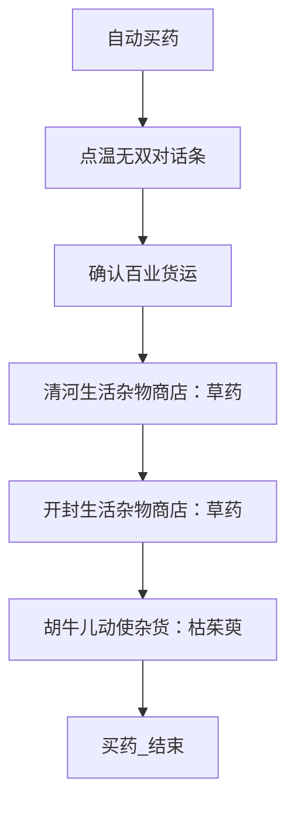
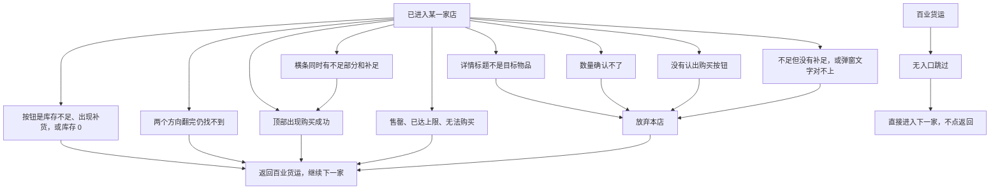

# 自动买药

本页说明界面任务「自动买药」。入口节点、选项和购买逻辑在 `assets/interface.json`，节点在 `assets/resource/pipeline/medicine_task.json`，三张模板在 `assets/resource/image/medicine/`。

流水线协议见 [任务流水线协议](https://github.com/MaaXYZ/MaaFramework/blob/main/docs/zh_cn/3.1-%E4%BB%BB%E5%8A%A1%E6%B5%81%E6%B0%B4%E7%BA%BF%E5%8D%8F%E8%AE%AE.md)。`next` 按顺序在同一张截图上识别，只进入第一个命中的节点；这一轮都没命中就等到 `timeout`，再走 `on_error`。没写 `recognition` 的节点是直接命中。`on_error` 里的直接命中节点会马上执行，排在它后面的兄弟不会再试。

节点没写的 `timeout`、`rate_limit`、`post_delay` 继承 `assets/resource/default_pipeline.json`：等待后继 4444 毫秒，两轮识别至少间隔 444 毫秒，动作之后再等 99 毫秒。OCR 默认阈值 0.6，模板默认阈值 0.8。下表只列节点里写出来的 ROI；直接命中不使用 ROI。

本分支没有 `docs/zh_cn/README.md`。那份索引在 PR #1（`cursor/zh-cn-project-docs-d8ea`）。两支合并后，把本页和 [存放原料](存放原料.md) 加进索引。

## 功能概述

角色已经站在 NPC 温无双旁边时，任务打开百业货运，按顺序处理三家店，最后停在百业货运界面，不再点货运自己的返回。

| 顺序 | 商店 | 购买目标 |
| --- | --- | --- |
| 1 | 清河生活杂物商店 | 草药 |
| 2 | 开封生活杂物商店 | 草药 |
| 3 | 胡牛儿动使杂货 | 枯茱萸 |

清河和开封的货架相同。有库存时，草药在生活杂物商店第二行第三列，枯茱萸在胡牛儿第五行第一列、单价 1000。买完之后卡片会沉到列表底部，任务不按格子点：先认当前画面上的名字，没有再逐次往下翻。

三家共用界面选项「购买数量」：买 1 个，或点最大后购买。某一家的 8 张材料卡都进不去，或这件货的日库存、周库存已经是 0，就跳过这家，继续下一家。跳过也是正常结束。

## 前置条件

- 角色站在温无双身旁，能点到屏幕右侧中部的对话条「温无双」。任务不寻路，也不点头顶名牌。
- 百业货运这一轮的 8 张材料卡里，至少有一件目标商店也卖的同名物品，否则对应那家店会被跳过。
- 控制器把画面缩放到短边 720。下面的 ROI 和点击坐标都是这张 1280×720 图上的数，不是 1600×900 截图像素。
- 中文 OCR 模型已放到 `assets/resource/model/ocr/`。加载失败时材料名和按钮都不会命中。

## 完整流程

### 主路径



对话到货运：

1. `买药_点击温无双对话条` 只在 ROI `[730, 380, 220, 70]` 里点「温无双」。大世界画面不会静止，这个节点没有 `post_wait_freezes`，点完只等 400 毫秒。OCR 失败就点坐标 (809, 413)，最多 2 次。
2. `买药_寻找货运选项` 先找右侧「百业货运」。没有选项时，点底部对话里的「货运订单 / 人手不足 / 少侠 / 百业之繁荣」，最多 5 次，再回来找选项。
3. 标题栏认出「百业货运」后进入 `买药_准备清河`。

每一家店的公共后半段是：点一张材料卡 → 点「获取途径」 → 点这家店的名字 → 在当前货架画面上按文字找目标，没有就往下翻 → 核对右侧详情标题 → 确认还有库存 → 按选项设定数量 → OCR「购买」 → 处理结果 → 点右上角返回 → 确认回到百业货运且获取途径弹窗已关。返回之后走锚点 `买药_买完返回`。

材料卡只在 `[200, 350, 560, 270]` 里认，不包含右侧详情。`order_by` 是 `Vertical`：先比纵坐标，y 完全相同才比 x。`Horizontal` 是先比 x，会按列而不是按行排。清河和开封如果一个用 index 0、一个用 index 1，就会点到不同的卡。两家现在都从 `买药_生活杂物候选0` 开始，排序相同，所以是同一张卡。获取途径弹窗里会同时列出清河生活杂物商店和开封生活杂物商店。

已经凑满的卡没有「获取途径」，右侧只有「百业频道求助」。点开后认不出获取途径，就点左侧空白 (400, 300)，再试下一张。绿色完成数字和卡名不在同一个框里，流水线不靠颜色排除这些卡。弹窗里没有这家店的名字时，同样关弹窗换下一张。8 张里面对得上的都会试。某一序号已经没有匹配，就不再往下试。

都进不去时走带店名的跳过节点：`买药_清河跳过_无入口`、`买药_开封跳过_无入口`、`买药_胡牛儿跳过_无入口`。人还在百业货运，这些节点不点返回，否则会退出货运。日志里能直接看到是哪一家没有入口。

已经点到店名、但商店标题对不上时，不再换剩下的卡。这时人可能已经在店里，继续点货运卡片会点错地方。按关弹窗或返回离开，然后去下一家。

进店之后不把列表拉到顶。买完的商品会沉到列表底部，固定格子对不上。先 OCR 当前画面。没有就手指从 (300, 520) 滑到 (300, 260)，露出下面的行，最多 8 次。仍然没有就反方向再翻 8 次。两个方向都没有，当作本店已买完。草药和枯茱萸的点击阈值是 0.35，用来认变灰的名字。角标「库存不足」不在点击目标里。

选中之后进入 `买药_确认可购买`。右下角按钮是「库存不足」、详情里出现「补货」，或日库存、周库存为 0，就走锚点「买药_已买完跳过」，点返回再去下一家，绝不点那个灰按钮。有剩余才设定数量。

跳过和买完都进入下一家，最后到 `买药_结束`。这是正常结束，不是报错。

### 失败和放弃



- 点不开温无双，或百业货运标题对不上：`买药_强制结束`。任务停在当前画面。
- 清河没有可用入口：`买药_清河跳过_无入口`，不点返回，改去开封。开封同样改去胡牛儿。胡牛儿没有入口：`买药_胡牛儿跳过_无入口`，正常结束。
- 店里这件货库存是 0，或翻到头仍找不到：对应的已买完跳过节点，点返回后继续下一家。
- 换卡时若获取途径弹窗还开着，`买药_换卡前关弹窗` 点左侧 (400, 300) 再试下一张。这个节点不限制次数，否则 8 张卡换不完。已经点了店名但商店标题对不上时，改走 `买药_关闭途径弹窗`，最多 3 次，然后确认是否回到货运，不再换卡。
- 标题、数量或「购买」按钮不符合下面的安全原则时，走 `买药_放弃本店`，只点返回，不购买。
- 商店返回模板没命中时，点 (1182, 34)，最多 2 次。还回不到货运就强制结束。

## 节点一览

下表按 `medicine_task.json` 的书写顺序。`买药_生活杂物候选0` 到 `候选7`、`买药_胡牛儿候选0` 到 `候选7`，以及两边的路由，各自合成一行。识别方式里的「直接命中」就是 `DirectHit`，不看画面。`Click 识别区域` 表示点击本节点刚刚认出的文字或模板。`next` 和 `on_error` 从左到右是数组顺序，只会进入第一个命中的节点。

| 节点 | 识别方式 | ROI | 动作 | next | on_error |
| --- | --- | --- | --- | --- | --- |
| `自动买药` | 直接命中 | — | DoNothing | `买药_点击温无双对话条` | `买药_寻找货运选项` |
| `买药_点击温无双对话条` | OCR「温无双」 | `[730, 380, 220, 70]` | Click 识别区域 | `买药_寻找货运选项` | `买药_点击温无双坐标` |
| `买药_点击温无双坐标` | 直接命中 | — | Click (809, 413) | `买药_寻找货运选项` | `买药_点击百业货运坐标` |
| `买药_寻找货运选项` | 直接命中 | — | DoNothing | `买药_点击百业货运`、`买药_点对话展开选项` | `买药_点击温无双坐标`、`买药_点击百业货运坐标` |
| `买药_点击百业货运` | OCR「百业货运」 | `[840, 470, 180, 55]` | Click 识别区域 | `买药_确认货运界面` | `买药_点击百业货运坐标` |
| `买药_点对话展开选项` | OCR「货运订单」、「人手不足」、「少侠」、「百业之繁荣」 | `[300, 585, 700, 50]` | Click 识别区域 | `买药_寻找货运选项` | `买药_点击百业货运坐标` |
| `买药_点击百业货运坐标` | 直接命中 | — | Click (924, 498) | `买药_确认货运界面` | `买药_强制结束` |
| `买药_确认货运界面` | OCR「百业货运」 | `[90, 0, 260, 65]` | DoNothing | `买药_准备清河` | `买药_强制结束` |
| `买药_准备清河` | 直接命中 | — | DoNothing | `买药_生活杂物候选0` | `买药_清河跳过_无入口` |
| `买药_准备开封` | 直接命中 | — | DoNothing | `买药_生活杂物候选0` | `买药_开封跳过_无入口` |
| `买药_准备胡牛儿` | 直接命中 | — | DoNothing | `买药_胡牛儿候选0` | `买药_胡牛儿跳过_无入口` |
| `买药_清河跳过_无入口` | 直接命中 | — | DoNothing | `买药_准备开封` | — |
| `买药_开封跳过_无入口` | 直接命中 | — | DoNothing | `买药_准备胡牛儿` | — |
| `买药_胡牛儿跳过_无入口` | 直接命中 | — | DoNothing | `买药_结束` | — |
| `买药_清河跳过_已买完` | 直接命中 | — | DoNothing | `买药_返回货运` | — |
| `买药_开封跳过_已买完` | 直接命中 | — | DoNothing | `买药_返回货运` | — |
| `买药_胡牛儿跳过_已买完` | 直接命中 | — | DoNothing | `买药_返回货运` | — |
| `买药_生活杂物候选0` 至 `候选7` | OCR 29 个生活杂物候选，Vertical，index 0 至 7，阈值 0.5 | `[200, 350, 560, 270]` | Click 识别区域 | `买药_点击获取途径` | `买药_换卡前关弹窗` |
| `买药_生活杂物路由1` 至 `路由7` | 直接命中 | — | DoNothing | 同序号的 `买药_生活杂物候选*` | `买药_入口用尽` |
| `买药_胡牛儿候选0` 至 `候选7` | OCR 38 个胡牛儿候选，Vertical，index 0 至 7，阈值 0.5 | `[200, 350, 560, 270]` | Click 识别区域 | `买药_点击获取途径` | `买药_换卡前关弹窗` |
| `买药_胡牛儿路由1` 至 `路由7` | 直接命中 | — | DoNothing | 同序号的 `买药_胡牛儿候选*` | `买药_入口用尽` |
| `买药_入口用尽` | 直接命中 | — | DoNothing | 锚点「买药_无入口跳过」 | `买药_结束` |
| `买药_换卡前关弹窗` | 直接命中 | — | Click (400, 300) | 锚点「买药_换下一张」 | `买药_入口用尽` |
| `买药_点击获取途径` | OCR「获取途径」 | `[790, 300, 220, 80]` | Click 识别区域 | 锚点「买药_目标商店」 | `买药_换卡前关弹窗` |
| `买药_点击清河商店` | OCR「清河生活杂物商店」 | `[540, 330, 230, 210]` | Click 识别区域 | `买药_确认商店` | `买药_关闭途径弹窗` |
| `买药_点击开封商店` | OCR「开封生活杂物商店」 | `[540, 330, 230, 210]` | Click 识别区域 | `买药_确认商店` | `买药_关闭途径弹窗` |
| `买药_点击胡牛儿商店` | OCR「胡牛儿动使杂货」 | `[480, 260, 420, 320]` | Click 识别区域 | `买药_确认胡牛儿` | `买药_关闭途径弹窗` |
| `买药_确认商店` | OCR「生活杂物」 | `[40, 8, 240, 62]` | DoNothing | `买药_寻找草药` | `买药_关闭途径弹窗` |
| `买药_寻找草药` | 直接命中 | — | DoNothing | `买药_点击草药`、`买药_草药向下翻` | `买药_草药改向上翻` |
| `买药_草药向下翻` | 直接命中 | — | Swipe (300, 520)→(300, 260) | `买药_寻找草药` | `买药_草药改向上翻` |
| `买药_草药改向上翻` | 直接命中 | — | DoNothing | `买药_点击草药`、`买药_草药向上翻` | 锚点「买药_已买完跳过」 |
| `买药_草药向上翻` | 直接命中 | — | Swipe (300, 260)→(300, 520) | `买药_草药改向上翻` | 锚点「买药_已买完跳过」 |
| `买药_点击草药` | OCR「草药」，Vertical，阈值 0.35 | `[40, 150, 700, 480]` | Click 识别区域 | `买药_校验草药标题` | `买药_放弃本店` |
| `买药_校验草药标题` | OCR「草药」 | `[800, 78, 250, 62]` | DoNothing | `买药_确认可购买` | `买药_放弃本店` |
| `买药_确认胡牛儿` | OCR「胡牛儿动使杂货」 | `[15, 0, 420, 72]` | DoNothing | `买药_寻找枯茱萸` | `买药_关闭途径弹窗` |
| `买药_寻找枯茱萸` | 直接命中 | — | DoNothing | `买药_点击枯茱萸`、`买药_枯茱萸向下翻` | `买药_枯茱萸改向上翻` |
| `买药_枯茱萸向下翻` | 直接命中 | — | Swipe (300, 520)→(300, 260) | `买药_寻找枯茱萸` | `买药_枯茱萸改向上翻` |
| `买药_枯茱萸改向上翻` | 直接命中 | — | DoNothing | `买药_点击枯茱萸`、`买药_枯茱萸向上翻` | 锚点「买药_已买完跳过」 |
| `买药_枯茱萸向上翻` | 直接命中 | — | Swipe (300, 260)→(300, 520) | `买药_枯茱萸改向上翻` | 锚点「买药_已买完跳过」 |
| `买药_点击枯茱萸` | OCR「枯茱萸」，Vertical，阈值 0.35 | `[40, 140, 720, 500]` | Click 识别区域 | `买药_校验枯茱萸标题` | `买药_放弃本店` |
| `买药_校验枯茱萸标题` | OCR「枯茱萸」 | `[800, 78, 250, 62]` | DoNothing | `买药_确认可购买` | `买药_放弃本店` |
| `买药_确认可购买` | 直接命中 | — | DoNothing | `买药_按钮是库存不足`、`买药_看到补货`、`买药_库存为零`、`买药_库存还有` | `买药_设定数量` |
| `买药_按钮是库存不足` | OCR「库存不足」，阈值 0.35 | `[1080, 640, 190, 75]` | DoNothing | 锚点「买药_已买完跳过」 | `买药_放弃本店` |
| `买药_看到补货` | OCR「补货」，阈值 0.35 | `[880, 525, 360, 95]` | DoNothing | 锚点「买药_已买完跳过」 | `买药_放弃本店` |
| `买药_库存为零` | OCR 日库存或周库存为 0，阈值 0.35 | `[1000, 140, 270, 70]` | DoNothing | 锚点「买药_已买完跳过」 | `买药_放弃本店` |
| `买药_库存还有` | OCR 日库存或周库存大于 0，阈值 0.35 | `[1000, 140, 270, 70]` | DoNothing | `买药_设定数量` | `买药_设定数量` |
| `买药_设定数量` | 直接命中 | — | DoNothing | `买药_确保数量为1` | `买药_放弃本店` |
| `买药_确保数量为1` | 直接命中 | — | DoNothing | `买药_按钮是库存不足`、`买药_看到补货`、`买药_数量已是1`、`买药_点击减号`、`买药_点击减号坐标` | `买药_输入数量1`、`买药_放弃本店` |
| `买药_数量已是1` | OCR 正则 `^\s*1\s*$` | `[1044, 548, 86, 54]` | DoNothing | `买药_点击购买` | `买药_放弃本店` |
| `买药_点击减号` | 模板 `medicine/减号.png`，阈值 0.65 | `[980, 530, 90, 90]` | Click 识别区域 | `买药_确保数量为1` | — |
| `买药_点击减号坐标` | 直接命中 | — | Click (1021, 578) | `买药_确保数量为1` | — |
| `买药_输入数量1` | 直接命中 | — | Click (1084, 578) | `买药_输入文本1` | `买药_放弃本店` |
| `买药_输入文本1` | 直接命中 | — | InputText「1」 | `买药_数量键盘确定`、`买药_确保数量为1` | `买药_放弃本店` |
| `买药_数量键盘确定` | OCR「确定」、「确认」、「完成」 | `[240, 360, 800, 340]` | Click 识别区域 | `买药_确保数量为1` | `买药_放弃本店` |
| `买药_点击最大` | 模板 `medicine/最大.png`，阈值 0.65 | `[1140, 530, 100, 90]` | Click 识别区域 | `买药_点击购买` | `买药_点击最大坐标` |
| `买药_点击最大坐标` | 直接命中 | — | Click (1184, 578) | `买药_点击购买` | `买药_放弃本店` |
| `买药_点击购买` | OCR「购买」 | `[1040, 640, 220, 75]` | Click 识别区域 | `买药_处理购买结果` | `买药_放弃本店` |
| `买药_处理购买结果` | 直接命中 | — | DoNothing | `买药_看到购买成功`、`买药_兑换看到补足`、`买药_兑换看到不足部分`、`买药_点兑换取消`、`买药_购买失败`、`买药_购买确认`、`买药_无购买弹窗` | `买药_放弃本店` |
| `买药_看到购买成功` | OCR「购买成功」 | `[480, 100, 320, 70]` | DoNothing | `买药_返回货运` | `买药_返回货运` |
| `买药_兑换看到补足` | OCR「补足」 | `[400, 290, 460, 70]` | DoNothing | `买药_兑换补足后核对不足部分` | `买药_不足时点取消` |
| `买药_兑换补足后核对不足部分` | OCR「不足部分」 | `[400, 290, 460, 70]` | DoNothing | `买药_点兑换确认`、`买药_点兑换确认坐标` | `买药_不足时点取消` |
| `买药_兑换看到不足部分` | OCR「不足部分」 | `[400, 290, 460, 70]` | DoNothing | `买药_兑换确认有补足` | `买药_点兑换取消` |
| `买药_兑换确认有补足` | OCR「补足」 | `[400, 290, 460, 70]` | DoNothing | `买药_点兑换确认` | `买药_不足时点取消` |
| `买药_点兑换确认` | OCR「确认」 | `[990, 440, 190, 70]` | Click 识别区域 | `买药_等待购买成功` | `买药_点兑换确认坐标` |
| `买药_点兑换确认坐标` | 直接命中 | — | Click (1082, 475) | `买药_等待购买成功` | — |
| `买药_等待购买成功` | 直接命中 | — | DoNothing | `买药_看到购买成功` | `买药_返回货运` |
| `买药_点兑换取消` | OCR「取消」 | `[60, 440, 180, 70]` | Click 识别区域 | `买药_放弃本店` | `买药_放弃本店` |
| `买药_不足时点取消` | OCR「取消」 | `[60, 440, 180, 70]` | Click 识别区域 | `买药_放弃本店` | `买药_点兑换取消坐标` |
| `买药_点兑换取消坐标` | 直接命中 | — | Click (140, 475) | `买药_放弃本店` | — |
| `买药_购买失败` | OCR「售罄」、「已达上限」、「无法购买」 | `[280, 160, 680, 380]` | DoNothing | `买药_关闭购买弹窗` | `买药_点击返回坐标` |
| `买药_关闭购买弹窗` | OCR「取消」、「知道了」、「关闭」 | `[280, 160, 680, 400]` | Click 识别区域 | `买药_返回货运` | `买药_点击返回坐标` |
| `买药_购买确认` | OCR「知道了」、「点击空白」 | `[280, 140, 680, 220]` | Click 识别区域 | `买药_返回货运` | `买药_点击返回坐标` |
| `买药_无购买弹窗` | OCR 取反，12 个词 | `[280, 90, 720, 430]` | DoNothing | `买药_返回货运` | `买药_点击返回坐标` |
| `买药_放弃本店` | 直接命中 | — | DoNothing | `买药_返回货运` | — |
| `买药_返回货运` | 模板 `medicine/返回.png`，阈值 0.8 | `[1125, 0, 145, 68]` | Click 识别区域 | `买药_确认回到货运` | `买药_点击返回坐标` |
| `买药_点击返回坐标` | 直接命中 | — | Click (1182, 34) | `买药_确认回到货运` | `买药_强制结束` |
| `买药_确认回到货运` | OCR「百业货运」 | `[90, 0, 260, 65]` | DoNothing | `买药_货运无弹窗` | `买药_关闭途径弹窗`、`买药_强制结束` |
| `买药_货运无弹窗` | OCR 取反，「清河生活杂物商店」、「开封生活杂物商店」、「胡牛儿动使杂货」 | `[520, 320, 260, 230]` | DoNothing | 锚点「买药_买完返回」 | `买药_关闭途径弹窗`、`买药_强制结束` |
| `买药_关闭途径弹窗` | 直接命中 | — | Click (400, 300) | `买药_确认回到货运` | `买药_返回货运`、`买药_强制结束` |
| `买药_结束` | 直接命中 | — | DoNothing | — | — |
| `买药_强制结束` | 直接命中 | — | DoNothing | — | — |

没写出来的等待，以 JSON 为准。和购买是否发生直接相关的几个限制是：对话展开最多 5 次；每张材料卡等「获取途径」最多 2.5 秒，弹窗里等店名最多 2.8 秒；草药和枯茱萸向下、向上各翻 8 次；确认可购买最多等 2.5 秒；数量已是 1 之后等「购买」最多 4 秒，等不到就放弃；减号最多点 20 次；输入「1」最多 2 次；处理购买结果最多等 4 秒。`买药_寻找货运选项` 和 `买药_处理购买结果` 的 `rate_limit` 是 400 毫秒，`买药_确保数量为1` 和 `买药_确认可购买` 是 300 毫秒。

`买药_无购买弹窗` 取反的 12 个词是：确定、确认、取消、知道了、不足部分、补足、手动兑换、本赛季不再提醒、售罄、无法购买、点击空白、购买成功。这些字都没出现，才当作没有弹窗并返回。

候选节点点中之后写入锚点「买药_换下一张」：生活杂物候选 i 指向 `买药_生活杂物路由` 后面那一张（候选 0 指向路由 1），候选 7 指向 `买药_入口用尽`。胡牛儿同样。`max_hit` 为 4，清河和开封会再点同一张卡。路由认不出这个序号时，直接 `买药_入口用尽`，不再往更高的序号试，因为后面的 index 也不会有匹配。

准备节点在进店前写入下面四个锚点。候选节点只改「买药_换下一张」，不覆盖另外三个。

| 准备节点 | 买药_目标商店 | 买药_买完返回 | 买药_无入口跳过 | 买药_已买完跳过 |
| --- | --- | --- | --- | --- |
| `买药_准备清河` | `买药_点击清河商店` | `买药_准备开封` | `买药_清河跳过_无入口` | `买药_清河跳过_已买完` |
| `买药_准备开封` | `买药_点击开封商店` | `买药_准备胡牛儿` | `买药_开封跳过_无入口` | `买药_开封跳过_已买完` |
| `买药_准备胡牛儿` | `买药_点击胡牛儿商店` | `买药_结束` | `买药_胡牛儿跳过_无入口` | `买药_胡牛儿跳过_已买完` |

## 购买数量

选项名 `买药数量`，界面标签「购买数量」，`default_case` 是 `买1个`。草药和枯茱萸都经过 `买药_设定数量`，所以两档对三家店生效。

流水线里 `买药_设定数量` 的默认 `next` 已经是 `买药_确保数量为1`。没选到这个选项时，行为与「买 1 个」相同。

进这个节点之前，`买药_确认可购买` 已经确认库存不是 0。买 1 个还会在 `买药_确保数量为1` 里再看一次右下角是不是「库存不足」、数量栏位置有没有「补货」。命中就跳过这家，不会点减号坐标。买满把后继直接换成最大按钮，不再做这第二次检查。

`买1个` 的 `pipeline_override` 再写一遍这条后继，并把失败改成先尝试输入、再放弃：

```json
{
    "买药_设定数量": {
        "next": ["买药_确保数量为1"],
        "on_error": ["买药_输入数量1", "买药_放弃本店"]
    }
}
```

买 1 个时的实际顺序：

1. 数量栏 ROI `[1044, 548, 86, 54]` 的文字匹配 `^\s*1\s*$` 才去点「购买」。
2. 不是 1 就点 `medicine/减号.png`。模板阈值 0.65，没对上就点减号中心 (1021, 578)，然后回到第 1 步。
3. 减号这条链超时后，点数量栏 (1084, 578)，`InputText`「1」。若出现「确定 / 确认 / 完成」，点掉键盘，再回到第 1 步核对是不是 1。
4. 输入节点 `max_hit` 为 2。仍然不是 1，或「购买」按钮认不出，进入 `买药_放弃本店`。

`买满` 的覆盖是：

```json
{
    "买药_设定数量": {
        "next": ["买药_点击最大"],
        "on_error": ["买药_点击最大坐标"],
        "timeout": 3000
    }
}
```

先点 `medicine/最大.png`，阈值 0.65。模板失败就点 (1184, 578)，这是 1600×900 上 (1480, 723) 乘 0.8。然后仍要 OCR「购买」。最大按钮和购买按钮都认不出时放弃，不按购买坐标盲点。买满不读取数量是不是 1。钱不够时走同一套兑换弹窗规则。

## 购买前校验、兑换弹窗和安全原则

### 标题校验

点中货架上的物品之后、改数量之前，在右侧详情标题区域 OCR。ROI 是 `[800, 78, 250, 62]`，对应大约 x 800–1050、y 78–140。

- 生活杂物商店必须读到「草药」，节点 `买药_校验草药标题`。
- 胡牛儿必须读到「枯茱萸」，节点 `买药_校验枯茱萸标题`。

标题区域故意不包含左侧货架，也不包含更下方的说明文字。2.5 秒内对不上，`on_error` 是 `买药_放弃本店`。对上之后进入 `买药_确认可购买`，先判断售罄，再改数量。进店时商店会自动选中用来打开获取途径的那件材料；标题校验就是为了避免把那件材料买走。

### 售罄（已实机确认）

胡牛儿动使杂货里已经买完的「火箭」排在列表最后。1600×900 实机截图上的样式是：

- 列表卡片变暗，左上角有小字「库存不足」，物品名是灰色。
- 右侧详情在标题下方写「日库存 0/99」。草药和枯茱萸同一位置是「周库存」，例如「周库存 97/99」。两种都认。数字是剩余/上限。
- 数量栏消失，换成红色条「每日 5:00 补货」。
- 右下购买按钮变灰，文字变成「库存不足」。换到 1280×720 大约是 x 1090–1250、y 655–705。

选中目标之后，`买药_确认可购买` 按下面的顺序看。前三条命中就走锚点「买药_已买完跳过」，点返回，进下一家。这三个节点都是 DoNothing，不会去点那个灰按钮：

1. `买药_按钮是库存不足`：ROI `[1080, 640, 190, 75]`，只认「库存不足」。范围只盖住右下角按钮，不盖住货架上其他卡的角标。
2. `买药_看到补货`：ROI `[880, 525, 360, 95]`，认红色条上的「补货」。
3. `买药_库存为零`：ROI `[1000, 140, 270, 70]`。1600×900 上这条库存大约在 x 1340–1500、y 205–230，乘 0.8 后大约是 x 1072–1200、y 164–184，ROI 在外面留了一圈。正则只认日库存或周库存后面紧跟 0，或者单独一框的 `0/数量`。`10/99` 不会被当成 0。

库存为 0 的 `expected` 是：

```text
日库存\s*0\s*/
周库存\s*0\s*/
日库存\s*0\s*$
周库存\s*0\s*$
^\s*0\s*/\s*\d+\s*$
```

`买药_库存还有` 认出日库存或周库存后面是 1–9，或者单独一框的 `97/99` 这种，才进入 `买药_设定数量`：

```text
日库存\s*[1-9]
周库存\s*[1-9]
^\s*[1-9]\d*\s*/\s*\d+\s*$
```

2.5 秒里这四条都没读到，才退回数量流程。库存正常但 OCR 漏读时，仍然可以买。买 1 个在点减号之前还会再看一次灰按钮和补货条，避免减号坐标 (1021, 578) 点到红色补货条。买满的界面覆盖把 `买药_设定数量` 的后继直接换成最大按钮，这一步不再复查；售罄主要靠前面的 `买药_确认可购买`。即便如此，`买药_点击购买` 也只认「购买」，不会把「库存不足」点下去。

货架上的灰色名字用阈值 0.35。`买药_点击草药` 和 `买药_点击枯茱萸` 的 `expected` 只有物品名，没有「库存不足」，所以不会去点角标。

### 购买成功

正向判断是 `买药_看到购买成功`：OCR「购买成功」，ROI `[480, 100, 320, 70]`，即顶部正中大约 y 100–170。命中后不点击提示本身，直接返回货运。

点过金色确认后，`买药_等待购买成功` 再等这条提示，最多 2.5 秒。提示已经消失就仍然返回货运，不再点一次购买。

`买药_购买确认` 只处理「知道了」和「点击空白」，ROI 停在 y 360 以上，不负责兑换弹窗上的「确认」。

### 兑换弹窗

钱不够、但另一种货币可以补上时，画面中间出现横条，例如「将消耗 600，不足部分使用 400补足，是否继续？」。数字前面有货币图标。按 1280×720：正文大约 y 315–340、x 430–810；左下「取消」约 (140, 475)；右侧「手动兑换」约 (879, 475)；金色「确认」约 (1082, 475)。复选框「本赛季不再提醒」在按钮上方。任务不点它，也不点「手动兑换」。

`买药_处理购买结果` 的后继顺序是：

1. 「购买成功」。
2. 横条 ROI `[400, 290, 460, 70]` 里有「补足」。接着必须再看到「不足部分」，两项都在才点确认。
3. 同一 ROI 里先看到「不足部分」、还没看到「补足」时，再找一次「补足」。找到就点确认；找不到就取消。
4. 左下 ROI `[60, 440, 180, 70]` 里有「取消」。用于看不懂的弹窗。
5. 「售罄」「已达上限」「无法购买」。关掉提示后返回，不把「不足」算进这里，避免和兑换弹窗抢点击。
6. 「知道了」或「点击空白」。
7. 上面这些词和兑换相关的词都不在画面上，视为没有弹窗，返回。

点确认时，OCR「确认」的 ROI 是 `[990, 440, 190, 70]`，只盖住金色按钮。「手动兑换」不含「确认」这四个字，也不会落进这个 ROI。OCR 没命中、且已经同时看到「补足」和「不足部分」时，点坐标 (1082, 475)。

取消走左下「取消」。已经确定弹窗不是可补足、而 OCR 又没点到「取消」时，才点 (140, 475)。

### 识别失败不盲点购买

购买按钮只有 `买药_点击购买` 这一处，且必须先 OCR 到「购买」才点击。下面这些情况都不会按坐标盲点购买：

- 右下角是「库存不足」、出现「补货」，或日库存、周库存为 0：走这家的已买完跳过，点返回
- 货架向下、向上都翻过仍找不到目标：同样走已买完跳过
- 详情标题不是目标物品：`买药_放弃本店`
- 数量栏认不出 1，减号和输入也调不到 1
- 输入「1」或数字键盘确定失败
- 「购买」四个字本身认不出。灰按钮上的「库存不足」对不上「购买」
- 买满时最大按钮的坐标兜底失败

允许的坐标点击只有：对话条、百业货运选项、减号、数量栏、最大按钮、已经核对过的兑换确认或取消、商店返回、关闭获取途径时点弹窗外。这些都不是在未核对物品时按下购买。

## 商店物品表

入口材料必须和货架上的名字相同，任务才会点那张卡再打开获取途径。单字不进入候选。「蛋」在生活杂物商店里有售，但流水线故意不认它。

### 生活杂物商店

清河和开封是同一份 30 种物品。下表按货架阅读顺序。流水线候选是其中 29 种，不含「蛋」。`replace` 把「草菇」「蕈茹」收成「蕈菇」，把「白腊」收成「白蜡」。

| 序号 | 物品 | 是否作为入口候选 |
| --- | --- | --- |
| 1 | 厚脂肉块 | 是 |
| 2 | 碎肉块 | 是 |
| 3 | 蛋 | 否，单字 |
| 4 | 蕈菇 | 是 |
| 5 | 野果 | 是 |
| 6 | 河鱼 | 是 |
| 7 | 草药 | 是。也是这两家店的购买目标 |
| 8 | 昆虫 | 是 |
| 9 | 甲壳 | 是 |
| 10 | 短毛羽 | 是 |
| 11 | 粗矿石 | 是 |
| 12 | 原木 | 是 |
| 13 | 粗毛皮 | 是 |
| 14 | 桦木 | 是 |
| 15 | 白蜡 | 是 |
| 16 | 冬青木 | 是 |
| 17 | 枫木 | 是 |
| 18 | 梨花木 | 是 |
| 19 | 梅花木 | 是 |
| 20 | 古松木 | 是 |
| 21 | 海棠木 | 是 |
| 22 | 榆木 | 是 |
| 23 | 胡杨木 | 是 |
| 24 | 榉木 | 是 |
| 25 | 柳木 | 是 |
| 26 | 紫藤木 | 是 |
| 27 | 桃木 | 是 |
| 28 | 竹子 | 是 |
| 29 | 银杏木 | 是 |
| 30 | 玉兰木 | 是 |

### 胡牛儿动使杂货

4 列，10 行，共 38 种。有库存时枯茱萸在第 5 行第 1 列；买完后会沉到列表底部，任务按文字找，不点这个格子。没有商品的格子写成「—」。

| 行 | 第 1 列 | 第 2 列 | 第 3 列 | 第 4 列 |
| --- | --- | --- | --- | --- |
| 1 | 拔霞供 | 神仙酿鱼 | 三蔬杂菇 | 木箭 |
| 2 | 止血散 | 盛景路牌 | 普通鱼饥 | 面食饥 |
| 3 | 虫饥 | 草饥 | 稚子垂纶 | 小蟾蜍钓竿 |
| 4 | 野山参 | 魏紫 | 玉楼春 | 耗悉茗 |
| 5 | 枯茱萸 | 一丈红 | 寒菌幼株 | 东陵瓜 |
| 6 | 龙骨 | 独山蓝玉 | 青礙石 | 寒铁 |
| 7 | 独山玉 | 洛口石首鱼 | 鳙鱼 | 鲈鱼 |
| 8 | 河豚 | 脂尾羊皮 | 豪猪棘券 | 鼬皮 |
| 9 | 吠鹿肉 | 獾子油 | 野鸡肉 | 长尾玽 |
| 10 | 柳叶玽 | 火箭 | — | — |

`买药_胡牛儿候选0` 到 `买药_胡牛儿候选7` 的 `expected` 相同，用识别更稳的写法，再靠 `replace` 把上表里的异写换过去之后匹配。购买目标「枯茱萸」如果出现在 8 张卡里，也可以当作入口材料。改名单时这 8 个节点要一起改。

| 货架上可能被看成 | 替换后参与匹配 |
| --- | --- |
| 耗悉茗 | 耶悉茗 |
| 普通鱼饥、面食饥、虫饥、草饥，以及单独的「鱼饥」 | 把「饥」换成「饵」 |
| 青礙石 | 青礞石 |
| 长尾玽 | 长尾羽 |
| 柳叶玽 | 柳叶羽 |

其余 30 个名字在 `expected` 里与上表相同：拔霞供、神仙酿鱼、三蔬杂菇、木箭、止血散、盛景路牌、稚子垂纶、小蟾蜍钓竿、野山参、魏紫、玉楼春、枯茱萸、一丈红、寒菌幼株、东陵瓜、龙骨、独山蓝玉、寒铁、独山玉、洛口石首鱼、鳙鱼、鲈鱼、河豚、脂尾羊皮、豪猪棘券、鼬皮、吠鹿肉、獾子油、野鸡肉、火箭。加上替换后的 8 个，候选共 38 个。阈值 0.5。两个字的名字仍可能被更长的卡名带上，实机如果点错卡，先把该候选从列表里去掉或提高阈值。

### 新增一家店或一种物品

新增一种入口材料：把名字加进对应候选的 `expected`。生活杂物改 `买药_生活杂物候选0` 到 `买药_生活杂物候选7`，八份一起改。胡牛儿改 `买药_胡牛儿候选0` 到 `买药_胡牛儿候选7`。不要加单字。OCR 经常看错的字，八个节点都加同一条 `replace`，替换后的文字必须出现在 `expected` 里。

把购买目标从草药或枯茱萸改成同店的其他物品时：

1. 改点击货架的 `expected`，以及购买前标题校验的 `expected`。标题 ROI 保持在右上角详情名上。灰色名字把阈值留在 0.35 左右。
2. 物品不在当前屏时，寻找节点会先看当前画面，再向下翻、向上翻，各 8 次。不要先把列表拉到顶，售罄的卡在底部。
3. 数量、购买、兑换和返回不用复制。新的点击节点 `next` 仍指向对应的标题校验。标题校验的 `next` 必须是 `买药_确认可购买`，不要改回直接 `买药_设定数量`，否则售罄时会去点数量栏。

新增第四家店时，沿用锚点，不要把店名写死在公共节点里：

1. 增加 `买药_准备某店`。`anchor` 里写四个键：`买药_目标商店` 指向「获取途径里点店名」，`买药_买完返回` 指向下一家或 `买药_结束`，`买药_无入口跳过` 指向这家的无入口跳过节点，`买药_已买完跳过` 指向这家的已买完跳过节点。
2. 把上一家的 `买药_买完返回` 改到这个新准备节点。上一家无入口跳过节点的 `next` 也要指向它，否则会跳过新店。
3. 准备节点的 `next` 指向候选 0。候选的 `on_error` 用直接命中的换卡节点，不要把可能认不出的 OCR 放进 `on_error`。OCR 在 `on_error` 里再失败一次，任务会直接停掉。
4. 增加「点店名」和「确认标题」两个 OCR。点店名的 `next` 进入确认标题。确认标题失败时走返回，不要再去点货运上的下一张卡。
5. 找商品、点商品、校验标题、`买药_确认可购买` 四步走完后，才进入现有的 `买药_设定数量`。
6. 把新店全名加进 `买药_货运无弹窗` 的取反列表，否则获取途径弹窗还在时就会被当成已经关掉。

## 坐标系

调试截图是 1600×900。`interface.json` 里安卓控制器的 `display_short_side` 为 720。短边 900 缩到 720 的比例是 0.8，长边 1600 × 0.8 = 1280。识别和 `Click` / `Swipe` 的数字都在这张 1280×720 图上。

ROI 写成 `[x, y, w, h]`。例如购买成功提示 `[480, 100, 320, 70]` 覆盖 x 480–800、y 100–170。

从截图像素换到流水线坐标：乘 0.8 后取整。百业货运选项在截图上的实测中心约为 (1156, 620)，1156 × 0.8 = 924.8，620 × 0.8 = 496，节点 `target` 是 [924, 498]。反方向把流水线坐标除以 0.8，才是 `adb shell input` 要用的设备像素。金色确认 (1082, 475) 约对应截图 (1353, 594)，取消 (140, 475) 约对应 (175, 594)。

手动 `screencap` 若得到的是 1600×900，不要把图上的点直接填进 pipeline。先乘 0.8。

## 本地调试

环境、OCR 模型和 schema 校验的通用步骤在合并 PR #1 之后的 [本地开发与调试](本地开发与调试.md)。下面只写这条任务在 MuMu 上容易踩空的部分。

### MuMu 多屏截到桌面

MuMu 多开或多块屏幕时，普通 Adb 截图可能截到模拟器桌面，OCR 和模板都会对不上，点击也会点到桌面。MaaFramework 5.8.1 的 MuMu EmulatorExtras 用 `extras.mumu.app_package` 调用 `nemu_get_display_id`，截图和触控都落在这个包对应的画面上。

PyPI 包名是 `maafw`。控制器要同时把截图和触控设成 `EmulatorExtras`。只改截图时，触控仍可能打到另一块 display。`path` 是 MuMu 安装根目录，其下要能找到 `shell/sdk/external_renderer_ipc.dll` 或 `nx_main/sdk/external_renderer_ipc.dll`。`index` 是多开管理器里的实例序号，主实例一般是 0。燕云十六声的包名是 `com.netease.yyslscn`。

```json
{
    "extras": {
        "mumu": {
            "enable": true,
            "index": 0,
            "path": "C:/Program Files/Netease/MuMu Player 12",
            "app_package": "com.netease.yyslscn"
        }
    }
}
```

`interface.json` 里的 Adb 控制器不会替你填写这段，因为路径和实例号每台机器不同。用 MaaPiCli、调试器或下面的 Python 脚本连接时，把这段放进控制器 config。连上后先看第一张截图是不是游戏。

### 用 adb 按 display 截图和点击

知道游戏 display id 之后，可以不经过流水线，单独截一张图或点一个点。`-d` 后面是 display id，不是 MuMu 的实例 index。id 要从 `dumpsys display` 或 EmulatorExtras 的日志里看，桌面经常是 0，游戏是另一块。

```bash
adb connect 127.0.0.1:16384
adb shell dumpsys display
adb exec-out screencap -d <display_id> -p > shot.png
adb shell input -d <display_id> tap <x> <y>
```

这里的 `<x>` `<y>` 是该 display 的像素。1600×900 的图上要用截图坐标，不是 pipeline 的 1280×720 坐标。例如要点金色确认，用大约 (1353, 594)，不要用 (1082, 475)。

### 用 MaaFw 5.8.1 跑这条任务

5.8.1 的 `AdbController` 签名是 `adb_path`、`address`、`screencap_methods`、`input_methods`、`config`。截图枚举里 `EmulatorExtras = 1 << 6`，触控枚举里 `EmulatorExtras = 1 << 3`。默认触控组合不包含 EmulatorExtras，所以要显式传入。

在仓库根目录执行。先准备 OCR 模型（`python tools/configure.py`），再安装这一版绑定：

```bash
python -m pip install maafw==5.8.1
```

下面的脚本只演示连接和入口。`adb_path`、地址和 `index` 按本机修改。`pipeline_override` 与界面里「买 1 个」相同；买满时把 `next` 换成 `买药_点击最大`，`on_error` 换成 `买药_点击最大坐标`。

```python
from pathlib import Path

from maa.controller import AdbController
from maa.define import MaaAdbInputMethodEnum, MaaAdbScreencapMethodEnum
from maa.resource import Resource
from maa.tasker import Tasker
from maa.toolkit import Toolkit

root = Path(__file__).resolve().parent
Toolkit.init_option(str(root / "assets"))

resource = Resource()
resource.post_bundle(str(root / "assets" / "resource")).wait()

controller = AdbController(
    adb_path=r"C:\Program Files\Netease\MuMu Player 12\shell\adb.exe",
    address="127.0.0.1:16384",
    screencap_methods=MaaAdbScreencapMethodEnum.EmulatorExtras,
    input_methods=MaaAdbInputMethodEnum.EmulatorExtras,
    config={
        "extras": {
            "mumu": {
                "enable": True,
                "index": 0,
                "path": "C:/Program Files/Netease/MuMu Player 12",
                "app_package": "com.netease.yyslscn",
            }
        }
    },
)
controller.post_connection().wait()

tasker = Tasker()
tasker.bind(resource, controller)
job = tasker.post_task(
    "自动买药",
    {
        "买药_设定数量": {
            "next": ["买药_确保数量为1"],
            "on_error": ["买药_输入数量1", "买药_放弃本店"],
        }
    },
)
job.wait()
print(job.status)
```

改完 JSON 后可以只做 schema 校验，不需要连模拟器：

```bash
python -m pip install jsonschema==4.26.0 referencing==0.37.0
python tools/validate_schema.py --schema-dir deps/tools
```

本仓库 `default_pipeline.json` 里模板默认段含有 schema 不接受的字段，这条命令目前会在该文件上报错。`medicine_task.json` 和 `interface.json` 通过即可。

## 已知问题与待验证

第二轮实机里，清河的草药和胡牛儿的枯茱萸已经买到，金色确认和「购买成功」也都认出过。开封当时被整店跳过。售罄样式另有一张胡牛儿的截图。下面把已经确认的和还没复测的分开。

### 已实机确认

- 清河生活杂物商店的草药可以买到，顶部能认出「购买成功」。
- 胡牛儿的枯茱萸可以买到。兑换横条先读到「补足」、再读到「不足部分」时，金色「确认」能被 OCR 点中，随后出现「购买成功」。
- 售罄样式见「售罄（已实机确认）」。胡牛儿列表最后的「火箭」是变暗卡片、角标「库存不足」、详情「日库存 0/99」、红色「每日 5:00 补货」、灰按钮「库存不足」。草药和枯茱萸的库存行是「周库存」，规则里两种都认。对应节点按这张截图写了，还没有在售罄的那一局里把整条任务跑完。
- 开封被跳过的原因已经对上日志：`order_by` 为 Horizontal 时，index 1 点到了已完成的「野果」。那张卡没有「获取途径」，超时后关弹窗，锚点直接去了胡牛儿，开封整店没进。这次改成和清河同一张卡，获取途径失败就换下一张。这条新路径还没有复测。

### 仍需注意

- `买药_点击温无双坐标` 的附注写的是截图点 (1031, 516)。按 0.8 计算约是 (825, 413)，节点 `target` 实际是 [809, 413]。执行以 `target` 为准。
- 游戏自带数字键盘可能不接受 `InputText`。买 1 个时调不到 1 会放弃这家店，不会按当前数量购买。买满不走输入。
- 兑换横条若被货币图标拆成多段，可能只读到「补足」或只读到「不足部分」。两条分支都要求两个词都出现才点金色确认；只看到其中一个会去点取消。
- 先命中「不足部分」、再命中「补足」时，金色「确认」若 OCR 失败，这条分支的 `on_error` 是取消，而不是确认坐标。先命中「补足」时，确认 OCR 失败会点 (1082, 475)。
- 「购买成功」停留时间短。点确认之后 2.5 秒内没读到，仍会返回货运。若其实没买成，任务不会再补点一次购买。
- 返回箭头阈值 0.8，搜索范围只有右上角 `[1125, 0, 145, 68]`。模板对不上时还有坐标 (1182, 34)。阈值再高一档可能让正常箭头也落到坐标兜底。
- 生活杂物候选里仍有两个字的名字，例如「白蜡」。胡牛儿候选里有「魏紫」「鲈鱼」「寒铁」。它们可能匹配到更长的卡名。
- 灰色名字若分数低于 0.35，会当成货架上没有这件，走已买完跳过，仍然不会购买。
- 三种售罄信号都没读到时，会退回数量流程。买满在那之后可能点一次最大按钮的坐标，位置和红色补货条重叠。购买按钮本身仍然只认「购买」。
- 已经点到店名但商店标题对不上时，不再换剩余的材料卡，直接离开这家，避免人在店里还去点货运卡片。
- 列表是否已经滑到底，流水线看的是滑动次数（各 8 次），不是前后两张图有没有变化。
- 买满时无法预先知道总价是否超过余额，只能等购买之后的兑换弹窗。能补足就确认，不能就取消并换下一家。
