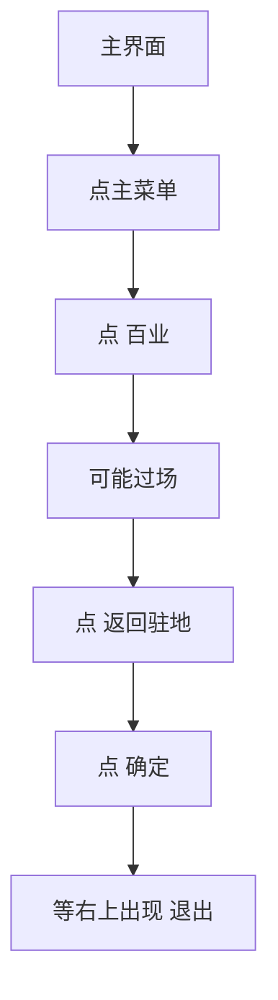

# 返回百业

本页说明界面任务「返回百业」。入口在 `assets/interface.json`，节点在 `assets/resource/pipeline/return_baiye_task.json`，入口名 `返回百业`。可单独跑；也可由 [买药炼药一条龙](买药炼药一条龙.md) 在 [买钱袋](买钱袋.md) 成功回主界面后通过锚点 `钱袋_结束后` 调用。

坐标与 ROI 均按控制器缩放到短边 720 后的 **1280×720** 图计算。

> **实现状态**：流水线已落地。「返回驻地 / 确定」ROI 待实机再收紧。

## 目标

从主界面打开功能菜单，进入「百业」，点右下 **返回驻地** 并 **确定**，再等加载结束进入驻地。

## 步骤

1. 点右上角 **主菜单**（`storage/主菜单.png`）；若菜单已开且能看到「百业」则跳过。
2. OCR 点 **百业**（功能菜单 ROI 约 `[780, 150, 480, 450]`）。只点一次。
3. （可能有过场动画）OCR 点右下 **返回驻地**（ROI 约 `[900, 520, 380, 200]`）。等待写在前驱 `回百业_点百业` 的 `timeout`（120 秒，过场有时超过 1 分钟）。
4. OCR 点弹窗金色 **确定**（ROI `[990, 440, 190, 70]`，实测框约 `[1076, 462, 42, 25]`）。**不要**把「确认」写进 expected：正文「是否确认返回百业驻地？」会误点文字。失败兜底坐标 `(1082, 475)`。
5. **等加载结束**：右上角出现 **退出**（与 [离开百业](离开百业.md) 的 `离百业_点退出` 同一按钮）。OCR「退出」，ROI `[1000, 0, 280, 70]`，阈值 0.5；`DoNothing`，**只认不点**。等待写在前驱 `回百业_点确定` / `回百业_点确定坐标` 的 `timeout`（120 秒，进驻地加载有时超过 1 分钟）。
6. 走到 `回百业_结束` 后走锚点 `回百业_结束后`。一条龙接到 [找温无双](找温无双.md)。单独跑不设锚点，停在 `回百业_收工`（人在驻地门口）。

## 与一条龙的衔接

| 项 | 说明 |
| --- | --- |
| 触发 | 一条龙入口锚点 `"钱袋_结束后": "返回百业"` |
| 时机 | [买钱袋](买钱袋.md) 成功回到主界面、走到 `钱袋_结束` 之后 |
| 单独买钱袋 / 炼药 | 不设该锚点，落到 `钱袋_收工`，不返回百业 |
| 买钱失败 | `钱袋_结束失败` 不走返回百业 |
| 结束后 | 锚点 `回百业_结束后`。一条龙 → [找温无双](找温无双.md)。单独跑 → `回百业_收工` |
| 返回失败 | `回百业_结束失败` 不找人 |

## 安全原则

- 主菜单 / 百业只点一次，避免连点进错界面。
- 点百业后可能有过场：以「返回驻地」出现为准再点，不盲点右下角。
- 点确定后进驻地有加载：以右上「退出」出现为准再结束任务。
- **不要点「退出」**：本任务要留在百业驻地；退出是 [离开百业](离开百业.md) 用的。
- 不改写买药 / 炼药 / 买钱袋内部锚点状态。
